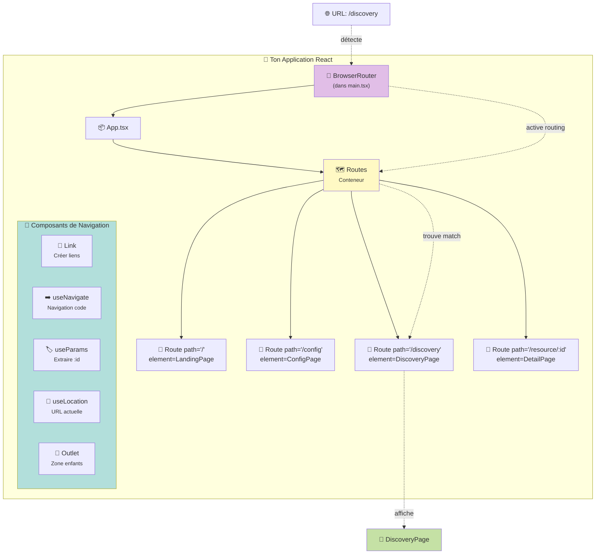
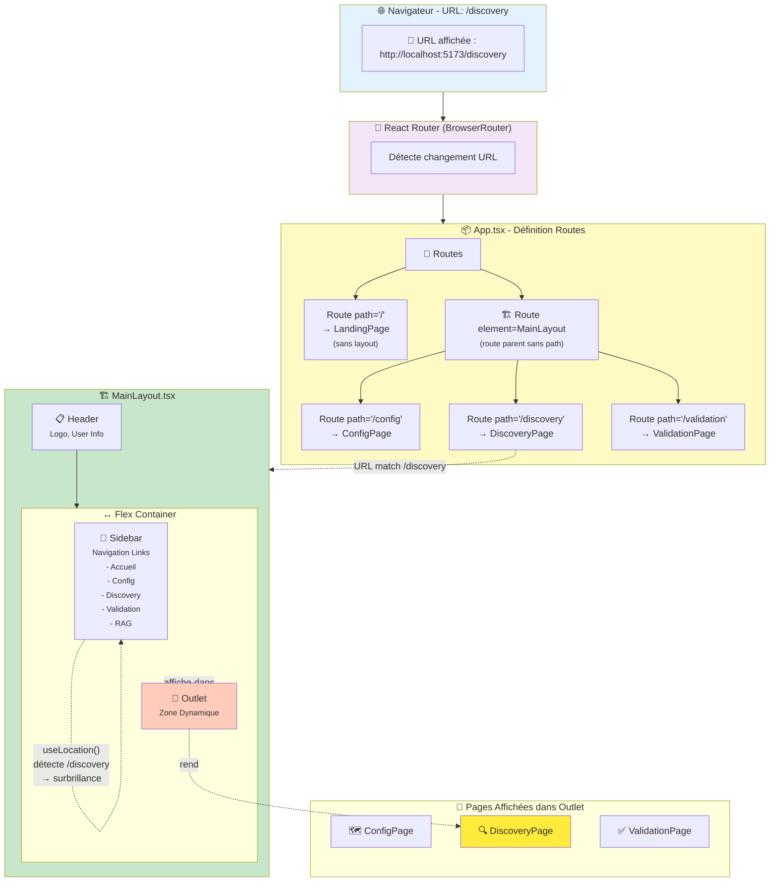
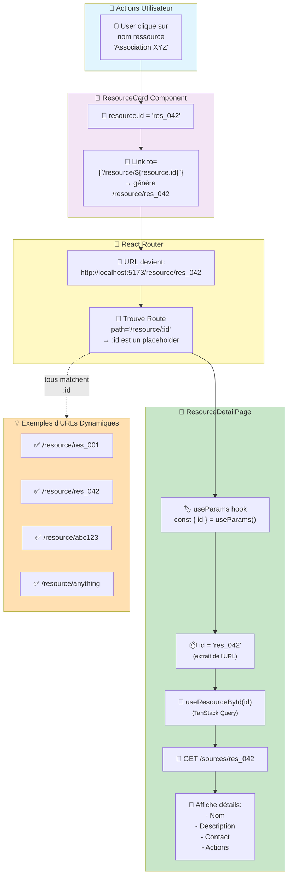
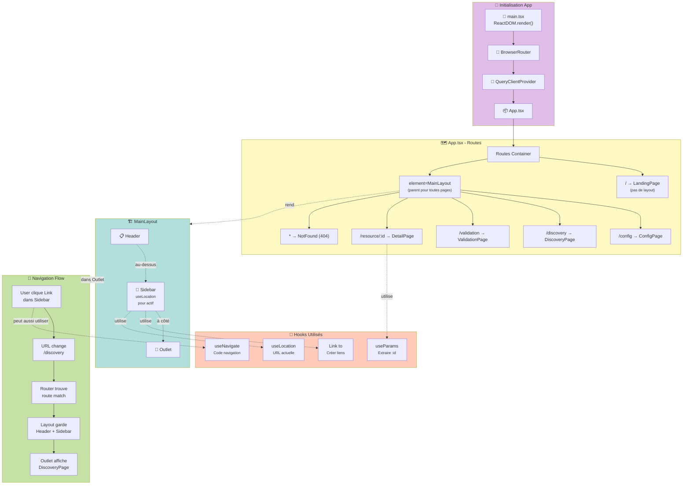
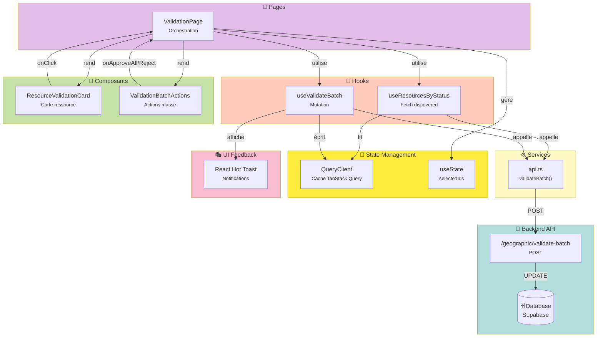

# 📘 Ressource REACT - Guide d'apprentissage progressif

**Projet** : Resource Discovery Platform  
**Objectif** : Apprendre React 18 + TypeScript en construisant une interface d'administration  
**Niveau** : TypeScript intermédiaire, découverte de React moderne

---

## 🗓️ ÉTAPE 1 - Setup & Fondations ✅

### 🎯 Objectif de l'étape
Créer un projet React moderne avec Vite et comprendre l'architecture de base.

### 📚 Concepts clés à comprendre

#### 1. **Vite - Le build tool moderne**

**Pourquoi Vite et pas Create React App ?**
- ⚡ **Démarrage instantané** : Utilise ESM (modules natifs du navigateur)
- 🔥 **Hot Module Replacement ultra rapide** : Modifications visibles en <50ms
- 📦 **Build optimisé** : Utilise Rollup en production
- 🎯 **TypeScript de base** : Pas de configuration complexe

**Comparaison rapide** :
```
Create React App (CRA) - Ancien standard
├── Webpack (lent à démarrer)
├── Configuration cachée
└── Devient lourd sur gros projets

Vite - Standard moderne (2024+)
├── Démarrage instantané
├── Configuration simple et visible
└── Performance constante même sur gros projets
```

#### 2. **React 18 - Nouveautés importantes**

Tu connais déjà TypeScript, donc tu vas apprécier React avec TS ! Voici les concepts React à maîtriser :

**a) Les Composants fonctionnels** (on n'utilise plus les classes)
```tsx
// ✅ Moderne - Composant fonctionnel
function MonComposant() {
  return <div>Hello</div>
}

// ❌ Ancien - Composant classe (obsolète)
class MonComposant extends React.Component {
  render() {
    return <div>Hello</div>
  }
}
```

**b) Les Hooks** - La magie de React moderne
- `useState` : Gérer l'état local
- `useEffect` : Effets de bord (API calls, subscriptions)
- `useCallback` / `useMemo` : Optimisation performance
- Et plein d'autres qu'on découvrira !

**c) JSX/TSX** - JavaScript XML avec TypeScript
```tsx
// C'est du JavaScript qui ressemble à du HTML
const element = <h1 className="title">Bonjour {name}</h1>

// Sous le capot, c'est transformé en :
const element = React.createElement('h1', {className: 'title'}, 'Bonjour ', name)
```

#### 3. **TypeScript dans React**

**Les types essentiels** :
```tsx
// Type pour les props d'un composant
interface ButtonProps {
  label: string
  onClick: () => void
  disabled?: boolean  // ? = optionnel
}

// Type pour le state
interface UserState {
  name: string
  age: number
  isLoggedIn: boolean
}

// Type pour les événements
const handleClick = (event: React.MouseEvent<HTMLButtonElement>) => {
  console.log(event.currentTarget.value)
}
```

**Pourquoi TypeScript + React = 💍** :
- ✅ Autocompletion des props dans VSCode
- ✅ Erreurs détectées avant l'exécution
- ✅ Refactoring sécurisé
- ✅ Documentation intégrée (les types = la doc)

---

### � NPM vs YARN - Quelle différence ?

**Les deux sont des gestionnaires de packages JavaScript**. Ils font la même chose : installer des bibliothèques.

#### **NPM (Node Package Manager)**
- 📅 **Créé en** : 2010 (le premier)
- 🏢 **Par** : Équipe Node.js (officiel)
- 📦 **Installé avec** : Node.js (déjà présent si tu as Node)
- 🔒 **Fichier de lock** : `package-lock.json`

#### **Yarn**
- 📅 **Créé en** : 2016
- 🏢 **Par** : Facebook (Meta)
- 📦 **Installation** : `npm install -g yarn` (nécessite npm !)
- 🔒 **Fichier de lock** : `yarn.lock`
- ⚡ **Avantages historiques** : Plus rapide et sécurisé que npm (v3-v5)

---

#### **Comparaison des commandes**

| Action | NPM | Yarn |
|--------|-----|------|
| Installer les dépendances | `npm install` | `yarn` ou `yarn install` |
| Ajouter un package | `npm install react` | `yarn add react` |
| Supprimer un package | `npm uninstall react` | `yarn remove react` |
| Démarrer le projet | `npm run dev` | `yarn dev` |
| Installer globalement | `npm install -g vite` | `yarn global add vite` |

---

#### **Aujourd'hui en 2026 : Presque pareil !**

NPM a rattrapé son retard. **Les différences sont minimes** :

**Vitesse** : Yarn légèrement plus rapide sur gros projets  
**Syntaxe** : Yarn plus court (`yarn` vs `npm install`)  
**Compatibilité** : NPM plus universel (pré-installé)  
**Workspace** : Yarn meilleur pour les mono-repos

---

#### **Mon conseil pour toi** 🎯

**Utilise NPM** parce que :
- ✅ Déjà installé avec Node.js
- ✅ Documentation React officielle utilise NPM
- ✅ Plus standard dans les tutoriels
- ✅ Un outil en moins à apprendre

**Tu pourras passer à Yarn plus tard** si tu veux, ça prend 5 minutes à switcher.

---

#### **Règle d'or** ⚠️

**Ne mélange JAMAIS les deux dans un même projet !**

```bash
# ❌ MAUVAIS - Mélange NPM et Yarn
npm install
yarn add react-query
npm run dev

# ✅ BON - Choisis-en un
npm install
npm install react-query
npm run dev
```

**Pourquoi ?** Tu auras deux fichiers de lock (`package-lock.json` ET `yarn.lock`) avec des versions différentes = bugs garantis !

---

### �🛠️ Étape 1 - Installation Vite

**Commande à exécuter** :
```bash
cd ~/resource-discovery-platform
npm create vite@latest frontend -- --template react-ts
```

**Décortiquons cette commande** :
- `npm create vite@latest` : Lance le générateur Vite (version la plus récente)
- `frontend` : Nom du dossier à créer
- `--template react-ts` : Template React + TypeScript (au lieu de react-js)

**Ce qui va se passer** :
1. ✅ Création du dossier `frontend/`
2. ✅ Installation des fichiers de base :
   - `package.json` : Liste des dépendances
   - `tsconfig.json` : Configuration TypeScript
   - `vite.config.ts` : Configuration Vite
   - `index.html` : Point d'entrée HTML
   - `src/` : Ton code React

**Alternative avec Yarn** (si tu préfères) :
```bash
yarn create vite frontend --template react-ts
```

---

### 🗂️ Structure de fichiers générée

Après la commande, tu auras :
```
frontend/
├── index.html              ← Point d'entrée (contient <div id="root">)
├── package.json            ← Dépendances du projet
├── tsconfig.json           ← Configuration TypeScript
├── tsconfig.node.json      ← Config TS pour Vite
├── vite.config.ts          ← Configuration Vite
├── public/                 ← Assets statiques (images, fonts)
│   └── vite.svg
└── src/                    ← TON CODE ICI
    ├── main.tsx            ← Point d'entrée React
    ├── App.tsx             ← Composant racine
    ├── App.css             ← Styles du composant App
    ├── index.css           ← Styles globaux
    ├── vite-env.d.ts       ← Types Vite pour TS
    └── assets/             ← Images/icônes utilisées dans le code
        └── react.svg
```

**Fichiers clés à comprendre** :

#### `index.html` - Le point d'entrée
```html
<!DOCTYPE html>
<html lang="fr">
  <body>
    <div id="root"></div>  <!-- React se monte ici -->
    <script type="module" src="/src/main.tsx"></script>
  </body>
</html>
```

#### `src/main.tsx` - Bootstrap React
```tsx
import React from 'react'
import ReactDOM from 'react-dom/client'
import App from './App.tsx'
import './index.css'

// Monte l'application React dans <div id="root">
ReactDOM.createRoot(document.getElementById('root')!).render(
  <React.StrictMode>
    <App />
  </React.StrictMode>,
)
```

#### `src/App.tsx` - Ton premier composant
```tsx
import { useState } from 'react'
import './App.css'

function App() {
  const [count, setCount] = useState(0)
  
  return (
    <div className="App">
      <h1>Vite + React</h1>
      <button onClick={() => setCount(count + 1)}>
        count is {count}
      </button>
    </div>
  )
}

export default App
```

---

### 🚀 Étape 2 - Installation des dépendances

**Commandes** :
```bash
cd frontend
npm install   # ou : yarn install
```

**Ce qui se passe** :
- 📥 Téléchargement des packages dans `node_modules/`
- 📝 Création de `package-lock.json` (verrouille les versions exactes)
- ⏱️ Durée : 30 secondes - 2 minutes selon connexion

**Dépendances installées** (regarde `package.json`) :
```json
{
  "dependencies": {
    "react": "^18.3.1",           // La lib React
    "react-dom": "^18.3.1"        // React pour le navigateur
  },
  "devDependencies": {
    "@vitejs/plugin-react": "^4.3.4",  // Plugin Vite pour React
    "typescript": "~5.6.2",             // Compilateur TypeScript
    "vite": "^6.0.5"                    // Build tool
  }
}
```

---

### 🎨 Étape 3 - Premier lancement

**Commande** :
```bash
npm run dev   # ou : yarn dev
```

**Ce qui se passe** :
1. 🔧 Vite démarre un serveur de développement
2. 🌐 Ouvre un navigateur sur `http://localhost:5173`
3. 👀 Chaque modification = rechargement instantané
4. 🔥 HMR (Hot Module Replacement) activé

**Tu verras dans le terminal** :
```
  VITE v6.0.5  ready in 234 ms

  ➜  Local:   http://localhost:5173/
  ➜  Network: use --host to expose
  ➜  press h + enter to show help
```

**Teste le HMR** :
1. Ouvre `src/App.tsx`
2. Change le texte "Vite + React" en "Mon Admin"
3. Sauvegarde (Ctrl+S)
4. 💥 Le navigateur se met à jour instantanément (pas de F5 !)

---

### 📖 Exercice pratique - Comprendre le flow

**À faire maintenant** :

1. **Lance Vite** et ouvre le navigateur
2. **Modifie `App.tsx`** :
   - Change le titre
   - Ajoute un deuxième bouton
   - Change la couleur avec CSS
3. **Observe** : Les changements apparaissent sans recharger la page

**Exemple de modification** :
```tsx
function App() {
  const [count, setCount] = useState(0)
  const [name, setName] = useState("Admin")
  
  return (
    <div className="App">
      <h1>Resource Discovery - {name}</h1>
      <button onClick={() => setCount(count + 1)}>
        Compteur : {count}
      </button>
      <button onClick={() => setName("Boss")}>
        Change mon nom
      </button>
    </div>
  )
}
```

**Question de compréhension** :
- Que fait `useState` ?
- Pourquoi `setCount(count + 1)` et pas `count = count + 1` ?
- Pourquoi les changements apparaissent sans F5 ?

---
**Réponses** :

**1. Que fait `useState` ?**
> `useState` crée une variable d'état réactive qui persiste entre les rendus du composant. Elle retourne un tableau contenant la valeur actuelle et une fonction setter. Quand le setter est appelé, React est notifié du changement et déclenche automatiquement un nouveau rendu du composant.

**2. Pourquoi `setCount(count + 1)` et pas `count = count + 1` ?**
> Les variables d'état React sont immuables (read-only). L'affectation directe (`count = count + 1`) ne notifie pas React du changement, donc aucun re-render n'est déclenché et l'interface ne se met pas à jour. Seul le setter (`setCount`) peut modifier la valeur ET notifier React pour mettre à jour l'UI.

**3. Pourquoi les changements apparaissent sans F5 ?**
> Quand tu cliques sur le bouton, React réagit automatiquement au changement d'état (via `useState`). React re-rend le composant, compare le Virtual DOM (ancien vs nouveau), et met à jour uniquement les parties du vrai DOM qui ont changé. Tout cela se passe sans recharger la page.

---

### 📋 Flow détaillé d'un clic sur le bouton

**Comprendre ce qui se passe quand on clique** :

```tsx
<button onClick={() => setCount(count + 1)}>
  count is {count}
</button>
```

**Les 7 étapes du flow** :

**1. 🖱️ Clic utilisateur**
- L'utilisateur clique sur le bouton
- Le navigateur déclenche un événement `click`

**2. ⚡ Exécution du handler**
- React appelle la fonction `onClick`
- `() => setCount(count + 1)` s'exécute
- Exemple : si `count = 5`, alors `setCount(6)` est appelé

**3. 🔔 Notification à React**
- `setCount()` informe React : "L'état a changé !"
- React marque le composant comme "à re-rendre"
- La valeur `count` passe de 5 à 6 dans la mémoire de React

**4. 🎨 Re-render du composant**
- React ré-exécute la fonction `App()`
- Le JSX est régénéré avec la nouvelle valeur : `count is 6`
- React crée un nouveau **Virtual DOM**

**5. 🔄 Diff du Virtual DOM**
- React compare : Ancien Virtual DOM ↔️ Nouveau Virtual DOM
- React détecte : "Seul le texte du bouton a changé"
- React optimise : pas besoin de tout redessiner !

**6. 🖼️ Mise à jour du vrai DOM**
- React modifie **uniquement** le texte du bouton dans le navigateur
- Pas de rechargement de page
- Pas de perte du focus / scroll / etc.

**7. ✅ Affichage final**
- L'utilisateur voit : `count is 6`
- Durée totale : ~16ms (1 frame à 60 FPS)

**💡 Concept clé : Le Virtual DOM**

React ne modifie jamais le DOM directement. Il crée d'abord une copie virtuelle (objet JavaScript), compare l'ancien et le nouveau, puis ne met à jour que ce qui a changé. C'est ce qui rend React ultra-rapide !

```tsx
// Exemple : Si tu as ça
<div>
  <h1>Titre</h1>
  <button>count is {count}</button>
  <p>Description longue...</p>
</div>

// Quand count change de 5 à 6 :
// React NE touche PAS à <h1> ni <p>
// React modifie SEULEMENT le texte du bouton
// → Performance optimale ! 🚀
```

---

### 🎯 Checklist Étape 1

Avant de passer à l'Étape 2, vérifie que :

- [ ] Vite est installé et démarre sans erreur
- [ ] Tu comprends le rôle de `index.html`, `main.tsx`, `App.tsx`
- [ ] Tu as modifié `App.tsx` et vu le HMR fonctionner
- [ ] Tu comprends `useState` à un niveau basique
- [ ] Le serveur tourne sur `http://localhost:5173`

---

### 💡 Points à retenir

**React en 3 phrases** :
1. React = bibliothèque pour créer des UI avec des **composants**
2. Un composant = fonction qui retourne du JSX/TSX
3. `useState` = donner de la mémoire à un composant

**Vite en 3 phrases** :
1. Vite = outil qui compile et sert ton application
2. Mode dev = instantané (ESM natif)
3. Mode prod = optimisé (Rollup)

**TypeScript + React** :
1. Les props = interfaces
2. Les states = types explicites
3. Les events = types React (MouseEvent, ChangeEvent, etc.)

---

### 🔜 Prochaine étape - ÉTAPE 2

On va apprendre :
- 🧩 **Créer des composants** réutilisables
- 📁 **Structurer le projet** (dossiers components/, hooks/, services/)
- 🎨 **Installer Tailwind CSS** (styling moderne)
- 🎯 **Props et communication** parent → enfant

---

**Dernière mise à jour** : Étape 1 validée ✅  
**Statut** : Prêt pour Étape 2  
**Prochaine session** : Étape 2 - Composants et structure

---
---

## 🗓️ ÉTAPE 2 - Composants & Architecture

### 🎯 Objectif de l'étape
Comprendre comment **structurer une vraie application React** avec des composants réutilisables, une architecture claire, et du styling moderne.

---

### 📚 Concepts clés - Les Composants React

#### 1. **Qu'est-ce qu'un composant ?**

Un composant = **une fonction qui retourne du JSX/TSX** (du HTML amélioré).

**Analogie** : Imagine un site web comme une maison :
- 🏠 **App** = La maison entière
- 🚪 **Header** = La porte d'entrée
- 🪟 **Sidebar** = Les fenêtres
- 🛋️ **Content** = Le salon
- 🔘 **Button** = Les interrupteurs

Chaque pièce (composant) est **réutilisable** : tu peux avoir plusieurs boutons, plusieurs fenêtres, etc.

---

#### 2. **Composant simple vs Composant avec props**

**Sans props** (pas flexible) :
```tsx
function WelcomeMessage() {
  return <h1>Bonjour Alice</h1>
}

// Utilisation
<WelcomeMessage />  // Affiche toujours "Alice"
```

**Avec props** (réutilisable) :
```tsx
interface WelcomeProps {
  name: string
}

function WelcomeMessage({ name }: WelcomeProps) {
  return <h1>Bonjour {name}</h1>
}

// Utilisation
<WelcomeMessage name="Alice" />   // Bonjour Alice
<WelcomeMessage name="Bob" />     // Bonjour Bob
<WelcomeMessage name="Charlie" /> // Bonjour Charlie
```

**Les props = les paramètres** de ton composant. Tu passes des données du parent vers l'enfant.

---

#### 3. **Communication Parent → Enfant**

**Règle d'or** : Les données **descendent** (du parent vers l'enfant via props).

```tsx
// PARENT : App.tsx
function App() {
  const userName = "Admin"
  const userRole = "Gestionnaire"
  
  return (
    <div>
      <Header userName={userName} role={userRole} />
      <Content />
    </div>
  )
}

// ENFANT : Header.tsx
interface HeaderProps {
  userName: string
  role: string
}

function Header({ userName, role }: HeaderProps) {
  return (
    <header>
      <h1>Bienvenue {userName}</h1>
      <p>Rôle : {role}</p>
    </header>
  )
}
```

**Flow des données** :
```
App (parent)
  ↓ props
Header (enfant) ← Reçoit userName et role
```

---

#### 4. **Types de props courants**

```tsx
interface ComponentProps {
  // Primitives
  title: string
  count: number
  isActive: boolean
  
  // Optionnels
  subtitle?: string  // Le ? signifie "peut être undefined"
  
  // Fonctions (callbacks)
  onClick: () => void
  onChange: (value: string) => void
  
  // Objets
  user: {
    name: string
    email: string
  }
  
  // Tableaux
  items: string[]
  products: Product[]
  
  // React nodes (pour passer du JSX)
  children: React.ReactNode
  icon: React.ReactElement
}
```

---

### 📁 Architecture de projet React

#### Structure recommandée pour notre projet

```
frontend/src/
├── components/          ← Composants réutilisables
│   ├── ui/             ← Composants UI génériques (Button, Input, Card)
│   │   ├── Button.tsx
│   │   ├── Input.tsx
│   │   └── Card.tsx
│   ├── layout/         ← Composants de mise en page (Header, Sidebar)
│   │   ├── Header.tsx
│   │   ├── Sidebar.tsx
│   │   └── Layout.tsx
│   └── features/       ← Composants métier (ResourceCard, FilterPanel)
│       ├── ResourceCard.tsx
│       └── FilterPanel.tsx
│
├── pages/              ← Pages complètes (routage)
│   ├── Dashboard.tsx
│   ├── ResourceList.tsx
│   └── Settings.tsx
│
├── hooks/              ← Hooks personnalisés
│   ├── useResources.ts
│   └── useFilters.ts
│
├── services/           ← Appels API
│   ├── api.ts
│   └── resourceService.ts
│
├── types/              ← Types TypeScript partagés
│   └── index.ts
│
├── utils/              ← Fonctions utilitaires
│   └── helpers.ts
│
├── App.tsx             ← Composant racine
├── main.tsx            ← Point d'entrée
└── index.css           ← Styles globaux
```

**Principe** : **Un fichier = un composant**

---

#### **Règles de nommage**

✅ **BON** :
- `Button.tsx` → Composant `Button`
- `ResourceCard.tsx` → Composant `ResourceCard`
- `useResources.ts` → Hook `useResources`

❌ **MAUVAIS** :
- `button.tsx` → Minuscule (convention = majuscule pour composants)
- `MyButton.tsx` mais fonction `function Button()` → Incohérence
- `components.tsx` → Trop vague (plusieurs composants dans un fichier)

---

### 🎨 Tailwind CSS - Le styling moderne

#### **Pourquoi Tailwind au lieu de CSS classique ?**

**CSS classique** :
```css
/* styles.css */
.button {
  background-color: blue;
  color: white;
  padding: 0.5rem 1rem;
  border-radius: 0.25rem;
}
```

```tsx
<button className="button">Cliquer</button>
```

**Tailwind** (utility-first) :
```tsx
<button className="bg-blue-500 text-white px-4 py-2 rounded">
  Cliquer
</button>
```

**Avantages Tailwind** :
- ✅ Pas de fichiers CSS séparés
- ✅ Pas de noms de classes à inventer
- ✅ Cohérence visuelle (système de design intégré)
- ✅ Tree-shaking automatique (supprime le CSS inutilisé)
- ✅ Responsive ultra simple (`md:`, `lg:`)

**Classes courantes** :
```tsx
// Couleurs
bg-blue-500, text-white, border-gray-300

// Espacement
p-4 (padding), m-2 (margin), px-6 (padding horizontal), mt-8 (margin top)

// Tailles
w-full (width 100%), h-10 (height 2.5rem), text-lg (font size)

// Layout
flex, grid, items-center, justify-between

// Responsive
md:w-1/2 (width 50% sur écrans moyens+)
lg:text-xl (text XL sur grands écrans+)
```

⚠️ **Important Tailwind** : Les couleurs nécessitent TOUJOURS un numéro (50 à 950).  
❌ `bg-blue` n'existe pas → ✅ utilise `bg-blue-500`  
Convention : 500 = standard, 600-700 = hover, 200-300 = fonds clairs.


#### **Échelle de couleurs : 50 à 950**

Tailwind utilise une échelle de **11 niveaux** pour chaque couleur :

```
50  = Très très clair (presque blanc)
100 = Très clair
200 = Clair
300 = Moyen clair
400 = Moyen
500 = ★ STANDARD (la couleur "normale") ★
600 = Moyen foncé
700 = Foncé
800 = Très foncé
900 = Très très foncé
950 = Presque noir
```


#### **Exemple CONCRET : Différence visible**

```tsx
// ❌ CE QUI NE MARCHE PAS
<button className="bg-blue">Je suis invisible</button>
<button className="bg-gray">Moi aussi</button>

// ✅ CE QUI MARCHE (couleurs TRÈS différentes)
<button className="bg-blue-500 text-white px-4 py-2">
  Bouton bleu vif
</button>

<button className="bg-gray-200 text-gray-700 px-4 py-2">
  Bouton gris clair
</button>

<button className="bg-red-600 text-white px-4 py-2">
  Bouton rouge foncé
</button>

<button className="bg-green-500 text-white px-4 py-2">
  Bouton vert
</button>
```
---

#### **Palette de couleurs complète Tailwind**

| Couleur | 500 (standard) | Usage typique |
|---------|---------------|---------------|
| `gray-500` | 🩶 Gris moyen | Texte secondaire, fonds neutres |
| `red-500` | 🔴 Rouge | Boutons dangereux, erreurs |
| `orange-500` | 🟠 Orange | Alertes, warnings |
| `yellow-500` | 🟡 Jaune | Attention |
| `green-500` | 🟢 Vert | Succès, validation |
| `blue-500` | 🔵 Bleu | Boutons principaux |
| `indigo-500` | 🟣 Indigo | |
| `purple-500` | 🟣 Violet | |
| `pink-500` | 🩷 Rose | |


---

### 🎨 Installer Tailwind CSS

**Commandes** :
```bash
cd ~/resource-discovery-platform/frontend

# Installer Tailwind
npm install -D tailwindcss@^3 postcss autoprefixer


# Générer les fichiers de config
npx tailwindcss init -p
```

**Configuration `tailwind.config.js`** :
```js
/** @type {import('tailwindcss').Config} */
export default {
  content: [
    "./index.html",
    "./src/**/*.{js,ts,jsx,tsx}",
  ],
  theme: {
    extend: {},
  },
  plugins: [],
}
```

**Ajouter dans `src/index.css`** (remplace tout le contenu) :
```css
@tailwind base;
@tailwind components;
@tailwind utilities;
```

**Redémarre le serveur** :
```bash
npm run dev
```

---
### 🔍 Outils pour visualiser Tailwind

#### **1. Inspecteur du navigateur (F12)**

→ Ouvre Chrome DevTools (F12)  
→ Clique sur le bouton avec l'outil sélecteur  
→ Clique sur ton composant  
→ Regarde l'onglet "Styles" : tu verras le CSS réel appliqué !

**Exemple** :
```
bg-blue-500 → background-color: rgb(59, 130, 246)
text-white → color: rgb(255, 255, 255)
px-4 → padding-left: 1rem; padding-right: 1rem;
```

#### **2. Tailwind Playground en ligne**

→ Va sur https://play.tailwindcss.com/  
→ Teste tes classes en temps réel  
→ Vois le résultat instantanément !

#### **3. Extension VSCode : Tailwind CSS IntelliSense**

```bash
# Installe l'extension dans VSCode
# Cherche "Tailwind CSS IntelliSense" par Tailwind Labs
```

**Avantages** :
- ✅ Autocompletion des classes
- ✅ Aperçu de la couleur au survol
- ✅ Suggestions contextuelles

---

### 🧪 Exercices pratiques : Composants de démonstration Tailwind

Pour bien comprendre Tailwind, nous allons créer **deux composants de démonstration** réutilisables.

---

#### **Exercice 1 : Composant TestColor** - Comprendre les couleurs

**Objectif** : Créer un composant qui affiche toutes les nuances de couleurs Tailwind.

**Étape 1 : Créer le fichier**
```bash
mkdir -p src/components/demo
touch src/components/demo/TestColor.tsx
```

**Étape 2 : Code du composant TestColor.tsx**

Dans `src/components/demo/TestColor.tsx` :

```tsx
// 💡 Nouvelle notion : Props de type fonction (callback)
interface TestColorProps {
  onBack: () => void  // Fonction callback pour revenir au menu
}

function TestColor({ onBack }: TestColorProps) {
  return (
    <div className="min-h-screen bg-white p-8">
      {/* Bouton retour */}
      <button
        onClick={onBack}
        className="mb-4 flex items-center gap-2 text-blue-600 hover:text-blue-800 font-semibold transition"
      >
        ← Retour au menu
      </button>
      <h1 className="text-3xl font-bold mb-8 text-gray-800">
        🎨 Test des couleurs Tailwind
      </h1>
      
      {/* Explication échelle */}
      <div className="mb-8 bg-blue-50 border-l-4 border-blue-500 p-4">
        <p className="text-sm text-gray-700">
          <strong>💡 Échelle Tailwind :</strong> 50 (très clair) → 500 (standard) → 950 (très foncé)
        </p>
      </div>

      {/* Boutons bleus (nuances) */}
      <div className="mb-8">
        <h2 className="text-xl font-semibold mb-4 text-gray-700">Bleus (3 nuances)</h2>
        <div className="flex gap-2 flex-wrap">
          <button className="bg-blue-300 text-white px-4 py-2 rounded shadow">blue-300</button>
          <button className="bg-blue-500 text-white px-4 py-2 rounded shadow">blue-500 ⭐</button>
          <button className="bg-blue-700 text-white px-4 py-2 rounded shadow">blue-700</button>
        </div>
      </div>
      
      {/* Boutons gris (nuances) */}
      <div className="mb-8">
        <h2 className="text-xl font-semibold mb-4 text-gray-700">Gris (3 nuances)</h2>
        <div className="flex gap-2 flex-wrap">
          <button className="bg-gray-200 text-gray-700 px-4 py-2 rounded shadow">gray-200</button>
          <button className="bg-gray-500 text-white px-4 py-2 rounded shadow">gray-500 ⭐</button>
          <button className="bg-gray-800 text-white px-4 py-2 rounded shadow">gray-800</button>
        </div>
      </div>
      
      {/* Palette complète */}
      <div className="mb-8">
        <h2 className="text-xl font-semibold mb-4 text-gray-700">Palette arc-en-ciel (niveau 500)</h2>
        <div className="flex gap-2 flex-wrap">
          <button className="bg-red-500 text-white px-4 py-2 rounded shadow hover:shadow-lg transition">Rouge</button>
          <button className="bg-orange-500 text-white px-4 py-2 rounded shadow hover:shadow-lg transition">Orange</button>
          <button className="bg-yellow-500 text-gray-800 px-4 py-2 rounded shadow hover:shadow-lg transition">Jaune</button>
          <button className="bg-green-500 text-white px-4 py-2 rounded shadow hover:shadow-lg transition">Vert</button>
          <button className="bg-blue-500 text-white px-4 py-2 rounded shadow hover:shadow-lg transition">Bleu</button>
          <button className="bg-purple-500 text-white px-4 py-2 rounded shadow hover:shadow-lg transition">Violet</button>
          <button className="bg-pink-500 text-white px-4 py-2 rounded shadow hover:shadow-lg transition">Rose</button>
        </div>
      </div>
      
      {/* Hover effects */}
      <div className="mb-8">
        <h2 className="text-xl font-semibold mb-4 text-gray-700">Effet hover interactif</h2>
        <button className="bg-blue-500 hover:bg-blue-700 text-white px-6 py-3 rounded shadow-md hover:shadow-xl transition-all duration-300 transform hover:scale-105">
          🖱️ Survole-moi avec la souris !
        </button>
      </div>

      {/* Légende */}
      <div className="mt-8 p-4 bg-gray-100 rounded">
        <h3 className="font-semibold mb-2">📝 À retenir :</h3>
        <ul className="text-sm text-gray-700 space-y-1">
          <li>• 500 = couleur standard (recommandé)</li>
          <li>• 600-700 = pour effets hover</li>
          <li>• 200-300 = pour fonds clairs</li>
          <li>• Toujours utiliser un numéro (❌ bg-blue → ✅ bg-blue-500)</li>
        </ul>
      </div>
    </div>
  )
}

export default TestColor
```

---

#### **Exercice 2 : Composant TestFonction** - Mises en page professionnelles

**Objectif** : Comprendre les classes Tailwind les plus utilisées (flex, bordures, espacement, alignement).

**Créer le fichier** :
```bash
touch src/components/demo/TestFonction.tsx
```

**Code du composant TestFonction.tsx** :

Dans `src/components/demo/TestFonction.tsx` :

```tsx
// 💡 Même pattern : Props de type fonction
interface TestFonctionProps {
  onBack: () => void
}

function TestFonction({ onBack }: TestFonctionProps) {
  return (
    <div className="min-h-screen bg-gray-50 p-8">
      {/* Bouton retour */}
      <button
        onClick={onBack}
        className="mb-4 flex items-center gap-2 text-purple-600 hover:text-purple-800 font-semibold transition"
      >
        ← Retour au menu
      </button>
      <h1 className="text-3xl font-bold mb-8 text-gray-800">
        🧰 Mises en page Tailwind - Les essentiels
      </h1>

      {/* 1. FLEXBOX : Layout horizontal */}
      <div className="mb-12 bg-white p-6 rounded-lg shadow">
        <h2 className="text-xl font-semibold mb-4 text-blue-600">1️⃣ Flexbox - Layout horizontal</h2>
        
        {/* Flex basique */}
        <div className="mb-4">
          <p className="text-sm text-gray-600 mb-2">flex + gap-4 (espacement automatique)</p>
          <div className="flex gap-4 bg-blue-50 p-4 rounded">
            <div className="bg-blue-500 text-white px-4 py-2 rounded">Item 1</div>
            <div className="bg-blue-500 text-white px-4 py-2 rounded">Item 2</div>
            <div className="bg-blue-500 text-white px-4 py-2 rounded">Item 3</div>
          </div>
        </div>

        {/* Flex avec justify-between */}
        <div className="mb-4">
          <p className="text-sm text-gray-600 mb-2">flex + justify-between (espace entre items)</p>
          <div className="flex justify-between bg-green-50 p-4 rounded">
            <div className="bg-green-500 text-white px-4 py-2 rounded">Gauche</div>
            <div className="bg-green-500 text-white px-4 py-2 rounded">Droite</div>
          </div>
        </div>

        {/* Flex avec items-center */}
        <div className="mb-4">
          <p className="text-sm text-gray-600 mb-2">flex + items-center (centré verticalement)</p>
          <div className="flex items-center gap-4 bg-purple-50 p-4 rounded h-24">
            <div className="bg-purple-500 text-white px-4 py-2 rounded">Centré</div>
            <div className="bg-purple-500 text-white px-4 py-6 rounded">Plus grand</div>
            <div className="bg-purple-500 text-white px-4 py-2 rounded">Centré</div>
          </div>
        </div>

        {/* Flex centré complet */}
        <div>
          <p className="text-sm text-gray-600 mb-2">flex + justify-center + items-center (centré H+V)</p>
          <div className="flex justify-center items-center bg-orange-50 p-4 rounded h-24">
            <div className="bg-orange-500 text-white px-6 py-3 rounded">Centré parfait</div>
          </div>
        </div>
      </div>

      {/* 2. ESPACEMENT : Padding et Margin */}
      <div className="mb-12 bg-white p-6 rounded-lg shadow">
        <h2 className="text-xl font-semibold mb-4 text-green-600">2️⃣ Espacement - Padding & Margin</h2>
        
        <div className="space-y-4">
          <div className="bg-red-50 p-4 rounded">
            <p className="text-sm text-gray-600 mb-2">p-4 = padding de 1rem (16px) sur tous les côtés</p>
            <div className="bg-red-500 text-white p-4 rounded">Padding uniforme</div>
          </div>

          <div className="bg-blue-50 p-4 rounded">
            <p className="text-sm text-gray-600 mb-2">px-6 py-3 = padding horizontal 1.5rem, vertical 0.75rem</p>
            <div className="bg-blue-500 text-white px-6 py-3 rounded inline-block">Padding custom</div>
          </div>

          <div className="bg-green-50 p-4 rounded">
            <p className="text-sm text-gray-600 mb-2">mt-4 mb-2 = margin top 1rem, margin bottom 0.5rem</p>
            <div className="bg-green-500 text-white p-4 rounded mt-4 mb-2">Avec marges</div>
            <div className="bg-green-500 text-white p-4 rounded">Item suivant</div>
          </div>
        </div>

        <div className="mt-6 p-4 bg-gray-100 rounded">
          <p className="text-sm font-semibold mb-1">📐 Échelle d'espacement :</p>
          <p className="text-xs text-gray-600">1 = 0.25rem (4px) • 2 = 0.5rem (8px) • 4 = 1rem (16px) • 6 = 1.5rem (24px) • 8 = 2rem (32px)</p>
        </div>
      </div>

      {/* 3. BORDURES */}
      <div className="mb-12 bg-white p-6 rounded-lg shadow">
        <h2 className="text-xl font-semibold mb-4 text-purple-600">3️⃣ Bordures - Styles et épaisseurs</h2>
        
        <div className="grid gap-4 md:grid-cols-2">
          <div className="border border-gray-300 p-4 rounded">
            <p className="text-sm font-semibold">border (1px gris par défaut)</p>
          </div>

          <div className="border-2 border-blue-500 p-4 rounded">
            <p className="text-sm font-semibold">border-2 border-blue-500</p>
          </div>

          <div className="border-4 border-red-500 p-4 rounded">
            <p className="text-sm font-semibold">border-4 border-red-500</p>
          </div>

          <div className="border-l-4 border-green-500 p-4 bg-green-50">
            <p className="text-sm font-semibold">border-l-4 (bordure gauche)</p>
          </div>

          <div className="border border-dashed border-gray-400 p-4 rounded">
            <p className="text-sm font-semibold">border-dashed</p>
          </div>

          <div className="border-2 border-purple-500 rounded-lg p-4">
            <p className="text-sm font-semibold">rounded-lg (coins arrondis)</p>
          </div>
        </div>
      </div>

      {/* 4. ALIGNEMENT DU TEXTE */}
      <div className="mb-12 bg-white p-6 rounded-lg shadow">
        <h2 className="text-xl font-semibold mb-4 text-orange-600">4️⃣ Alignement du texte</h2>
        
        <div className="space-y-4">
          <div className="bg-blue-50 p-4 rounded text-left border-l-4 border-blue-500">
            <p className="font-semibold">text-left (par défaut)</p>
            <p className="text-sm text-gray-600">Le texte est aligné à gauche.</p>
          </div>

          <div className="bg-green-50 p-4 rounded text-center border-l-4 border-green-500">
            <p className="font-semibold">text-center</p>
            <p className="text-sm text-gray-600">Le texte est centré.</p>
          </div>

          <div className="bg-purple-50 p-4 rounded text-right border-l-4 border-purple-500">
            <p className="font-semibold">text-right</p>
            <p className="text-sm text-gray-600">Le texte est aligné à droite.</p>
          </div>

          <div className="bg-orange-50 p-4 rounded text-justify border-l-4 border-orange-500">
            <p className="font-semibold">text-justify</p>
            <p className="text-sm text-gray-600">Le texte est justifié sur toute la largeur. Lorem ipsum dolor sit amet, consectetur adipiscing elit. Sed do eiusmod tempor incididunt ut labore et dolore magna aliqua.</p>
          </div>
        </div>
      </div>

      {/* 5. TAILLES DE TEXTE */}
      <div className="mb-12 bg-white p-6 rounded-lg shadow">
        <h2 className="text-xl font-semibold mb-4 text-red-600">5️⃣ Tailles de texte & Poids</h2>
        
        <div className="space-y-3">
          <p className="text-xs text-gray-600">text-xs (0.75rem / 12px) - Très petit</p>
          <p className="text-sm text-gray-600">text-sm (0.875rem / 14px) - Petit</p>
          <p className="text-base text-gray-700">text-base (1rem / 16px) - Normal (défaut)</p>
          <p className="text-lg text-gray-700">text-lg (1.125rem / 18px) - Grand</p>
          <p className="text-xl text-gray-800">text-xl (1.25rem / 20px) - Très grand</p>
          <p className="text-2xl font-bold text-gray-800">text-2xl + font-bold - Titre</p>
          <p className="text-3xl font-bold text-gray-900">text-3xl + font-bold - Grand titre</p>
        </div>

        <div className="mt-6 space-y-2">
          <p className="font-light">font-light (300)</p>
          <p className="font-normal">font-normal (400) - Défaut</p>
          <p className="font-medium">font-medium (500)</p>
          <p className="font-semibold">font-semibold (600)</p>
          <p className="font-bold">font-bold (700)</p>
        </div>
      </div>

      {/* 6. OMBRES */}
      <div className="mb-12 bg-white p-6 rounded-lg shadow">
        <h2 className="text-xl font-semibold mb-4 text-indigo-600">6️⃣ Ombres (Shadows)</h2>
        
        <div className="grid gap-4 md:grid-cols-3">
          <div className="shadow-sm bg-white p-4 rounded border">
            <p className="text-sm font-semibold">shadow-sm</p>
            <p className="text-xs text-gray-600">Ombre légère</p>
          </div>

          <div className="shadow bg-white p-4 rounded">
            <p className="text-sm font-semibold">shadow</p>
            <p className="text-xs text-gray-600">Ombre standard</p>
          </div>

          <div className="shadow-md bg-white p-4 rounded">
            <p className="text-sm font-semibold">shadow-md</p>
            <p className="text-xs text-gray-600">Ombre medium</p>
          </div>

          <div className="shadow-lg bg-white p-4 rounded">
            <p className="text-sm font-semibold">shadow-lg</p>
            <p className="text-xs text-gray-600">Ombre large</p>
          </div>

          <div className="shadow-xl bg-white p-4 rounded">
            <p className="text-sm font-semibold">shadow-xl</p>
            <p className="text-xs text-gray-600">Ombre extra-large</p>
          </div>

          <div className="shadow-2xl bg-white p-4 rounded">
            <p className="text-sm font-semibold">shadow-2xl</p>
            <p className="text-xs text-gray-600">Ombre maximale</p>
          </div>
        </div>
      </div>

      {/* 7. RESPONSIVE DESIGN */}
      <div className="mb-12 bg-white p-6 rounded-lg shadow">
        <h2 className="text-xl font-semibold mb-4 text-pink-600">7️⃣ Responsive - Breakpoints</h2>
        
        <div className="bg-pink-50 p-6 rounded">
          <p className="text-base mb-4 md:text-lg lg:text-xl">
            Ce texte change de taille selon l'écran
          </p>
          
          <div className="grid grid-cols-1 md:grid-cols-2 lg:grid-cols-3 gap-4">
            <div className="bg-pink-500 text-white p-4 rounded">1 col mobile</div>
            <div className="bg-pink-500 text-white p-4 rounded">2 col tablette</div>
            <div className="bg-pink-500 text-white p-4 rounded">3 col desktop</div>
          </div>

          <div className="mt-4 p-3 bg-white rounded">
            <p className="text-xs font-semibold mb-1">📱 Breakpoints :</p>
            <p className="text-xs text-gray-600">
              sm: 640px • md: 768px • lg: 1024px • xl: 1280px • 2xl: 1536px
            </p>
          </div>
        </div>
      </div>

      {/* RÉSUMÉ FINAL */}
      <div className="bg-gradient-to-r from-blue-500 to-purple-600 text-white p-8 rounded-lg shadow-xl">
        <h2 className="text-2xl font-bold mb-4">📋 Résumé des essentiels Tailwind</h2>
        
        <div className="grid md:grid-cols-2 gap-6 text-sm">
          <div>
            <h3 className="font-bold mb-2">Layout</h3>
            <ul className="space-y-1 text-blue-100">
              <li>• flex = conteneur flexible</li>
              <li>• justify-between = espacement</li>
              <li>• items-center = centré vertical</li>
              <li>• gap-4 = espacement entre items</li>
            </ul>
          </div>

          <div>
            <h3 className="font-bold mb-2">Espacement</h3>
            <ul className="space-y-1 text-blue-100">
              <li>• p-4 = padding uniforme</li>
              <li>• px-6 py-3 = padding personnalisé</li>
              <li>• m-4 = margin uniforme</li>
              <li>• mt-8 mb-4 = margin ciblée</li>
            </ul>
          </div>

          <div>
            <h3 className="font-bold mb-2">Couleurs</h3>
            <ul className="space-y-1 text-blue-100">
              <li>• bg-blue-500 = fond bleu</li>
              <li>• text-white = texte blanc</li>
              <li>• border-gray-300 = bordure grise</li>
              <li>• Toujours un numéro (50-950)</li>
            </ul>
          </div>

          <div>
            <h3 className="font-bold mb-2">Style</h3>
            <ul className="space-y-1 text-blue-100">
              <li>• rounded = coins arrondis</li>
              <li>• shadow-md = ombre</li>
              <li>• font-bold = texte gras</li>
              <li>• hover:bg-blue-700 = effet survol</li>
            </ul>
          </div>
        </div>

        <div className="mt-6 p-4 bg-white/10 rounded backdrop-blur">
          <p className="text-sm">
            💡 <strong>Conseil pro :</strong> Combine ces classes pour créer des interfaces modernes. 
            Exemple : <code className="bg-black/20 px-2 py-1 rounded">flex items-center gap-4 p-4 bg-white rounded-lg shadow-md</code>
          </p>
        </div>
      </div>
    </div>
  )
}

export default TestFonction
```

---

#### **Étape 3 : Utiliser les composants de démonstration**

Dans `src/App.tsx`, tu peux maintenant importer et tester ces composants :

```tsx
import TestColor from './components/demo/TestColor'
import TestFonction from './components/demo/TestFonction'
import { useState } from 'react'

function App() {
  const [view, setView] = useState<'menu' | 'colors' | 'functions'>('menu')

  // 💡 Fonction pour retourner au menu (sera passée en prop)
  const handleBackToMenu = () => {
    setView('menu')
  }

  if (view === 'colors') {
    // On passe la fonction handleBackToMenu en prop
    return <TestColor onBack={handleBackToMenu} />
  }

  if (view === 'functions') {
    // Même chose ici
    return <TestFonction onBack={handleBackToMenu} />
  }

  return (
    <div className="min-h-screen bg-gradient-to-br from-blue-500 to-purple-600 flex items-center justify-center p-8">
      <div className="bg-white rounded-xl shadow-2xl p-8 max-w-md w-full">
        <h1 className="text-3xl font-bold mb-6 text-gray-800">
          🎨 Démos Tailwind CSS
        </h1>
        
        <p className="text-gray-600 mb-6">
          Choisis une démonstration pour comprendre Tailwind :
        </p>

        <div className="space-y-3">
          <button
            onClick={() => setView('colors')}
            className="w-full bg-blue-500 hover:bg-blue-600 text-white font-semibold py-3 px-4 rounded-lg shadow-md hover:shadow-lg transition-all duration-200"
          >
            🎨 Test Couleurs
          </button>

          <button
            onClick={() => setView('functions')}
            className="w-full bg-purple-500 hover:bg-purple-600 text-white font-semibold py-3 px-4 rounded-lg shadow-md hover:shadow-lg transition-all duration-200"
          >
            🧰 Mises en page
          </button>
        </div>

        <div className="mt-6 p-3 bg-blue-50 rounded-lg">
          <p className="text-xs text-gray-600 text-center">
            💡 <strong>Concept React :</strong> Les boutons "Retour" utilisent des <strong>callback props</strong> (fonctions passées en props)
          </p>
        </div>
      </div>
    </div>
  )
}

export default App
```

**Sauvegarde et teste** → Tu devrais avoir un menu pour naviguer entre les démos !

---

### 🐛 Checklist de dépannage

Si toutes tes couleurs sont pareilles, vérifie :

**1. Tailwind est-il installé ?**
```bash
cd ~/resource-discovery-platform/frontend
npm list tailwindcss
# Doit afficher : tailwindcss@3.x.x
```

**2. Le fichier `index.css` contient-il les directives ?**
```css
@tailwind base;
@tailwind components;
@tailwind utilities;
```

**3. Le fichier `tailwind.config.js` existe-t-il ?**
```bash
ls tailwind.config.js
# Doit exister dans frontend/
```

**4. Le serveur a-t-il été redémarré après l'installation ?**
```bash
# Arrête (Ctrl+C) et relance
npm run dev
```

**5. La console du navigateur (F12) affiche-t-elle des erreurs ?**
→ Ouvre l'onglet Console dans Chrome DevTools

---

### 💡 Aide-mémoire rapide : Couleurs + Numéros

```
TOUJOURS avec un numéro :
✅ bg-blue-500, bg-red-600, bg-green-400
❌ bg-blue, bg-red, bg-green

Conventions :
- 500 = Couleur standard
- 600-700 = Pour hover (un peu plus foncé)
- 200-300 = Pour fonds clairs
- 50-100 = Pour backgrounds très subtils
```

---

### � Comprendre les Props et TypeScript (IMPORTANT !)

Avant de créer des composants, tu DOIS comprendre comment fonctionnent les **interfaces** et la **destructuration** en TypeScript/React.

---

#### 1. **Qu'est-ce qu'une interface TypeScript ?**

Une interface = **un contrat** qui définit la forme d'un objet.

**Analogie** : Imagine un formulaire papier. L'interface, c'est le formulaire vierge qui dit "Il faut remplir ces champs". L'objet, c'est le formulaire rempli.

**Exemple simple** :
```tsx
// Interface = Le formulaire vierge
interface Person {
  name: string      // Obligatoire
  age: number       // Obligatoire
  email?: string    // Optionnel (le ? signifie "peut être absent")
}

// Objet = Le formulaire rempli
const user: Person = {
  name: "Alice",
  age: 25,
  email: "alice@exemple.com"
}

// ✅ Valide
const user2: Person = {
  name: "Bob",
  age: 30
  // email absent, mais OK car optionnel
}

// ❌ ERREUR - age manquant
const user3: Person = {
  name: "Charlie"
  // TypeScript dit : "Il manque age !"
}
```

**Pourquoi utiliser des interfaces ?**
- ✅ TypeScript vérifie que tu passes les bonnes données
- ✅ VSCode t'aide avec l'autocompletion
- ✅ Les erreurs sont détectées avant l'exécution
- ✅ C'est une documentation intégrée au code

---

#### 2. **Interface pour les Props d'un composant**

En React, **les props = un objet** que le parent passe à l'enfant. L'interface décrit cet objet.

**Sans TypeScript (JavaScript)** :
```jsx
function Greeting(props) {
  return <h1>Bonjour {props.name}</h1>
}

// Problème : props.name peut être undefined, number, etc.
// Aucune vérification !
```

**Avec TypeScript** :
```tsx
// L'interface définit EXACTEMENT ce que props doit contenir
interface GreetingProps {
  name: string
}

function Greeting(props: GreetingProps) {
  return <h1>Bonjour {props.name}</h1>
}

// Utilisation
<Greeting name="Alice" />  // ✅ OK
<Greeting name={42} />      // ❌ ERREUR : name doit être string
<Greeting />                // ❌ ERREUR : name est obligatoire
```

**Ce qui se passe en coulisse** :
```tsx
// Quand tu écris :
<Greeting name="Alice" />

// React transforme ça en :
Greeting({ name: "Alice" })

// Et TypeScript vérifie :
// { name: "Alice" } correspond à GreetingProps ? ✅ Oui !
```

---

#### 3. **La destructuration des paramètres**

Au lieu d'écrire `props.name`, `props.age`, etc., on **destructure** directement.

**Version longue (avec props)** :
```tsx
interface GreetingProps {
  name: string
  age: number
}

function Greeting(props: GreetingProps) {
  return (
    <div>
      <h1>Bonjour {props.name}</h1>
      <p>Âge : {props.age}</p>
    </div>
  )
}
```

**Version courte (avec destructuration)** :
```tsx
interface GreetingProps {
  name: string
  age: number
}

function Greeting({ name, age }: GreetingProps) {
  return (
    <div>
      <h1>Bonjour {name}</h1>
      <p>Âge : {age}</p>
    </div>
  )
}
```

**Explication de la syntaxe** :
```tsx
function Greeting({ name, age }: GreetingProps)
              //   ^^^^^^^^^^^^  = Destructuration
              //                  ^^^^^^^^^^^^^^ = Type de l'objet destructuré
```

**C'est équivalent à** :
```tsx
function Greeting(props: GreetingProps) {
  const name = props.name
  const age = props.age
  // ... utiliser name et age
}
```

---

#### 4. **Props optionnelles et valeurs par défaut**

**Props optionnelles avec `?`** :
```tsx
interface ButtonProps {
  label: string       // Obligatoire
  onClick: () => void // Obligatoire
  variant?: 'primary' | 'secondary'  // Optionnel
  disabled?: boolean  // Optionnel
}

// Utilisation 1 : Tout spécifier
<Button label="Cliquer" onClick={handleClick} variant="primary" disabled={false} />

// Utilisation 2 : Ne pas mettre les optionnels
<Button label="Cliquer" onClick={handleClick} />  // variant et disabled = undefined
```

**Valeurs par défaut** :
```tsx
function Button({ 
  label, 
  onClick, 
  variant = 'primary',   // Si variant est undefined, utilise 'primary'
  disabled = false       // Si disabled est undefined, utilise false
}: ButtonProps) {
  // variant vaut 'primary' si non spécifié
  // disabled vaut false si non spécifié
}
```

**Comment ça marche ?** :
```tsx
// Si tu écris :
<Button label="OK" onClick={handleClick} />

// React appelle :
Button({ label: "OK", onClick: handleClick, variant: undefined, disabled: undefined })

// La destructuration avec valeurs par défaut devient :
label = "OK"
onClick = handleClick
variant = 'primary'   // Remplacé par défaut !
disabled = false      // Remplacé par défaut !
```

---

#### 5. **Types union (plusieurs choix possibles)**

```tsx
interface ButtonProps {
  variant?: 'primary' | 'secondary' | 'danger'  // 3 valeurs possibles
}

// ✅ Valide
<Button variant="primary" />
<Button variant="secondary" />
<Button variant="danger" />

// ❌ ERREUR
<Button variant="success" />  // "success" n'est pas dans la liste !
```

**Utilisation dans le code** :
```tsx
function Button({ variant = 'primary' }: ButtonProps) {
  let color = ""
  
  if (variant === 'primary') {
    color = "blue"
  } else if (variant === 'secondary') {
    color = "gray"
  } else if (variant === 'danger') {
    color = "red"
  }
  
  // Ou avec un opérateur ternaire (plus court) :
  const color2 = variant === 'primary' ? "blue" 
               : variant === 'secondary' ? "gray" 
               : "red"
}
```

---

#### 6. **Types de fonctions (callbacks)**

Les props peuvent être des fonctions (pour gérer les événements).

**Type simple** :
```tsx
interface ButtonProps {
  onClick: () => void
  // () = fonction sans paramètres
  // void = ne retourne rien
}

function Button({ onClick }: ButtonProps) {
  return <button onClick={onClick}>Cliquer</button>
}

// Utilisation
<Button onClick={() => console.log("Cliqué")} />
```

**Type avec paramètres** :
```tsx
interface InputProps {
  onChange: (value: string) => void
  // (value: string) = fonction avec un paramètre string
}

function Input({ onChange }: InputProps) {
  return (
    <input 
      onChange={(e) => onChange(e.target.value)} 
    />
  )
}

// Utilisation
<Input onChange={(val) => console.log("Nouvelle valeur :", val)} />
```

---

#### 7. **Exemple complet avec explication ligne par ligne**

```tsx
// 1. Définir l'interface (le contrat)
interface ButtonProps {
  label: string                        // Texte du bouton (obligatoire)
  onClick: () => void                  // Fonction à appeler au clic (obligatoire)
  variant?: 'primary' | 'secondary'    // Style du bouton (optionnel, 2 choix)
  disabled?: boolean                   // Bouton désactivé ? (optionnel)
}

// 2. Créer le composant
function Button({ 
  label,                   // Extrait label de props
  onClick,                 // Extrait onClick de props
  variant = 'primary',     // Extrait variant, défaut 'primary' si undefined
  disabled = false         // Extrait disabled, défaut false si undefined
}: ButtonProps) {          // Le type de l'objet destructuré
  
  // 3. Utiliser les props comme de simples variables
  const isPrimary = variant === 'primary'
  
  return (
    <button 
      onClick={onClick}      // Attache la fonction au clic
      disabled={disabled}    // Active/désactive le bouton
    >
      {label}                {/* Affiche le texte */}
    </button>
  )
}

// 4. Utilisation
function App() {
  const handleClick = () => {
    alert("Bouton cliqué !")
  }
  
  return (
    <div>
      {/* React transforme ces attributs en un objet */}
      <Button 
        label="Valider"          {/* props.label = "Valider" */}
        onClick={handleClick}    {/* props.onClick = handleClick */}
        variant="primary"        {/* props.variant = "primary" */}
      />
      
      {/* Autre exemple : props optionnelles absentes */}
      <Button 
        label="Annuler"          {/* props.label = "Annuler" */}
        onClick={handleClick}    {/* props.onClick = handleClick */}
                                 {/* props.variant = undefined → devient 'primary' */}
                                 {/* props.disabled = undefined → devient false */}
      />
    </div>
  )
}
```

---

#### 8. **Récapitulatif visuel : Le flow complet**

```
PARENT (App.tsx)
│
│  <Button label="OK" onClick={handleClick} variant="primary" />
│
└──> React crée un objet props :
     {
       label: "OK",
       onClick: handleClick,
       variant: "primary"
     }
     
     ↓

ENFANT (Button.tsx)
│
│  interface ButtonProps {
│    label: string
│    onClick: () => void
│    variant?: 'primary' | 'secondary'
│  }
│
│  TypeScript vérifie : props correspond à ButtonProps ? ✅ Oui !
│
│  function Button({ label, onClick, variant = 'primary' }: ButtonProps)
│                    ↑       ↑        ↑
│                    │       │        └── Si undefined, devient 'primary'
│                    │       └────────── Fonction à appeler
│                    └────────────────── "OK"
│
└──> Utilise label, onClick, variant comme des variables normales
```

---

### 💡 Points à retenir - Props et TypeScript

**Interface** :
- ✅ Définit la forme d'un objet (contrat)
- ✅ Props obligatoires sans `?`, optionnelles avec `?`
- ✅ Types union avec `|` (plusieurs choix)

**Destructuration** :
- ✅ `{ name, age }` au lieu de `props.name, props.age`
- ✅ Valeurs par défaut : `variant = 'primary'`
- ✅ Plus lisible et concis

**Types courants** :
- ✅ `string`, `number`, `boolean` (primitifs)
- ✅ `() => void` (fonction sans paramètres)
- ✅ `(value: string) => void` (fonction avec paramètres)
- ✅ `React.ReactNode` (pour children)

#### 🔄 Props nommées vs Props children

Il existe **deux manières principales** de passer du contenu à un composant :

**1️⃣ Props nommées** (tu connais exactement ce que tu passes)

```tsx
// Définition du composant
interface ButtonProps {
  label: string
  onClick: () => void
  variant?: 'primary' | 'secondary'
}

const Button: React.FC<ButtonProps> = ({ label, onClick, variant = 'primary' }) => {
  return (
    <button 
      onClick={onClick}
      className={`px-4 py-2 ${variant === 'primary' ? 'bg-blue-500' : 'bg-gray-500'}`}
    >
      {label}
    </button>
  )
}

// Utilisation
<Button label="Cliquer ici" onClick={() => console.log('Click!')} variant="primary" />
```

✅ **Quand utiliser** : Quand tu connais **exactement** ce que le composant doit afficher (texte, nombre, fonction).

**2️⃣ Props children** (tu ne connais pas ce que tu vas recevoir)

```tsx
// Définition du composant
interface CardProps {
  title: string
  children: React.ReactNode  // Peut contenir n'importe quoi !
}

const Card: React.FC<CardProps> = ({ title, children }) => {
  return (
    <div className="border rounded-lg p-4">
      <h2 className="text-xl font-bold mb-4">{title}</h2>
      <div className="content">
        {children}  {/* Affiche ce qui est passé entre les balises */}
      </div>
    </div>
  )
}

// Utilisation - Tu peux mettre N'IMPORTE QUOI entre les balises !
<Card title="Mon profil">
  <p>Nom : Jean Dupont</p>
  <p>Age : 25 ans</p>
  <Button label="Modifier" onClick={() => {}} />
  
</Card>
```

✅ **Quand utiliser** : Quand le composant est un **conteneur** qui doit afficher du contenu flexible (layout, wrapper, modal).

**📊 Comparaison visuelle**

| Aspect | Props nommées | Props children |
|--------|---------------|----------------|
| **Structure** | `<Button label="Texte" />` | `<Card>Contenu varié</Card>` |
| **Flexibilité** | ❌ Contenu fixé par l'interface | ✅ Contenu totalement libre |
| **Type** | Type précis (`string`, `number`, etc.) | `React.ReactNode` (tout est accepté) |
| **Usage** | Boutons, inputs, badges | Cards, modals, layouts, containers |

**🎯 Règle simple** :
- **Tu ne connais pas les enfants** → Utilise `children`
- **Tu connais exactement** ce que tu passes → Utilise des props nommées

**💡 Exemple combiné** (les deux en même temps !)

```tsx
interface AlertProps {
  type: 'success' | 'error' | 'warning'  // Prop nommée
  children: React.ReactNode              // Prop children
}

const Alert: React.FC<AlertProps> = ({ type, children }) => {
  const colors = {
    success: 'bg-green-100 border-green-500 text-green-900',
    error: 'bg-red-100 border-red-500 text-red-900',
    warning: 'bg-yellow-100 border-yellow-500 text-yellow-900',
  }

  return (
    <div className={`border-l-4 p-4 ${colors[type]}`}>
      {children}  {/* Le contenu est flexible */}
    </div>
  )
}

// Utilisation
<Alert type="success">
  <h3>Succès !</h3>
  <p>Votre compte a été créé.</p>
  <Button label="Continuer" onClick={() => {}} />
</Alert>
```

✅ **Avantages** : Combine la **structure fixe** (type d'alerte) avec du **contenu flexible** (message personnalisé).

---

### �🛠️ Exercice pratique - Créer ton premier composant

#### Objectif : Créer un composant `Button` réutilisable

**Étape 1 : Créer la structure**
```bash
cd ~/resource-discovery-platform/frontend/src
mkdir components
mkdir components/ui
touch components/ui/Button.tsx
```

**Étape 2 : Écrire le composant**

Dans `src/components/ui/Button.tsx` :
```tsx
interface ButtonProps {
    label: string
    onClick: () => void
    variant?: 'primary' | 'secondary' | 'tab' | 'tab-active'
    disabled?: boolean
    type?: 'button' | 'submit' | 'reset'  // ← Ajouter cette ligne
}

export function Button({
    label,
    onClick,
    variant = 'primary',
    disabled = false,
    type = 'button'  // ← Ajouter ce param avec valeur par défaut
}: ButtonProps) {

    const baseStyles = "px-4 py-2 rounded-lg font-medium transition-colors"

    const variantStyles = {
        primary: "bg-purple-500 text-white hover:bg-purple-600",
        secondary: "bg-green-500 text-gray-700 hover:bg-green-600",
        tab: "bg-gray-100 text-gray-700 hover:bg-gray-200",
        'tab-active': "bg-blue-600 text-white"
    }[variant]

    const disabledStyles = disabled
        ? "opacity-50 cursor-not-allowed"
        : "cursor-pointer"

    return (
        <button
            type={type}  // ← Ajouter cette ligne
            onClick={onClick}
            disabled={disabled}
            className={`${baseStyles} ${variantStyles} ${disabledStyles}`}
        >
            {label}
        </button>
    )
}

```

**Étape 3 : Utiliser dans App.tsx**

Dans `src/App.tsx` :
```tsx
import { useState } from 'react'
import Button from './components/ui/Button'

function App() {
  const [count, setCount] = useState(0)
  
  const handleClick = () => {
    setCount(count + 1)
  }
  
  const handleReset = () => {
    setCount(0)
  }
  
  return (
    <div className="min-h-screen bg-gray-50 p-8">
      <h1 className="text-3xl font-bold mb-4">Mon Admin Dashboard</h1>
      <p className="text-lg mb-4">Compteur : {count}</p>
      
      <div className="flex gap-4">
        <Button 
          label="Incrémenter" 
          onClick={handleClick}
          variant="primary"
        />
        <Button 
          label="Réinitialiser" 
          onClick={handleReset}
          variant="secondary"
        />
        <Button 
          label="Désactivé" 
          onClick={() => {}}
          disabled={true}
        />
      </div>
    </div>
  )
}

export default App
```

### 📖 Exercices à faire toi-même

#### Exercice 1 : Composant Card

**Consigne** : Crée un composant `Card.tsx` dans `components/ui/` qui :
- Accepte un `title` (string)
- Accepte un `children` (React.ReactNode)
- Affiche un cadre avec ombre, padding, coins arrondis

**Solution** - `src/components/ui/Card.tsx` :

```tsx
interface CardProps {
  title: string
  children: React.ReactNode
}

function Card({ title, children }: CardProps) {
  return (
    <div className="bg-white rounded-lg shadow-md p-6 border border-gray-200">
      <h2 className="text-xl font-bold mb-4 text-gray-800">{title}</h2>
      <div className="text-gray-600">{children}</div>
    </div>
  )
}

export default Card
```

---

#### Exercice 2 : Composant Header

**Consigne** : Crée un composant `Header.tsx` dans `components/layout/` qui :
- Affiche le titre "Découverte des ressources"
- Affiche le nom de l'utilisateur (passé en prop)
- A un fond bleu et texte blanc

**Solution** - Crée d'abord le dossier :
```bash
mkdir -p src/components/layout
```

Dans `src/components/layout/Header.tsx` :

```tsx
interface HeaderProps {
  userName: string
}

function Header({ userName }: HeaderProps) {
  return (
    <header className="bg-blue-600 text-white p-4 shadow-lg">
      <div className="flex justify-between items-center">
        <h1 className="text-2xl font-bold">Découverte des ressources</h1>
        <div className="flex items-center gap-2">
          <span className="text-sm">👤</span>
          <span>{userName}</span>
        </div>
      </div>
    </header>
  )
}

export default Header
```

---

#### Exercice 3 : Composition complète

**Consigne** : Utilise `Card`, `Button` et `Header` ensemble dans `App.tsx` pour créer une interface d'administration avec :
- Un header avec ton nom
- Deux cartes côte à côte (grid responsive)
- Des boutons pour interagir

**Solution** - Dans `src/App.tsx` :

```tsx
import { useState } from 'react'
import Header from './components/layout/Header'
import Card from './components/ui/Card'
import Button from './components/ui/Button'

function App() {
  const [count, setCount] = useState(0)
  
  return (
    <div className="min-h-screen bg-gray-50">
      <Header userName="Admin" />
      
      <main className="p-8">
        <div className="grid gap-6 md:grid-cols-2">
          <Card title="Statistiques">
            <p className="text-lg mb-4">Compteur : {count}</p>
            <div className="flex gap-2">
              <Button 
                label="Incrémenter" 
                onClick={() => setCount(count + 1)}
                variant="primary"
              />
              <Button 
                label="Réinitialiser" 
                onClick={() => setCount(0)}
                variant="secondary"
              />
            </div>
          </Card>
          
          <Card title="Actions rapides">
            <p>Interface d'administration pour gérer les ressources.</p>
            <Button 
              label="Voir les ressources" 
              onClick={() => alert('Fonction à venir')}
              variant="primary"
            />
          </Card>
        </div>
      </main>
    </div>
  )
}

export default App
```

---

### 💡 Points à retenir - Étape 2

**Composants** :
1. Un composant = une fonction qui retourne du JSX
2. Props = passage de données parent → enfant
3. Un fichier = un composant (bonne pratique)

**Architecture** :
1. `components/ui/` = Composants génériques (Button, Input, Card)
2. `components/features/` = Composants métier (ResourceCard, FilterPanel)
3. `pages/` = Pages complètes

**Tailwind** :
1. Classes utilitaires directement dans le JSX
2. Pas de fichiers CSS séparés (sauf index.css)
3. Responsive avec `md:`, `lg:` préfixes

---

### 🎯 Checklist Étape 2

Avant de passer à l'Étape 3, vérifie que :

- [ ] Tailwind est installé et fonctionne
- [ ] Tu as créé au moins 2 composants (Button, Card ou Header)
- [ ] Tu comprends le flow des props (parent → enfant)
- [ ] Tu as utilisé des classes Tailwind pour styler
- [ ] Ton code est organisé dans `components/ui/` et `components/layout/`

---

### 🔜 Prochaine étape - ÉTAPE 3

On va apprendre :
- 🎣 **Hooks avancés** (useEffect, useCallback, useMemo)
- 🌐 **Appels API** avec fetch et gestion des erreurs
- 📊 **State management** pour partager des données
- 🔄 **Loading states** et feedback utilisateur

---

**Dernière mise à jour** : Étape 2 - Composants et architecture  
**Statut** : 📝 Document prêt pour expérimentation  
**Prochaine session** : Étape 3 - Hooks avancés et API

---
---

## 🗓️ ÉTAPE 3 - Hooks Avancés & Appels API 🚀

### 🎯 Objectif de l'étape
Maîtriser les hooks React pour gérer les **effets de bord** (API calls, timers, subscriptions) et connecter ton interface à ton **backend existant**.

### 🧩 Contexte : Ton Projet Réel

Tu construis une **interface d'administration** pour gérer des ressources critiques avec 5 écrans principaux :

1. **Recherche de ressources** : Filtres (langue, pays, catégorie) + appel API + affichage résultats
2. **Validation pertinence** : Liste ressources discovered + actions (garder/rejeter)
3. **Extraction données** : Édition contact info (phone, email, website)
4. **Configuration pays/langues** : CRUD pour configurer les 5 pays par langue
5. **Dashboard** : Statistiques et navigation

**Backend déjà prêt** ✅ :
- `POST /geographic/discover` (recherche ressources)
- `GET /sources?status=discovered` (lister ressources)
- `POST /sources/{id}/update-extracted-data` (mise à jour données)
- Endpoints batch pour validation

---

### 📚 Concepts clés à comprendre

#### 1. **useEffect - Le Hook des Effets de Bord**

**Qu'est-ce qu'un "effet de bord" ?**

En React, un **effet de bord** (side effect) est toute opération qui **sort du rendu** :
- 🌐 Appels API (fetch, axios)
- ⏱️ Timers (setTimeout, setInterval)
- 📡 Abonnements (WebSocket, EventSource)
- 💾 Manipulation du localStorage
- 📊 Logging ou analytics

**Pourquoi useEffect ?**

```tsx
// ❌ MAUVAIS - Appel API dans le rendu = boucle infinie !
function BadComponent() {
  const [data, setData] = useState(null)
  
  // 🔥 Ce code s'exécute à CHAQUE rendu !
  fetch('/api/data').then(res => res.json()).then(setData)
  // setData déclenche un re-render → fetch à nouveau → setData → etc. 💥
  
  return <div>{data?.name}</div>
}

// ✅ BON - useEffect contrôle QUAND l'effet s'exécute
function GoodComponent() {
  const [data, setData] = useState(null)
  
  useEffect(() => {
    fetch('/api/data').then(res => res.json()).then(setData)
  }, [])  // [] = s'exécute UNE SEULE FOIS au montage
  
  return <div>{data?.name}</div>
}
```

---

#### 2. **Les 3 Règles d'Or de useEffect**

**Règle 1️⃣ : Le tableau de dépendances contrôle QUAND l'effet s'exécute**

```tsx
useEffect(() => {
  console.log('Effet !')
}, [])  // Pas de dépendances = 1 seule fois au montage

useEffect(() => {
  console.log('Count a changé !')
}, [count])  // S'exécute quand count change

useEffect(() => {
  console.log('À CHAQUE rendu !')
})  // Pas de tableau = à chaque rendu (⚠️ RAREMENT UTILE)
```

**Règle 2️⃣ : Toujours nettoyer les effets (cleanup)**

```tsx
useEffect(() => {
  // ✅ Abonnement
  const subscription = someAPI.subscribe(data => setData(data))
  
  // ✅ Fonction de nettoyage (cleanup)
  return () => {
    subscription.unsubscribe()  // Désabonner au démontage
  }
}, [])

useEffect(() => {
  // ✅ Timer
  const timerId = setTimeout(() => console.log('Timeout !'), 1000)
  
  // ✅ Nettoyage du timer
  return () => {
    clearTimeout(timerId)
  }
}, [])
```

**Règle 3️⃣ : Liste TOUTES les dépendances utilisées dans l'effet**

```tsx
// ❌ MAUVAIS - userId est utilisé mais pas listé
useEffect(() => {
  fetch(`/api/user/${userId}`).then(...)
}, [])  // ❌ userId oublié !

// ✅ BON - userId est dans les dépendances
useEffect(() => {
  fetch(`/api/user/${userId}`).then(...)
}, [userId])  // ✅ L'effet se relance quand userId change
```

💡 **Astuce VSCode** : L'extension ESLint React te prévient si tu oublies une dépendance !

---

#### 3. **Pattern : Appel API avec Loading & Error**

**Structure standard pour TOUS tes appels API** :

```tsx
interface Resource {
  id: string
  name: string
  country: string
  phone: string
}

function ResourceList() {
  // 🎯 Les 3 états indispensables
  const [resources, setResources] = useState<Resource[]>([])
  const [loading, setLoading] = useState(true)
  const [error, setError] = useState<string | null>(null)

  useEffect(() => {
    // ✅ Fonction async à l'intérieur de useEffect
    async function fetchResources() {
      try {
        setLoading(true)
        setError(null)
        
        const response = await fetch('http://localhost:8000/sources?status=discovered')
        
        if (!response.ok) {
          throw new Error(`Erreur ${response.status}: ${response.statusText}`)
        }
        
        const data = await response.json()
        setResources(data.sources)
      } catch (err) {
        setError(err instanceof Error ? err.message : 'Erreur inconnue')
      } finally {
        setLoading(false)  // Toujours exécuté
      }
    }

    fetchResources()
  }, [])  // Exécuter une seule fois au montage

  // 🎨 Rendu conditionnel selon l'état
  if (loading) {
    return <div className="text-center p-8">⏳ Chargement...</div>
  }

  if (error) {
    return (
      <div className="bg-red-100 border border-red-400 text-red-700 px-4 py-3 rounded">
        ❌ Erreur : {error}
      </div>
    )
  }

  return (
    <div>
      <h2>Ressources découvertes ({resources.length})</h2>
      <ul>
        {resources.map(resource => (
          <li key={resource.id}>{resource.name} - {resource.country}</li>
        ))}
      </ul>
    </div>
  )
}
```

**🎯 Pattern à réutiliser pour TOUS tes écrans !**

---

#### 4. **Custom Hooks - Réutiliser la Logique**

**Problème** : Tu vas faire des appels API partout dans ton app. Comment éviter la duplication ?

**Solution** : Créer des **custom hooks** !

**Fichier** : `src/hooks/useResources.ts`

```tsx
import { useState, useEffect } from 'react'

interface Resource {
  id: string
  name: string
  country: string
  phone: string
  email: string
  website: string
}

// ✅ Custom hook pour fetcher les ressources
export function useResources(status?: string) {
  const [resources, setResources] = useState<Resource[]>([])
  const [loading, setLoading] = useState(true)
  const [error, setError] = useState<string | null>(null)

  useEffect(() => {
    async function fetchData() {
      try {
        setLoading(true)
        setError(null)
        
        const url = status 
          ? `http://localhost:8000/sources?status=${status}`
          : 'http://localhost:8000/sources'
        
        const response = await fetch(url)
        if (!response.ok) throw new Error(`Erreur ${response.status}`)
        
        const data = await response.json()
        setResources(data.sources || [])
      } catch (err) {
        setError(err instanceof Error ? err.message : 'Erreur')
      } finally {
        setLoading(false)
      }
    }

    fetchData()
  }, [status])  // Refetch si status change

  return { resources, loading, error }
}
```

**Utilisation** :

```tsx
// Dans n'importe quel composant !
function DiscoveredResources() {
  const { resources, loading, error } = useResources('discovered')

  if (loading) return <div>⏳ Chargement...</div>
  if (error) return <div>❌ {error}</div>

  return (
    <ul>
      {resources.map(r => <li key={r.id}>{r.name}</li>)}
    </ul>
  )
}

function ValidatedResources() {
  const { resources, loading, error } = useResources('geo_validated')
  // Même logique réutilisée !
}
```

**✅ Avantages** :
- Code réutilisable
- Une seule source de vérité
- Tests plus faciles
- Maintenance simplifiée

---

#### 5. **useCallback - Mémoriser des Fonctions**

**Problème** :

```tsx
function Parent() {
  const [count, setCount] = useState(0)

  // ❌ Cette fonction est RECRÉÉE à chaque rendu !
  const handleClick = () => {
    console.log('Click !')
  }

  return <ExpensiveChild onClick={handleClick} />
}
```

Chaque fois que `Parent` se re-render, `handleClick` est une **nouvelle fonction** → `ExpensiveChild` se re-render même si rien n'a changé !

**Solution** : `useCallback`

```tsx
function Parent() {
  const [count, setCount] = useState(0)

  // ✅ La fonction est mémorisée et ne change pas
  const handleClick = useCallback(() => {
    console.log('Click !')
  }, [])  // [] = la fonction ne change jamais

  return <ExpensiveChild onClick={handleClick} />
}
```

**Règle simple** : Utilise `useCallback` quand tu passes une fonction en **prop** à un composant enfant optimisé avec `React.memo`.

---

#### 6. **useMemo - Mémoriser des Calculs**

**Problème** :

```tsx
function ResourceTable({ resources }) {
  // ❌ Ce filtre s'exécute à CHAQUE rendu (même si resources n'a pas changé)
  const filteredResources = resources.filter(r => r.country === 'France')

  return <Table data={filteredResources} />
}
```

**Solution** : `useMemo`

```tsx
function ResourceTable({ resources }) {
  // ✅ Le filtre ne se refait QUE si resources change
  const filteredResources = useMemo(() => {
    return resources.filter(r => r.country === 'France')
  }, [resources])

  return <Table data={filteredResources} />
}
```

**Règle simple** : Utilise `useMemo` pour des **calculs coûteux** (filtres, tris, transformations) sur des gros tableaux.

⚠️ **Ne pas abuser** : Pour des calculs simples (< 100ms), `useMemo` ajoute plus de overhead que de gain !

---

### 🛠️ Exercice pratique - Interface de Recherche

#### Objectif
Créer une **page de recherche de ressources** avec :
- Formulaire (langue, pays, catégorie)
- Appel API au backend
- Affichage résultats avec loading/error
- Custom hook réutilisable

---

#### Étape 1 : Créer le service API

**Fichier** : `src/services/api.ts`

```tsx
// Configuration API centralisée
const API_BASE_URL = 'http://localhost:8000'

// Types TypeScript pour les données
export interface DiscoveryFilters {
  language: string
  categories: string[]
  countries: string[]
  max_per_category: number
}

export interface Resource {
  id: string
  name: string
  title: string
  description: string
  url: string
  organization: string
  country: string
  region: string
  status: string
  contact_phone: string
  contact_email: string
  contact_url: string
  languages: string[]
  target_audience: string[]
}

export interface DiscoveryResponse {
  success: boolean
  message: string
  total_discovered: number
  newly_discovered: Resource[]
  estimated_duration?: string
}

// ✅ Fonction centralisée pour la découverte
export async function discoverResources(
  filters: DiscoveryFilters
): Promise<DiscoveryResponse> {
  const response = await fetch(`${API_BASE_URL}/geographic/discover`, {
    method: 'POST',
    headers: {
      'Content-Type': 'application/json',
      'Authorization': 'Bearer admin-token-2024'  // Token admin
    },
    body: JSON.stringify(filters)
  })

  if (!response.ok) {
    throw new Error(`Erreur API: ${response.status}`)
  }

  return response.json()
}

// ✅ Fonction pour lister les ressources
export async function fetchResources(status?: string): Promise<Resource[]> {
  const url = status 
    ? `${API_BASE_URL}/sources?status=${status}`
    : `${API_BASE_URL}/sources`

  const response = await fetch(url, {
    headers: {
      'Authorization': 'Bearer admin-token-2024'
    }
  })

  if (!response.ok) {
    throw new Error(`Erreur API: ${response.status}`)
  }

  const data = await response.json()
  return data.sources || []
}
```

---

#### Étape 2 : Custom Hook pour la découverte

**Fichier** : `src/hooks/useDiscovery.ts`

```tsx
import { useState } from 'react'
import { discoverResources, DiscoveryFilters, Resource } from '../services/api'

export function useDiscovery() {
  const [resources, setResources] = useState<Resource[]>([])
  const [loading, setLoading] = useState(false)
  const [error, setError] = useState<string | null>(null)
  const [totalDiscovered, setTotalDiscovered] = useState(0)

  const discover = async (filters: DiscoveryFilters) => {
    try {
      setLoading(true)
      setError(null)
      
      const response = await discoverResources(filters)
      
      setResources(response.newly_discovered)
      setTotalDiscovered(response.total_discovered)
      
      return response
    } catch (err) {
      const message = err instanceof Error ? err.message : 'Erreur inconnue'
      setError(message)
      throw err
    } finally {
      setLoading(false)
    }
  }

  return {
    resources,
    loading,
    error,
    totalDiscovered,
    discover
  }
}
```

---

#### Étape 3 : Composant Formulaire de Recherche

**Fichier** : `src/components/features/DiscoveryForm.tsx`

```tsx
import React, { useState } from 'react'

interface DiscoveryFormProps {
  onSubmit: (filters: {
    language: string
    categories: string[]
    countries: string[]
    max_per_category: number
  }) => void
  loading: boolean
}

const LANGUAGES = [
  { code: 'FR', name: 'Français', countries: ['France', 'Belgique', 'Suisse', 'Canada', 'Sénégal'] },
  { code: 'EN', name: 'English', countries: ['UK', 'USA', 'Australia', 'Canada', 'New Zealand'] },
  { code: 'ES', name: 'Español', countries: ['España', 'México', 'Argentina', 'Colombia', 'Perú'] },
  { code: 'DE', name: 'Deutsch', countries: ['Deutschland', 'Österreich', 'Schweiz'] },
  { code: 'PT', name: 'Português', countries: ['Portugal', 'Brasil', 'Angola', 'Moçambique'] }
]

const CATEGORIES = [
  { value: 'contact_urgence', label: 'Contacts d\'urgence' },
  { value: 'procedure_plateforme', label: 'Procédures plateformes' },
  { value: 'signalement_autorite', label: 'Signalement autorités' },
  { value: 'association_locale', label: 'Associations locales' }
]

export const DiscoveryForm: React.FC<DiscoveryFormProps> = ({ onSubmit, loading }) => {
  const [language, setLanguage] = useState('FR')
  const [selectedCategories, setSelectedCategories] = useState<string[]>(['contact_urgence'])
  const [selectedCountries, setSelectedCountries] = useState<string[]>([])
  const [maxPerCategory, setMaxPerCategory] = useState(3)

  const currentLanguage = LANGUAGES.find(l => l.code === language)

  const handleCategoryToggle = (category: string) => {
    setSelectedCategories(prev => 
      prev.includes(category)
        ? prev.filter(c => c !== category)
        : [...prev, category]
    )
  }

  const handleCountryToggle = (country: string) => {
    setSelectedCountries(prev =>
      prev.includes(country)
        ? prev.filter(c => c !== country)
        : [...prev, country]
    )
  }

  const handleSubmit = (e: React.FormEvent) => {
    e.preventDefault()
    onSubmit({
      language,
      categories: selectedCategories,
      countries: selectedCountries,
      max_per_category: maxPerCategory
    })
  }

  return (
    <form onSubmit={handleSubmit} className="bg-white rounded-lg shadow-md p-6 space-y-6">
      {/* Sélection Langue */}
      <div>
        <label className="block text-sm font-medium text-gray-700 mb-2">
          Langue
        </label>
        <select
          value={language}
          onChange={(e) => {
            setLanguage(e.target.value)
            setSelectedCountries([])  // Reset pays quand langue change
          }}
          className="w-full px-3 py-2 border border-gray-300 rounded-md"
        >
          {LANGUAGES.map(lang => (
            <option key={lang.code} value={lang.code}>
              {lang.name}
            </option>
          ))}
        </select>
      </div>

      {/* Sélection Catégories */}
      <div>
        <label className="block text-sm font-medium text-gray-700 mb-2">
          Catégories de ressources
        </label>
        <div className="space-y-2">
          {CATEGORIES.map(cat => (
            <label key={cat.value} className="flex items-center">
              <input
                type="checkbox"
                checked={selectedCategories.includes(cat.value)}
                onChange={() => handleCategoryToggle(cat.value)}
                className="mr-2"
              />
              {cat.label}
            </label>
          ))}
        </div>
      </div>

      {/* Sélection Pays */}
      <div>
        <label className="block text-sm font-medium text-gray-700 mb-2">
          Pays ({currentLanguage?.name})
        </label>
        <div className="space-y-2">
          {currentLanguage?.countries.map(country => (
            <label key={country} className="flex items-center">
              <input
                type="checkbox"
                checked={selectedCountries.includes(country)}
                onChange={() => handleCountryToggle(country)}
                className="mr-2"
              />
              {country}
            </label>
          ))}
        </div>
      </div>

      {/* Limite par catégorie */}
      <div>
        <label className="block text-sm font-medium text-gray-700 mb-2">
          Maximum par catégorie
        </label>
        <input
          type="number"
          min="1"
          max="10"
          value={maxPerCategory}
          onChange={(e) => setMaxPerCategory(Number(e.target.value))}
          className="w-full px-3 py-2 border border-gray-300 rounded-md"
        />
      </div>

      {/* Bouton Submit */}
      <button
        type="submit"
        disabled={loading || selectedCategories.length === 0}
        className={`w-full px-4 py-2 rounded-md text-white font-medium ${
          loading || selectedCategories.length === 0
            ? 'bg-gray-400 cursor-not-allowed'
            : 'bg-blue-500 hover:bg-blue-600'
        }`}
      >
        {loading ? '⏳ Recherche en cours...' : '🔍 Lancer la recherche'}
      </button>
    </form>
  )
}
```

---

#### Étape 4 : Page complète de Découverte

**Fichier** : `src/pages/DiscoveryPage.tsx`

```tsx
import React from 'react'
import { useDiscovery } from '../hooks/useDiscovery'
import { DiscoveryForm } from '../components/features/DiscoveryForm'

export const DiscoveryPage: React.FC = () => {
  const { resources, loading, error, totalDiscovered, discover } = useDiscovery()

  const handleSearch = async (filters: any) => {
    try {
      await discover(filters)
    } catch (err) {
      console.error('Erreur recherche:', err)
    }
  }

  return (
    <div className="max-w-6xl mx-auto p-6">
      <h1 className="text-3xl font-bold mb-6">🔍 Découverte de Ressources</h1>

      <div className="grid grid-cols-1 lg:grid-cols-3 gap-6">
        {/* Formulaire (1/3 gauche) */}
        <div className="lg:col-span-1">
          <DiscoveryForm onSubmit={handleSearch} loading={loading} />
        </div>

        {/* Résultats (2/3 droite) */}
        <div className="lg:col-span-2">
          {error && (
            <div className="bg-red-100 border border-red-400 text-red-700 px-4 py-3 rounded mb-4">
              ❌ {error}
            </div>
          )}

          {resources.length > 0 && (
            <div>
              <h2 className="text-xl font-semibold mb-4">
                📊 Résultats : {totalDiscovered} ressource(s) découverte(s)
              </h2>

              <div className="space-y-4">
                {resources.map(resource => (
                  <div key={resource.id} className="bg-white rounded-lg shadow p-4">
                    <h3 className="font-semibold text-lg">{resource.name}</h3>
                    <p className="text-gray-600 text-sm mt-1">{resource.description}</p>
                    <div className="mt-3 flex gap-4 text-sm">
                      <span className="bg-blue-100 text-blue-800 px-2 py-1 rounded">
                        {resource.country}
                      </span>
                      {resource.contact_phone && (
                        <span>📞 {resource.contact_phone}</span>
                      )}
                      {resource.contact_email && (
                        <span>📧 {resource.contact_email}</span>
                      )}
                    </div>
                  </div>
                ))}
              </div>
            </div>
          )}

          {!loading && resources.length === 0 && !error && (
            <div className="text-center text-gray-500 py-12">
              Aucune ressource découverte. Lance une recherche !
            </div>
          )}
        </div>
      </div>
    </div>
  )
}
```

---

#### Étape 5 : Intégrer dans App.tsx

```tsx
import { useState } from 'react'
import { DiscoveryPage } from './pages/DiscoveryPage'

function App() {
  return (
    <div className="min-h-screen bg-gray-50">
      <DiscoveryPage />
    </div>
  )
}

export default App
```

---

### 🎯 Points clés à retenir

1. **useEffect** : Pour les effets de bord (API, timers, subscriptions)
   - Tableau de dépendances `[]` = une seule fois
   - `[variable]` = quand variable change
   - Toujours nettoyer les effets (cleanup function)

2. **Pattern API** : 3 états (data, loading, error) + try/catch/finally

3. **Custom hooks** : Extraire logique réutilisable (`useDiscovery`, `useResources`)

4. **Service layer** : Centraliser les appels API dans `services/api.ts`

5. **useCallback** : Mémoriser fonctions passées en props

6. **useMemo** : Mémoriser calculs coûteux

---

### 🛠️ Exercices supplémentaires

1. **Auto-refresh** : Ajoute un bouton "Rafraîchir" qui recharge les ressources
2. **Filtre en temps réel** : Ajoute un champ de recherche qui filtre les résultats localement
3. **Pagination** : Affiche 10 résultats par page avec boutons Précédent/Suivant
4. **Export CSV** : Ajoute un bouton pour télécharger les résultats en CSV

---

### 🎓 Checklist Étape 3 - Partie 1 (Bases)

Avant de continuer, vérifie que :

- [ ] Tu comprends useEffect et ses 3 variantes de dépendances
- [ ] Tu sais gérer loading/error pour les API calls
- [ ] Tu as créé au moins 1 custom hook réutilisable
- [ ] Tu as centralisé tes appels API dans un service
- [ ] Tu comprends quand utiliser useCallback/useMemo

---

## ⚠️ Limites de l'Approche Manuelle (fetch + useEffect)

**Contexte** : Le code qu'on vient d'écrire fonctionne, mais il a des **problèmes en production**.

### 🐛 Problème 1 : Pas de Cache

**Scénario réel** : Tu navigues entre pages de ton admin dashboard

```tsx
// Page 1 : Liste des ressources discovered
function DiscoveredPage() {
  const { resources, loading } = useResources('discovered')
  // ⏳ Appel API 1 → Loading 2 secondes
  return <ResourceList resources={resources} />
}

// Tu cliques sur une ressource, puis tu reviens en arrière
// Page 1 à nouveau : Liste des ressources discovered
function DiscoveredPage() {
  const { resources, loading } = useResources('discovered')
  // ⏳ Appel API 2 → Re-loading 2 secondes (même données !)
  return <ResourceList resources={resources} />
}
```

**Problème** : Même si les données n'ont **pas changé**, on refetch à chaque fois !

**Impact** :
- ❌ UX dégradée (loading permanent)
- ❌ Bande passante gaspillée
- ❌ Charge serveur inutile
- ❌ Coûts API plus élevés

---

### 🐛 Problème 2 : Synchronisation Manuelle

**Scénario réel** : Tu valides une ressource

```tsx
// Composant A : Liste des ressources à valider
function PendingList() {
  const [resources, setResources] = useState([])
  
  useEffect(() => {
    fetch('/sources?status=geo_pending').then(...)
  }, [])
  
  const handleValidate = async (id) => {
    await fetch(`/sources/${id}/validate`, { method: 'POST' })
    
    // ❌ PROBLÈME : La liste n'est pas mise à jour !
    // Les données affichées sont obsolètes
  }
}

// Composant B : Statistiques dashboard
function Stats() {
  const [stats, setStats] = useState({ pending: 0, validated: 0 })
  
  useEffect(() => {
    fetch('/stats').then(...)
  }, [])
  
  // ❌ PROBLÈME : Les stats ne se mettent pas à jour
  // quand le Composant A valide une ressource !
}
```

**Solutions manuelles** (toutes problématiques) :

```tsx
// 😫 Solution 1 : Refetch manuel partout
const handleValidate = async (id) => {
  await fetch(`/sources/${id}/validate`, { method: 'POST' })
  fetchResources()  // Refetch dans ce composant
  fetchStats()      // Refetch stats (comment accéder à ça ?)
  fetchOtherData()  // Refetch autres composants (où sont-ils ?)
}

// 😫 Solution 2 : Callback props hell
<PendingList onValidate={() => {
  fetchResources()
  fetchStats()
  fetchOtherThing()
}} />

// 😫 Solution 3 : Polling (timer)
useEffect(() => {
  const interval = setInterval(fetchResources, 5000)  // ❌ 5s !
  return () => clearInterval(interval)
}, [])
```

**Problèmes** :
- ❌ Code verbeux et répétitif
- ❌ Bugs de synchronisation (données obsolètes)
- ❌ Appels API excessifs (polling)

---

### 🐛 Problème 3 : Pas d'Optimistic Updates

**Scénario réel** : Tu modifies le phone d'une ressource

```tsx
const handleUpdatePhone = async (id, newPhone) => {
  // ⏳ L'utilisateur clique sur "Sauvegarder"
  setLoading(true)
  
  try {
    await fetch(`/sources/${id}`, {
      method: 'PATCH',
      body: JSON.stringify({ phone: newPhone })
    })
    
    // ⏳ Attente 2 secondes...
    
    // Refetch pour avoir les données à jour
    const response = await fetch('/sources')
    const data = await response.json()
    setResources(data.sources)
  } finally {
    setLoading(false)
  }
  
  // ⏳ Total : 4 secondes entre le clic et la mise à jour visuelle !
}
```

**UX idéale** :
1. User clique "Sauvegarder"
2. ✅ Mise à jour **instantanée** à l'écran (optimistic)
3. API call en arrière-plan
4. Si erreur → Rollback automatique

**Avec l'approche manuelle** : Impossible sans code complexe !

---

### 🐛 Problème 4 : Gestion Erreurs Répétitive

**Réalité** : Tu dois gérer les erreurs partout

```tsx
// Hook 1
export function useResources() {
  const [error, setError] = useState(null)
  
  useEffect(() => {
    fetch('/sources')
      .catch(err => setError(err.message))  // Gestion erreur 1
  }, [])
}

// Hook 2
export function useValidation() {
  const [error, setError] = useState(null)
  
  useEffect(() => {
    fetch('/validation')
      .catch(err => setError(err.message))  // Gestion erreur 2 (copie)
  }, [])
}

// Hook 3... Hook 10... 😫
```

**Problèmes** :
- ❌ Code dupliqué
- ❌ Incohérence (certains affichent toast, d'autres inline)
- ❌ Pas de retry automatique
- ❌ Pas de fallback global

---

### 🐛 Problème 5 : Race Conditions

**Scénario vicieux** :

```tsx
function ResourceDetails({ id }) {
  const [resource, setResource] = useState(null)
  
  useEffect(() => {
    // User change de ressource rapidement
    // id = 1 → API call 1 (lente, 3 secondes)
    // id = 2 → API call 2 (rapide, 0.5 secondes)
    
    fetch(`/sources/${id}`)
      .then(data => setResource(data))
    
    // 🐛 RACE CONDITION :
    // - API call 2 termine en premier → setResource(data2)
    // - API call 1 termine après → setResource(data1)
    // Résultat : Tu affiches la ressource 1 alors que URL = /resource/2 !
  }, [id])
}
```

**Solution manuelle** : Cleanup avec flag `isCancelled` (complexe !)

---

### 📊 Récapitulatif des Limites

| Problème | Impact | Solution Manuelle | Difficulté |
|----------|--------|-------------------|------------|
| Pas de cache | UX lente, coûts API | Implémenter cache custom | ⭐⭐⭐⭐☆ |
| Synchronisation | Données obsolètes | Refetch manuel partout | ⭐⭐⭐☆☆ |
| Optimistic updates | UX lente | setState + rollback manuel | ⭐⭐⭐⭐⭐ |
| Gestion erreurs | Code dupliqué | Context + error boundaries | ⭐⭐⭐☆☆ |
| Race conditions | Bugs aléatoires | Cleanup flags | ⭐⭐⭐⭐☆ |

**Conclusion** : Les approches manuelles fonctionnent pour les **apps simples**, mais deviennent **ingérables** en production.

---

## 🚀 TanStack Query - Gestion Professionnelle des Données API

### 📖 Introduction - Pourquoi cette bibliothèque ?

Quand tu construis une **interface d'administration** comme la nôtre, tu vas rencontrer des besoins récurrents :

**Besoins de ton application** :
- 📋 Afficher des listes de ressources (discovered, pending, validated)
- ✏️ Modifier des données (valider, rejeter, éditer contact info)
- 🔄 Avoir plusieurs pages qui montrent les mêmes données
- ⚡ Vouloir une UX fluide (pas de loading permanent)
- 🔁 Synchroniser automatiquement toutes les listes après une modification

**Ce que TanStack Query apporte** :

| Problème Classique | Solution TanStack Query |
|-------------------|------------------------|
| Gérer loading/error partout | États automatiques (`isLoading`, `error`) |
| Requêtes dupliquées | Cache intelligent (1 seule requête pour mêmes données) |
| Synchronisation entre composants | Même cache partagé automatiquement |
| Rafraîchir après modification | Invalidation de cache simple |
| Race conditions | Gestion automatique |

**Philosophie** : Tu **déclares ce que tu veux** (les données), TanStack Query **gère comment** (le cache, loading, erreurs).

---

---

### 📦 Installation

```bash
npm install @tanstack/react-query
npm install @tanstack/react-query-devtools
```

**Deux packages** :
- `@tanstack/react-query` : La bibliothèque principale
- `@tanstack/react-query-devtools` : Outils de debug (fenêtre avec cache visible)

---

### 🏗️ Étape 1 : Configuration Initiale - Le Provider

#### 📚 Concept : Le QueryClient

TanStack Query fonctionne avec un système de **Provider** (comme Context API). Le **QueryClient** est le "cerveau" qui :
- 🧠 Stocke toutes les données en cache
- ⏱️ Décide quand refetch les données
- ⚙️ Configure les options globales (temps de cache, retry, etc.)

**Analogie** : Le QueryClient est comme un bibliothécaire qui :
- Range les livres (données) dans des étagères (cache)
- Sait quand un livre est périmé (staleTime)
- Décide quand jeter les vieux livres (cacheTime)

#### 🛠️ Implémentation

**Fichier** : `src/main.tsx`

```tsx
import React from 'react'
import ReactDOM from 'react-dom/client'
import { QueryClient, QueryClientProvider } from '@tanstack/react-query'
import { ReactQueryDevtools } from '@tanstack/react-query-devtools'
import App from './App'
import './index.css'

// 1️⃣ Créer le QueryClient avec configuration
const queryClient = new QueryClient({
  defaultOptions: {
    queries: {
      staleTime: 1000 * 60 * 5,        // 5 minutes
      cacheTime: 1000 * 60 * 10,       // 10 minutes
      refetchOnWindowFocus: false,     // Pas de refetch au focus
      retry: 1,                        // 1 seul retry si erreur
    },
  },
})

// 2️⃣ Wrapper l'app avec le Provider
ReactDOM.createRoot(document.getElementById('root')!).render(
  <React.StrictMode>
    <QueryClientProvider client={queryClient}>
      <App />
      <ReactQueryDevtools initialIsOpen={false} />
    </QueryClientProvider>
  </React.StrictMode>
)
```

#### 📖 Explication Configuration

| Option | Valeur | Signification |
|--------|--------|---------------|
| **staleTime** | 5 min | Données considérées "fraîches" pendant 5 min (pas de refetch) |
| **cacheTime** | 10 min | Données gardées en cache 10 min après que personne ne les utilise |
| **refetchOnWindowFocus** | false | Ne pas refetch quand user revient sur l'onglet |
| **retry** | 1 | Réessayer 1 fois si l'API échoue |

**Pourquoi ces valeurs ?** Pour une interface admin :
- ✅ 5 min de fraîcheur : Les données admin changent peu, pas besoin de refetch constant
- ✅ 10 min de cache : Si tu navigues entre pages, données disponibles instantanément
- ✅ Pas de refetch au focus : Évite les requêtes inutiles
- ✅ 1 retry : Si API échoue, réessaie une fois (évite spam si serveur down)

---

### 📚 Concepts Fondamentaux

#### 🎣 Concept 1 : useQuery - Lire des Données

**Qu'est-ce qu'une Query ?**

Une **query** = "Je veux récupérer des données depuis l'API" (GET)

**Anatomie d'une Query** :

```tsx
const { data, isLoading, error } = useQuery({
  queryKey: ['resources', 'discovered'],  // 1️⃣ Clé unique
  queryFn: () => fetch('/api/sources?status=discovered').then(r => r.json())  // 2️⃣ Fonction fetch
})
```

**Les 3 Éléments** :

1. **queryKey** : Identifiant unique du cache (array)
2. **queryFn** : Fonction async qui retourne les données
3. **Résultat** : Objet avec `data`, `isLoading`, `error`

**Exemple Simple** :

```tsx
import { useQuery } from '@tanstack/react-query'

function ResourcesList() {
  const { data, isLoading, error } = useQuery({
    queryKey: ['resources', 'discovered'],
    queryFn: () => fetch('/sources?status=discovered').then(r => r.json())
  })

  if (isLoading) return <div>⏳ Chargement...</div>
  if (error) return <div>❌ Erreur : {error.message}</div>

  return (
    <ul>
      {data.sources.map(r => <li key={r.id}>{r.name}</li>)}
    </ul>
  )
}
```

**Ce qui se passe** :
1. Premier render → `isLoading: true` → Appel API
2. Données reçues → `data` rempli → Affichage liste
3. Données mises en **cache** avec la clé `['resources', 'discovered']`
4. Si tu remontes ce composant → Données **instantanément** depuis cache (pas de loading)
5. Après 5 min (staleTime) → Refetch en arrière-plan pour rafraîchir

---

#### 🔑 Concept 2 : Query Keys - Le Système de Cache

**Règle d'Or** : Query Key = Identifiant unique des données

**Exemples Query Keys pour ton projet** :

```tsx
// ✅ BON - Keys différentes pour données différentes
['resources', 'discovered']     // Liste ressources discovered
['resources', 'geo_pending']    // Liste ressources geo_pending
['resources', 'rag_ready']      // Liste ressources rag_ready
['resource', 'res_001']         // Ressource spécifique ID res_001
['stats', 'dashboard']          // Statistiques dashboard
['countries', 'FR']             // Liste pays pour langue FR
```

**Pourquoi des arrays ?**

```tsx
// Query Key = ['resources', status]
useQuery({ 
  queryKey: ['resources', 'discovered'],  // Cache 1
  queryFn: () => fetchResources('discovered') 
})

useQuery({ 
  queryKey: ['resources', 'validated'],   // Cache 2 (différent !)
  queryFn: () => fetchResources('validated') 
})
```

**Avantage** : Cache séparé automatiquement selon le paramètre !

---

#### ✏️ Concept 3 : useMutation - Modifier des Données

**Qu'est-ce qu'une Mutation ?**

Une **mutation** = "Je veux modifier des données" (POST, PATCH, DELETE)

**Différence Query vs Mutation** :

| | useQuery | useMutation |
|-|----------|-------------|
| **Usage** | Lire (GET) | Écrire (POST/PATCH/DELETE) |
| **Auto-fetch** | Oui (au montage) | Non (manuel via `mutate()`) |
| **Cache** | Oui | Non |
| **Exemple** | Afficher liste | Valider une ressource |

**Exemple Simple** :

```tsx
import { useMutation, useQueryClient } from '@tanstack/react-query'

function ValidateButton({ resourceId }) {
  const queryClient = useQueryClient()

  const mutation = useMutation({
    mutationFn: (id) => 
      fetch(`/sources/${id}/validate`, { method: 'POST' }),
    
    onSuccess: () => {
      // Après succès, invalider le cache pour refetch
      queryClient.invalidateQueries({ queryKey: ['resources'] })
    }
  })

  return (
    <button 
      onClick={() => mutation.mutate(resourceId)}
      disabled={mutation.isPending}
    >
      {mutation.isPending ? '⏳ Validation...' : '✅ Valider'}
    </button>
  )
}
```

**Ce qui se passe** :
1. User clique → `mutation.mutate(resourceId)`
2. `isPending: true` → Bouton disabled
3. Appel API POST `/sources/{id}/validate`
4. **Succès** → `onSuccess()` exécuté
5. `invalidateQueries()` → **Toutes** les queries `['resources', ...]` refetch automatiquement
6. `isPending: false`

---

#### 🔄 Concept 4 : Invalidation - Synchroniser le Cache

**Problème** : Tu valides une ressource, comment mettre à jour toutes les listes ?

**Solution** : `invalidateQueries()` force le refetch des queries qui matchent

**Exemples** :

```tsx
const queryClient = useQueryClient()

// Invalider TOUTES les queries qui commencent par ['resources']
queryClient.invalidateQueries({ queryKey: ['resources'] })
// → Refetch de ['resources', 'discovered'], ['resources', 'pending'], etc.

// Invalider UNE query spécifique
queryClient.invalidateQueries({ queryKey: ['resource', 'res_001'] })
// → Refetch uniquement de ['resource', 'res_001']

// Invalider tout le cache
queryClient.invalidateQueries()
// → Refetch de TOUTES les queries actives
```

**Résultat** : Tous les composants qui utilisent ces données se **synchronisent automatiquement** ! 🎉

---

### 🛠️ Exercices Guidés - Construction des Outils

Maintenant qu'on a les concepts, construisons **tous les outils** dont on aura besoin pour l'interface admin.

---

#### 📝 Exercice 0 : Créer le Composant Button Réutilisable

**Objectif** : Créer un composant Button qu'on utilisera partout dans l'application

**Pourquoi le créer en premier ?**
- ✅ Cohérence visuelle dans toute l'app
- ✅ Moins de code répétitif (pas besoin d'écrire className à chaque fois)
- ✅ Facilite la maintenance (un seul fichier à modifier)
- ✅ On l'utilisera dans App.tsx, DiscoveryForm, et autres composants

**Fichier** : `src/components/ui/Button.tsx`

```tsx
interface ButtonProps {
    label: string
    onClick: () => void
    variant?: 'primary' | 'secondary' | 'tab' | 'tab-active'
    disabled?: boolean
    type?: 'button' | 'submit' | 'reset'  // ← Ajouter cette ligne
}

export function Button({
    label,
    onClick,
    variant = 'primary',
    disabled = false,
    type = 'button'  // ← Ajouter ce param avec valeur par défaut
}: ButtonProps) {

    const baseStyles = "px-4 py-2 rounded-lg font-medium transition-colors"

    const variantStyles = {
        primary: "bg-purple-500 text-white hover:bg-purple-600",
        secondary: "bg-green-500 text-gray-700 hover:bg-green-600",
        tab: "bg-gray-100 text-gray-700 hover:bg-gray-200",
        'tab-active': "bg-blue-600 text-white"
    }[variant]

    const disabledStyles = disabled
        ? "opacity-50 cursor-not-allowed"
        : "cursor-pointer"

    return (
        <button
            type={type}  // ← Ajouter cette ligne
            onClick={onClick}
            disabled={disabled}
            className={`${baseStyles} ${variantStyles} ${disabledStyles}`}
        >
            {label}
        </button>
    )
}

```

**📖 Explications** :

**Props** :
- `label` : Texte du bouton
- `onClick` : Fonction appelée au clic
- `variant` : Style du bouton (primary/secondary/tab/tab-active)
- `disabled` : Bouton désactivé ou non
- `type` : Type HTML (button/submit/reset) - par défaut 'button'

**Variants** :
- `primary` : Bouton principal (violet) - actions importantes
- `secondary` : Bouton secondaire (vert) - actions alternatives
- `tab` : Onglet inactif (gris)
- `tab-active` : Onglet actif (bleu)

**États** :
- Hover : Couleur plus foncée au survol
- Disabled : Opacité 50%, curseur not-allowed

---

#### 📝 Exercice 1 : Créer le Service API Complet

**Objectif** : Centraliser tous les appels API dans `src/services/api.ts`

**À faire** :
1. Créer le fichier `src/services/api.ts`
2. Définir les types TypeScript
3. Créer la configuration de base
4. Implémenter toutes les fonctions API nécessaires

**🎯 Correction** :

**Fichier** : `src/services/api.ts`

 🎯 RÔLE DE CE FICHIER (services/api.ts)

Ce fichier définit toutes les fonctions qui communiquent avec le backend Python.
Ces fonctions sont utilisées PAR React Query (TanStack) dans les composants.

FLOW COMPLET :
1. Composant React appelle useQuery() ou useMutation()
2. React Query appelle la fonction de ce fichier (ex: fetchResources)
3. La fonction fait la requête HTTP vers le backend FastAPI
4. React Query met en cache le résultat et le retourne au composant

💡 RÈGLES IMPORTANTES POUR REACT QUERY :
- Chaque fonction DOIT retourner une Promise<Type>
- En cas d'erreur, TOUJOURS faire throw Error (pas de return null)
- Les types TypeScript permettent à React Query d'inférer automatiquement
- GET → useQuery() / POST/PATCH/DELETE → useMutation()
 */

```tsx
// ============================================
// 🔧 Configuration de l'API
// ============================================

const API_BASE_URL = 'http://localhost:8000'  // L'URL de ton backend Python
const AUTH_TOKEN = 'votre-admin-token-2024'   // Token d'authentification

// ============================================
// 📦 Types TypeScript (Interfaces)
// ============================================

/**
 * Interface Resource : Représente une ressource découverte
 * Utilisée par React Query pour typer automatiquement les données
 */
export interface Resource {
    id: string
    name: string
    title: string
    description: string
    url: string
    organization: string
    country: string
    region: string
    status: string
    contact_phone: string
    contact_email: string
    contact_url: string
    languages: string[]
    target_audience: string[]
    workflow_status: string
}

/**
 * Interface DiscoveryFilters : Filtres pour la découverte géographique
 */
export interface DiscoveryFilters {
    language: string
    categories: string[]
    countries: string[]
    max_per_category: number
}

/**
 * Interface DiscoveryResponse : Réponse de l'API après découverte
 */
export interface DiscoveryResponse {
    success: boolean
    message: string
    total_discovered: number
    newly_discovered: Resource[]
    estimated_duration?: string
}

// ============================================
// 🔍 Fonctions API - Discovery (POST)
// ============================================

/**
 * 🚀 POST /geographic/discover
 * Lance une découverte géographique de ressources
 * 
 * 📌 UTILISATION AVEC REACT QUERY :
 * const mutation = useMutation({
 *   mutationFn: discoverResources,
 *   onSuccess: () => { ... }
 * })
 * 
 * @param filters - Filtres de découverte (langue, catégories, pays)
 * @returns Promise<DiscoveryResponse> - Résultat de la découverte
 * @throws Error si la requête échoue (React Query gère l'erreur)
 */
// Fonction asynchrone qui lance une découverte de ressources
export async function discoverResources(
    filters: DiscoveryFilters           // 📥 Paramètre : les filtres de recherche (langue, pays, etc.)
): Promise<DiscoveryResponse> {         // 📤 Retour : Une promesse qui résout en DiscoveryResponse
    
    // 🌐 Appel HTTP vers le backend Python
    const response = await fetch(
        `${API_BASE_URL}/geographic/discover`,  // 🔗 URL complète : http://localhost:8000/geographic/discover
        {
            method: 'POST',                     // ✏️ Méthode POST car on envoie des données pour créer/modifier
            
            headers: {                          // 📋 En-têtes HTTP (métadonnées de la requête)
                'Content-Type': 'application/json',  // 📦 On envoie du JSON
                'Authorization': AUTH_TOKEN          // 🔐 Token pour s'authentifier
            },
            
            body: JSON.stringify(filters)       // 📤 Conversion de l'objet JS → texte JSON
                                                 // Ex: { language: "fr" } → '{"language":"fr"}'
        }
    )
    // ⏸️ await = attend que le serveur réponde avant de continuer

    // ⚠️ IMPORTANT : throw Error pour que React Query détecte l'échec
    // React Query mettra automatiquement isError: true
    if (!response.ok) {
        throw new Error(`Erreur API: ${response.status}`)
    }

    return response.json()
}

// ============================================
// 📄 Fonctions API - Resources (GET)
// ============================================

/**
 * 🔍 GET /sources
 * Récupère la liste de toutes les ressources (avec filtre optionnel)
 * 
 * 📌 UTILISATION AVEC REACT QUERY :
 * const { data, isLoading } = useQuery({
 *   queryKey: ['resources', status],  // Clé unique pour le cache
 *   queryFn: () => fetchResources(status)
 * })
 * 
 * 💡 CACHE : React Query garde le résultat pendant 5 min (staleTime dans main.tsx)
 * 
 * @param status - Filtre optionnel par statut ('discovered', 'validated', etc.)
 * @returns Promise<Resource[]> - Liste des ressources
 * @throws Error si la requête échoue
 */
export async function fetchResources(status?: string): Promise<Resource[]> {
    // Construction de l'URL avec ou sans paramètre status
    const url = status
        ? `${API_BASE_URL}/sources?status=${status}`
        : `${API_BASE_URL}/sources`

    const response = await fetch(url, {
        headers: { 'Authorization': AUTH_TOKEN }
    })

    if (!response.ok) {
        throw new Error(`Erreur API: ${response.status}`)
    }

    const data = await response.json()
    // Le backend retourne { sources: [...] }
    return data.sources || []
}

/**
 * 🔍 GET /sources/:id
 * Récupère une ressource spécifique par son ID
 * 
 * 📌 UTILISATION AVEC REACT QUERY :
 * const { data } = useQuery({
 *   queryKey: ['resource', id],
 *   queryFn: () => fetchResourceById(id)
 * })
 * 
 * @param id - L'identifiant unique de la ressource
 * @returns Promise<Resource> - La ressource demandée
 * @throws Error si la ressource n'existe pas ou si erreur
 */
export async function fetchResourceById(id: string): Promise<Resource> {
    const response = await fetch(`${API_BASE_URL}/sources/${id}`, {
        headers: { 'Authorization': AUTH_TOKEN }
    })

    if (!response.ok) {
        throw new Error(`Erreur API: ${response.status}`)
    }

    const data = await response.json()
    return data.resource
}

// ============================================
// ✅ Fonctions API - Validation (POST)
// ============================================

/**
 * ✅ POST /sources/:id/validate
 * Valide une ressource (change son workflow_status)
 * 
 * 📌 UTILISATION AVEC REACT QUERY :
 * const mutation = useMutation({
 *   mutationFn: validateResource,
 *   onSuccess: () => {
 *     // Invalider le cache pour rafraîchir la liste
 *     queryClient.invalidateQueries({ queryKey: ['resources'] })
 *   }
 * })
 * 
 * 💡 IMPORTANT : Après succès, invalider le cache React Query pour recharger les données
 * 
 * @param id - L'identifiant de la ressource à valider
 * @returns Promise<void> - Pas de données retournées, juste succès/échec
 * @throws Error si la validation échoue
 */
export async function validateResource(id: string): Promise<void> {
    const response = await fetch(`${API_BASE_URL}/sources/${id}/validate`, {
        method: 'POST',
        headers: {
            'Content-Type': 'application/json',
            'Authorization': AUTH_TOKEN
        }
    })

    if (!response.ok) {
        throw new Error(`Erreur validation: ${response.status}`)
    }
    // Pas de return, juste vérifier que ça a fonctionné
}

/**
 * ❌ POST /sources/:id/reject
 * Rejette une ressource (change son workflow_status)
 * 
 * 📌 UTILISATION AVEC REACT QUERY : Même principe que validateResource
 * 
 * @param id - L'identifiant de la ressource à rejeter
 * @returns Promise<void>
 * @throws Error si le rejet échoue
 */
export async function rejectResource(id: string): Promise<void> {
    const response = await fetch(`${API_BASE_URL}/sources/${id}/reject`, {
        method: 'POST',
        headers: {
            'Content-Type': 'application/json',
            'Authorization': AUTH_TOKEN
        }
    })

    if (!response.ok) {
        throw new Error(`Erreur rejet: ${response.status}`)
    }
}

// ============================================
// ✏️ Fonctions API - Update (PATCH)
// ============================================

/**
 * ✏️ PATCH /sources/:id
 * Met à jour partiellement une ressource
 * 
 * 📌 UTILISATION AVEC REACT QUERY :
 * const mutation = useMutation({
 *   mutationFn: ({ id, data }) => updateResource(id, data),
 *   onSuccess: (updatedResource) => {
 *     // Mettre à jour le cache avec les nouvelles données
 *     queryClient.setQueryData(['resource', id], updatedResource)
 *   }
 * })
 * 
 * 💡 Partial<Resource> = Tu peux envoyer seulement les champs modifiés
 * 
 * @param id - L'identifiant de la ressource
 * @param data - Les champs à mettre à jour (partiel)
 * @returns Promise<Resource> - La ressource mise à jour
 * @throws Error si la mise à jour échoue
 */
export async function updateResource(
    id: string,
    data: Partial<Resource>
): Promise<Resource> {
    const response = await fetch(`${API_BASE_URL}/sources/${id}`, {
        method: 'PATCH',
        headers: {
            'Content-Type': 'application/json',
            'Authorization': AUTH_TOKEN
        },
        body: JSON.stringify(data)
    })

    if (!response.ok) {
        throw new Error(`Erreur mise à jour: ${response.status}`)
    }

    // Retourne la ressource mise à jour
    return response.json()
}

/**
 * ============================================
 * 📚 RÉSUMÉ POUR REACT QUERY
 * ============================================
 * 
 * GET (Lecture) → useQuery()
 * - fetchResources()
 * - fetchResourceById()
 * ─────────────────────────────────────────
 * POST/PATCH/DELETE (Écriture) → useMutation()
 * - discoverResources()
 * - validateResource()
 * - rejectResource()
 * - updateResource()
 * 
 * ⚡ POINTS CLÉS :
 * 1. Toutes retournent une Promise
 * 2. Toutes font throw Error en cas d'échec
 * 3. Les types permettent à React Query d'inférer automatiquement
 * 4. Après une mutation, penser à invalider le cache
 */
```

**📖 Explications** :

- **Configuration centralisée** : `API_BASE_URL` et `AUTH_TOKEN` en haut (facile à changer)
- **Types TypeScript** : `Resource`, `DiscoveryFilters`, etc. pour la sécurité
- **Gestion erreurs** : `if (!response.ok)` systématique
- **Organisation** : Fonctions groupées par domaine (Discovery, Resources, Validation, Update)

**✅ Bénéfices** :
- Un seul fichier à modifier si l'API change
- Autocomplete TypeScript partout
- Gestion d'erreur cohérente

---

#### 📝 Exercice 2 : Créer les Composants UI Réutilisables

**Objectif** : Créer les composants UI de base qu'on réutilisera partout

**À faire** :
1. LoadingSpinner (animation chargement)
2. ErrorMessage (affichage erreur avec retry)
3. ResourceCard (carte pour afficher une ressource)
4. ResourcesList (liste de ResourceCard)

**🎯 Corrections** :

##### 2.1 - LoadingSpinner

**Fichier** : `src/components/ui/LoadingSpinner.tsx`

```tsx
export function LoadingSpinner() {
  return (
    <div className="flex items-center justify-center p-8">
      <div className="animate-spin rounded-full h-12 w-12 border-b-2 border-blue-500"></div>
      <span className="ml-3 text-gray-600">Chargement...</span>
    </div>
  )
}
```

**📖 Explication** :
- `animate-spin` : Animation rotation Tailwind
- `border-b-2` : Bordure inférieure pour effet spinner
- Centré avec `flex` et `items-center`

---

##### 2.2 - ErrorMessage

**Fichier** : `src/components/ui/ErrorMessage.tsx`

```tsx
import Button from './Button'

interface ErrorMessageProps {
  error: Error | unknown
  onRetry?: () => void
}

export function ErrorMessage({ error, onRetry }: ErrorMessageProps) {
  const message = error instanceof Error 
    ? error.message 
    : 'Une erreur est survenue'
  
  return (
    <div className="bg-red-50 border border-red-200 rounded-lg p-4">
      <div className="flex items-start">
        <span className="text-2xl mr-3">❌</span>
        <div className="flex-1">
          <h3 className="text-sm font-medium text-red-800">Erreur</h3>
          <p className="mt-1 text-sm text-red-700">{message}</p>
          {onRetry && (
            <div className="mt-3">
              <Button
                label="🔄 Réessayer"
                onClick={onRetry}
                variant="secondary"
              />
            </div>
          )}
        </div>
      </div>
    </div>
  )
}
```

**📖 Explications** :
- `error instanceof Error` : Vérifie si c'est un vrai objet Error
- `onRetry?` : Props optionnelle (le `?` signifie optionnel)
- Bouton retry affiché seulement si `onRetry` fourni

**💡 Exemple d'utilisation** (c'est le **composant parent** qui passe les props) :
```tsx
function DiscoveryPage() {
  const discovery = useDiscoverResources()

  return (
    <>
      {discovery.error && (
        <ErrorMessage 
          error={discovery.error}                         // ← TanStack Query fournit l'erreur
          onRetry={() => discovery.mutate(discovery.variables!)}  // ← Fonction pour relancer
        />
      )}
    </>
  )
}
```

**Flux** : TanStack Query détecte erreur → Remplit `discovery.error` → Parent passe la prop → ErrorMessage affiche

---

##### 2.3 - ResourceCard

**Fichier** : `src/components/features/ResourceCard.tsx`

```tsx
import React from 'react'
import type { Resource } from '../../services/api'

interface ResourceCardProps {
  resource: Resource
  children?: React.ReactNode  // Pour les boutons d'action
}

export function ResourceCard({ resource, children }: ResourceCardProps) {
  return (
    <div className="bg-white rounded-lg shadow-md p-6 mb-4 hover:shadow-lg transition-shadow">
      {/* Header avec nom et badge status */}
      <div className="flex justify-between items-start mb-3">
        <h3 className="text-lg font-semibold text-gray-900">
          {resource.name}
        </h3>
        {resource.workflow_status && (
          <span className="px-3 py-1 text-xs font-medium rounded-full bg-blue-100 text-blue-800">
            {resource.workflow_status}
          </span>
        )}
      </div>

      {/* Description */}
      {resource.description && (
        <p className="text-gray-600 text-sm mb-3 line-clamp-2">
          {resource.description}
        </p>
      )}

      {/* Infos contact */}
      <div className="flex flex-wrap gap-3 text-sm text-gray-700 mb-4">
        {resource.country && (
          <span className="flex items-center gap-1">
            🌍 {resource.country}
          </span>
        )}
        {resource.contact_phone && (
          <span className="flex items-center gap-1">
            📞 {resource.contact_phone}
          </span>
        )}
        {resource.contact_email && (
          <span className="flex items-center gap-1">
            📧 {resource.contact_email}
          </span>
        )}
      </div>

      {/* Actions (passées en children) */}
      {children && (
        <div className="flex gap-2 pt-4 border-t border-gray-200">
          {children}
        </div>
      )}
    </div>
  )
}
```

**📖 Explications** :
- `children?: React.ReactNode` : Permet de passer des boutons d'action
- `line-clamp-2` : Limite description à 2 lignes (Tailwind)
- `hover:shadow-lg` : Effet hover pour UX
- Infos conditionnelles : `{resource.country && ...}` (affiche si existe)

**💡 Exemple Complet : ValidationPage avec Composant Button**

Le `children` est tout ce que tu mets **entre les balises** du composant. Voici un **exemple complet** d'une page de validation suivant la logique métier du projet :

**Fichier** : `src/pages/ValidationPage.tsx`

```tsx
import React from 'react'
import { useResources } from '../hooks/useResources'
import { useValidateResource } from '../hooks/useValidateResource'
import { useRejectResource } from '../hooks/useRejectResource'
import { ResourceCard } from '../components/features/ResourceCard'
import { LoadingSpinner } from '../components/ui/LoadingSpinner'
import { ErrorMessage } from '../components/ui/ErrorMessage'
import Button from '../components/ui/Button'

export function ValidationPage() {
  // 🎯 LOGIQUE MÉTIER : Récupérer les ressources en attente de validation
  const { data: resources, isLoading, error, refetch } = useResources('geo_pending')
  const validate = useValidateResource()
  const reject = useRejectResource()

  // État : Chargement
  if (isLoading) return <LoadingSpinner />

  // État : Erreur
  if (error) return <ErrorMessage error={error} onRetry={refetch} />

  // État : Aucune ressource
  if (!resources || resources.length === 0) {
    return (
      <div className="max-w-4xl mx-auto p-6">
        <div className="text-center py-12 text-gray-500 bg-gray-50 rounded-lg">
          <span className="text-6xl mb-4 block">✅</span>
          <h2 className="text-2xl font-semibold text-gray-700 mb-2">
            Aucune ressource à valider
          </h2>
          <p className="text-gray-600">
            Toutes les ressources découvertes ont été traitées
          </p>
        </div>
      </div>
    )
  }

  return (
    <div className="max-w-4xl mx-auto p-6">
      {/* Header avec statistiques */}
      <div className="mb-8">
        <h1 className="text-3xl font-bold text-gray-900">
          🔍 Validation des Ressources
        </h1>
        <p className="mt-2 text-gray-600">
          {resources.length} ressource{resources.length > 1 ? 's' : ''} en attente de validation
        </p>
      </div>

      {/* Liste des ressources */}
      <div className="space-y-4">
        {resources.map(resource => (
          <ResourceCard key={resource.id} resource={resource}>
            {/* 👇 Boutons d'action avec composant Button */}
            <Button
              label={validate.isPending ? '⏳ Validation...' : '✅ Valider'}
              onClick={() => validate.mutate(resource.id)}
              variant="primary"
              disabled={validate.isPending || reject.isPending}
            />
            <Button
              label={reject.isPending ? '⏳ Rejet...' : '❌ Rejeter'}
              onClick={() => reject.mutate(resource.id)}
              variant="secondary"
              disabled={validate.isPending || reject.isPending}
            />
          </ResourceCard>
        ))}
      </div>
    </div>
  )
}
```

**📖 Flux Complet de la Page** :

1. **Récupération données** :
   - `useResources('geo_pending')` : TanStack Query fetch les ressources avec status `geo_pending`
   - Cache automatique : Si tu reviens sur cette page, données instantanées
   - `isLoading`, `error`, `data` : États gérés automatiquement

2. **Gestion des 4 états** :
   - ⏳ **Loading** → `<LoadingSpinner />` (composant réutilisable)
   - ❌ **Error** → `<ErrorMessage />` avec bouton retry (utilise Button)
   - 📭 **Empty** → Message "Aucune ressource"
   - ✅ **Success** → Liste de ResourceCard avec boutons

3. **Actions utilisateur** :
   - User clique "✅ Valider" → `validate.mutate(resource.id)`
   - Hook `useValidateResource` : Appelle API + invalide cache + refetch automatique
   - ResourceCard **disparaît** de la liste (n'est plus `geo_pending`)
   - Compteur header mis à jour automatiquement

4. **UX optimisée** :
   - Boutons disabled pendant action (`validate.isPending || reject.isPending`)
   - Label dynamique : "⏳ Validation..." pendant mutation
   - Les 2 boutons bloqués si une action en cours (pas de double action)

5. **Logique métier respectée** :
   - Workflow : `discovered` → `geo_pending` → `validate/reject` → `rag_ready/rejected`
   - Après validation : TanStack Query refetch automatique toutes les listes
   - Synchronisation globale : Si ValidationPage + Stats ouverts, les 2 se mettent à jour

**💡 Variantes d'utilisation de ResourceCard** :

```tsx
// ✅ SANS boutons (affichage simple)
<ResourceCard resource={resource} />

// ✅ AVEC 1 seul bouton
<ResourceCard resource={resource}>
  <Button
    label="📖 Voir détails"
    onClick={() => navigate(`/resource/${resource.id}`)}
    variant="primary"
  />
</ResourceCard>

// ✅ AVEC 3 boutons
<ResourceCard resource={resource}>
  <Button label="✏️ Éditer" onClick={handleEdit} variant="primary" />
  <Button label="🗑️ Supprimer" onClick={handleDelete} variant="secondary" />
  <Button label="📋 Dupliquer" onClick={handleDuplicate} variant="secondary" />
</ResourceCard>
```

**Flux technique** : Parent passe boutons via `children` → ResourceCard reçoit → Affiche dans zone "Actions"

---

##### 2.4 - ResourcesList

**Fichier** : `src/components/features/ResourcesList.tsx`

```tsx
import { ResourceCard } from './ResourceCard'
import type { Resource } from '../../services/api'

interface ResourcesListProps {
  resources: Resource[]
  renderActions?: (resource: Resource) => React.ReactNode
}

export function ResourcesList({ resources, renderActions }: ResourcesListProps) {
  if (resources.length === 0) {
    return (
      <div className="text-center py-12 text-gray-500 bg-gray-50 rounded-lg">
        <span className="text-4xl mb-2 block">📭</span>
        Aucune ressource trouvée
      </div>
    )
  }

  return (
    <div className="space-y-4">
      {resources.map(resource => (
        <ResourceCard key={resource.id} resource={resource}>
          {renderActions && renderActions(resource)}
        </ResourceCard>
      ))}
    </div>
  )
}
```

**📖 Explications** :
- `renderActions?` : Fonction optionnelle pour rendre les boutons d'action
- `space-y-4` : Espacement vertical Tailwind entre cards
- Gère le cas "pas de ressources" avec message centré

**💡 Exemple d'usage complet avec composant Button** :

```tsx
import { ResourcesList } from '../components/features/ResourcesList'
import Button from '../components/ui/Button'
import { useValidateResource } from '../hooks/useValidateResource'
import { useRejectResource } from '../hooks/useRejectResource'

function MyPage() {
  const validate = useValidateResource()
  const reject = useRejectResource()

  return (
    <ResourcesList 
      resources={resources}
      renderActions={(resource) => (
        <>
          <Button
            label={validate.isPending ? '⏳ Validation...' : '✅ Valider'}
            onClick={() => validate.mutate(resource.id)}
            variant="primary"
            disabled={validate.isPending || reject.isPending}
          />
          <Button
            label={reject.isPending ? '⏳ Rejet...' : '❌ Rejeter'}
            onClick={() => reject.mutate(resource.id)}
            variant="secondary"
            disabled={validate.isPending || reject.isPending}
          />
        </>
      )}
    />
  )
}
```

---

#### 📝 Exercice 3 : Créer les Hooks Personnalisés

**Objectif** : Créer des hooks qui encapsulent la logique TanStack Query

**À faire** :
1. `useResources()` - Hook pour lister ressources
2. `useResourceById()` - Hook pour une ressource spécifique
3. `useDiscoverResources()` - Hook pour découverte
4. `useValidateResource()` - Hook pour validation

**🎯 Corrections** :

##### 3.1 - useResources

**Fichier** : `src/hooks/useResources.ts`

```tsx
import { useQuery } from '@tanstack/react-query'
import { fetchResources } from '../services/api'

export function useResources(status?: string) {
  return useQuery({
    queryKey: ['resources', status],  // Cache différent par status
    queryFn: () => fetchResources(status),
    staleTime: 1000 * 60 * 2,  // 2 minutes (plus court que défaut)
  })
}
```

**📖 Explications** :
- Query key avec `status` : Cache séparé pour chaque statut
- `staleTime: 2 min` : Ressources admin changent souvent, refetch plus fréquent
- Retourne directement le résultat de `useQuery` (pas besoin de wrapper)

**💡 Usage** :
```tsx
const { data, isLoading, error } = useResources('discovered')
```

---

##### 3.2 - useResourceById

**Fichier** : `src/hooks/useResourceById.ts`

```tsx
import { useQuery } from '@tanstack/react-query'
import { fetchResourceById } from '../services/api'

export function useResourceById(id: string) {
  return useQuery({
    queryKey: ['resource', id],
    queryFn: () => fetchResourceById(id),
    enabled: !!id,  // Ne fetch que si ID fourni
  })
}
```

**📖 Explications** :
- `enabled: !!id` : Ne lance la query que si `id` existe et n'est pas vide
- `!!id` convertit en boolean (`!!''` = false, `!!'res_001'` = true)

---

##### 3.3 - useDiscoverResources

**Fichier** : `src/hooks/useDiscoverResources.ts`

```tsx
import { useMutation } from '@tanstack/react-query'
import { discoverResources } from '../services/api'
import type { DiscoveryFilters } from '../services/api'

export function useDiscoverResources() {
  return useMutation({
    mutationFn: (filters: DiscoveryFilters) => discoverResources(filters),
  })
}
```

**📖 Explications** :
- `useMutation` car c'est une action (pas auto-fetch)
- Pas d'`onSuccess` ici (on le mettra dans le composant selon besoin)

**💡 Usage** :
```tsx
const discovery = useDiscoverResources()

// Lancer découverte
discovery.mutate(filters)

// États disponibles
discovery.isPending  // En cours ?
discovery.data       // Résultat
discovery.error      // Erreur
```

---

##### 3.4 - useValidateResource

**Fichier** : `src/hooks/useValidateResource.ts`

```tsx
import { useMutation, useQueryClient } from '@tanstack/react-query'
import { validateResource } from '../services/api'

export function useValidateResource() {
  const queryClient = useQueryClient()

  return useMutation({
    mutationFn: (id: string) => validateResource(id),
    onSuccess: () => {
      // Invalider TOUTES les listes de ressources
      queryClient.invalidateQueries({ queryKey: ['resources'] })
    },
  })
}
```

**📖 Explications** :
- `useQueryClient()` : Accès au client pour invalider cache
- `onSuccess` : Après validation, refetch toutes les listes de ressources
- `queryKey: ['resources']` : Match `['resources', 'discovered']`, `['resources', 'pending']`, etc.

**💡 Usage avec composant Button** :
```tsx
import Button from '../components/ui/Button'
import { useValidateResource } from '../hooks/useValidateResource'

function ValidationButton({ resourceId }: { resourceId: string }) {
  const validate = useValidateResource()

  return (
    <Button
      label={validate.isPending ? '⏳ Validation...' : '✅ Valider'}
      onClick={() => validate.mutate(resourceId)}
      variant="primary"
      disabled={validate.isPending}
    />
  )
}
```

**💡 Hook useRejectResource (même logique)** :

**Fichier** : `src/hooks/useRejectResource.ts`

```tsx
import { useMutation, useQueryClient } from '@tanstack/react-query'
import { rejectResource } from '../services/api'

export function useRejectResource() {
  const queryClient = useQueryClient()

  return useMutation({
    mutationFn: (id: string) => rejectResource(id),
    onSuccess: () => {
      // Invalider toutes les listes de ressources
      queryClient.invalidateQueries({ queryKey: ['resources'] })
    },
  })
}
```

---

#### 📝 Exercice 4 : Créer le Formulaire de Découverte

**Objectif** : Créer un formulaire simple pour lancer la découverte de ressources

**À faire** : Formulaire avec sélection langue, catégories et bouton de recherche


**Fichier** : `src/components/features/DiscoveryForm.tsx`

```tsx
import React, { useState } from 'react'
import type { DiscoveryFilters } from '../../services/api'
import Button from '../ui/Button'

interface DiscoveryFormProps {
  onSubmit: (filters: DiscoveryFilters) => void
  loading: boolean
}

const LANGUAGES = [
  { code: 'FR', name: 'Français', countries: ['France', 'Belgique', 'Suisse', 'Canada', 'Sénégal'] },
  { code: 'EN', name: 'English', countries: ['UK', 'USA', 'Australia', 'Canada', 'New Zealand'] },
  { code: 'ES', name: 'Español', countries: ['España', 'México', 'Argentina', 'Colombia', 'Perú'] },
  { code: 'DE', name: 'Deutsch', countries: ['Deutschland', 'Österreich', 'Schweiz', 'Liechtenstein', 'Belgique'] },
  { code: 'PT', name: 'Português', countries: ['Portugal', 'Brasil', 'Angola', 'Moçambique', 'Cabo Verde'] },
]

const CATEGORIES = [
  { value: 'contact_urgence', label: 'Contacts d\'urgence' },
  { value: 'procedure_plateforme', label: 'Procédures plateformes' },
  { value: 'signalement_autorite', label: 'Signalement autorités' },
  { value: 'association_locale', label: 'Associations locales' },
]

export function DiscoveryForm({ onSubmit, loading }: DiscoveryFormProps) {
  const [language, setLanguage] = useState('FR')
  const [selectedCategories, setSelectedCategories] = useState<string[]>(['contact_urgence'])
  const [selectedCountries, setSelectedCountries] = useState<string[]>([])
  const [maxPerCategory, setMaxPerCategory] = useState(3)

  const currentLanguage = LANGUAGES.find(l => l.code === language)

  const handleCategoryToggle = (category: string) => {
    setSelectedCategories(prev =>
      prev.includes(category)
        ? prev.filter(c => c !== category)
        : [...prev, category]
    )
  }

  const handleCountryToggle = (country: string) => {
    setSelectedCountries(prev =>
      prev.includes(country)
        ? prev.filter(c => c !== country)
        : [...prev, country]
    )
  }

  const handleSubmit = (e: React.FormEvent) => {
    e.preventDefault()
    onSubmit({
      language,
      categories: selectedCategories,
      countries: selectedCountries,
      max_per_category: maxPerCategory,
    })
  }

  return (
    <form onSubmit={handleSubmit} className="bg-white rounded-lg shadow-md p-6 space-y-6">
      {/* Sélection Langue */}
      <div>
        <label className="block text-sm font-medium text-gray-700 mb-2">
          🌍 Langue
        </label>
        <select
          value={language}
          onChange={(e) => {
            setLanguage(e.target.value)
            setSelectedCountries([])  // Reset pays quand langue change
          }}
          className="w-full px-3 py-2 border border-gray-300 rounded-md focus:ring-2 focus:ring-blue-500"
        >
          {LANGUAGES.map(lang => (
            <option key={lang.code} value={lang.code}>
              {lang.name}
            </option>
          ))}
        </select>
      </div>

      {/* Sélection Catégories */}
      <div>
        <label className="block text-sm font-medium text-gray-700 mb-2">
          📁 Catégories ({selectedCategories.length} sélectionnées)
        </label>
        <div className="space-y-2">
          {CATEGORIES.map(cat => (
            <label key={cat.value} className="flex items-center gap-2 p-2 hover:bg-gray-50 rounded cursor-pointer">
              <input
                type="checkbox"
                checked={selectedCategories.includes(cat.value)}
                onChange={() => handleCategoryToggle(cat.value)}
                className="w-4 h-4 text-blue-600"
              />
              <span className="text-sm">{cat.label}</span>
            </label>
          ))}
        </div>
      </div>

      {/* Sélection Pays */}
      <div>
        <label className="block text-sm font-medium text-gray-700 mb-2">
          🗺️ Pays ({selectedCountries.length} sélectionnés)
        </label>
        <div className="space-y-2">
          {currentLanguage?.countries.map(country => (
            <label key={country} className="flex items-center gap-2 p-2 hover:bg-gray-50 rounded cursor-pointer">
              <input
                type="checkbox"
                checked={selectedCountries.includes(country)}
                onChange={() => handleCountryToggle(country)}
                className="w-4 h-4 text-blue-600"
              />
              <span className="text-sm">{country}</span>
            </label>
          ))}
        </div>
      </div>

      {/* Nombre max par catégorie */}
      <div>
        <label className="block text-sm font-medium text-gray-700 mb-2">
          🔢 Max par catégorie : {maxPerCategory}
        </label>
        <input
          type="range"
          min="1"
          max="10"
          value={maxPerCategory}
          onChange={(e) => setMaxPerCategory(Number(e.target.value))}
          className="w-full"
        />
      </div>

      {/* Bouton Submit avec composant Button */}
      <div className="w-full">
        <Button
          type="submit"
          label={loading ? '⏳ Recherche en cours...' : '🔍 Lancer la découverte'}
          onClick={() => {}}  // Géré par le type="submit"
          variant="primary"
          disabled={loading || selectedCategories.length === 0}
        />
      </div>
    </form>
  )
}
```

**📖 Explications** :

**Gestion d'État** :
- `language`, `selectedCategories`, `selectedCountries`, `maxPerCategory` : États locaux du formulaire
- `handleCategoryToggle` / `handleCountryToggle` : Ajoutent/retirent des items de tableaux
- `handleSubmit` : Appelle `onSubmit` avec les filtres formatés

**Props depuis Parent** :
- `onSubmit` : Fonction appelée avec les filtres (le parent décide quoi faire)
- `loading` : Désactive le bouton pendant l'appel API

**UX** :
- Checkboxes pour multi-sélection
- Range slider pour le nombre max
- Reset des pays quand on change de langue
- Bouton disabled si aucune catégorie sélectionnée

**💡 Comment le parent l'utilise** :
```tsx
function DiscoveryPage() {
  const discovery = useDiscoverResources()

  return (
    <DiscoveryForm
      onSubmit={(filters) => discovery.mutate(filters)}  // ← Lance la mutation
      loading={discovery.isPending}                       // ← État de chargement
    />
  )
}
```

---

#### 📝 Exercice 5 : Page de Visualisation Configuration Pays/Langues

**Objectif** : Créer une page pour afficher la configuration des pays par langue (Étape 1 du workflow métier)

**Contexte Métier** : Dans le workflow, l'admin doit pouvoir **voir** la configuration active des 5 langues et leurs pays natifs. Cette configuration est utilisée pour la recherche de ressources.

**À faire** :
1. Créer un hook pour récupérer la configuration
2. Créer des composants pour afficher les langues et pays
3. Créer la page complète avec design responsive

**🎯 Corrections** :

##### 5.1 - Hook useCountriesConfig

**Fichier** : `src/hooks/useCountriesConfig.ts`

```tsx
import { useQuery } from '@tanstack/react-query'

interface Country {
  country_name: string
  country_code: string
  flag: string
  search_terms: string[]
  search_terms_count: number
  organizations_count: number
}

interface CountriesConfig {
  supported_languages: string[]
  total_countries: number
  countries_by_language: Record<string, Country[]>
}

export function useCountriesConfig() {
  return useQuery({
    queryKey: ['config', 'countries'],
    queryFn: async () => {
      const response = await fetch('http://localhost:8000/geographic/countries', {
        headers: { 'Authorization': 'Bearer admin-token-2024' }
      })
      
      if (!response.ok) {
        throw new Error(`Erreur API: ${response.status}`)
      }
      
      const data = await response.json()
      return data.data as CountriesConfig
    },
    staleTime: 1000 * 60 * 30, // 30 minutes (config change rarement)
  })
}
```

**📖 Explications** :
- Interface `Country` : Structure d'un pays avec métadonnées
- Interface `CountriesConfig` : Structure de la réponse API complète
- `staleTime: 30 min` : Config ne change presque jamais, cache long
- Types explicites pour autocomplete TypeScript

---

##### 5.2 - Composant LanguageCard

**Fichier** : `src/components/features/LanguageCard.tsx`

```tsx
import React from 'react'

interface Country {
  country_name: string
  country_code: string
  flag: string
  organizations_count: number
}

interface LanguageCardProps {
  languageCode: string
  languageName: string
  countries: Country[]
}

const LANGUAGE_NAMES: Record<string, string> = {
  'FR': 'Français',
  'EN': 'English',
  'ES': 'Español',
  'IT': 'Italiano',
  'DE': 'Deutsch',
  'PT': 'Português',
}

export function LanguageCard({ languageCode, countries }: LanguageCardProps) {
  const totalOrgs = countries.reduce((sum, c) => sum + c.organizations_count, 0)

  return (
    <div className="bg-white rounded-lg shadow-md p-6 hover:shadow-lg transition-shadow">
      {/* Header Langue */}
      <div className="flex items-center justify-between mb-4">
        <div>
          <h3 className="text-xl font-bold text-gray-900">
            {LANGUAGE_NAMES[languageCode] || languageCode}
          </h3>
          <p className="text-sm text-gray-600 mt-1">
            Code : <span className="font-mono bg-gray-100 px-2 py-0.5 rounded">{languageCode}</span>
          </p>
        </div>
        <div className="text-right">
          <div className="text-2xl font-bold text-blue-600">{countries.length}</div>
          <div className="text-xs text-gray-600">Pays</div>
        </div>
      </div>

      {/* Liste des pays */}
      <div className="space-y-3">
        {countries.map(country => (
          <div 
            key={country.country_code}
            className="flex items-center justify-between p-3 bg-gray-50 rounded-lg hover:bg-gray-100 transition-colors"
          >
            <div className="flex items-center gap-3">
              <span className="text-3xl">{country.flag}</span>
              <div>
                <p className="font-medium text-gray-900">{country.country_name}</p>
                <p className="text-xs text-gray-600">Code : {country.country_code}</p>
              </div>
            </div>
            <div className="text-right">
              <div className="text-lg font-semibold text-green-600">
                {country.organizations_count}
              </div>
              <div className="text-xs text-gray-600">Organisations</div>
            </div>
          </div>
        ))}
      </div>

      {/* Footer Stats */}
      <div className="mt-4 pt-4 border-t border-gray-200">
        <div className="flex justify-between text-sm">
          <span className="text-gray-600">Total organisations</span>
          <span className="font-bold text-blue-600">{totalOrgs}</span>
        </div>
      </div>
    </div>
  )
}
```

**📖 Explications** :
- `LANGUAGE_NAMES` : Mapping code → nom complet de la langue
- `totalOrgs` : Calcul du total d'organisations pour cette langue
- Design : Card avec header, liste pays, et footer stats
- Hover effects :  `hover:shadow-lg`, `hover:bg-gray-100` pour UX

---

##### 5.3 - Page ConfigurationPage Complète

**Fichier** : `src/pages/ConfigurationPage.tsx`

```tsx
import React from 'react'
import { useCountriesConfig } from '../hooks/useCountriesConfig'
import { LanguageCard } from '../components/features/LanguageCard'
import { LoadingSpinner } from '../components/ui/LoadingSpinner'
import { ErrorMessage } from '../components/ui/ErrorMessage'

export function ConfigurationPage() {
  const { data, isLoading, error, refetch } = useCountriesConfig()

  return (
    <div className="max-w-7xl mx-auto p-6">
      {/* Header avec Stats Globales */}
      <div className="mb-8">
        <h1 className="text-3xl font-bold text-gray-900 mb-2">
          ⚙️ Configuration Pays & Langues
        </h1>
        <p className="text-gray-600">
          Configuration active pour la découverte de ressources
        </p>

        {/* Stats globales */}
        {data && (
          <div className="mt-6 grid grid-cols-1 md:grid-cols-3 gap-4">
            <div className="bg-blue-50 rounded-lg p-4">
              <div className="text-sm text-blue-700 mb-1">Langues Supportées</div>
              <div className="text-3xl font-bold text-blue-900">
                {data.supported_languages.length}
              </div>
              <div className="text-xs text-blue-600 mt-1">
                {data.supported_languages.join(', ')}
              </div>
            </div>

            <div className="bg-green-50 rounded-lg p-4">
              <div className="text-sm text-green-700 mb-1">Pays Configurés</div>
              <div className="text-3xl font-bold text-green-900">
                {data.total_countries}
              </div>
              <div className="text-xs text-green-600 mt-1">
                Répartis sur {data.supported_languages.length} langues
              </div>
            </div>

            <div className="bg-purple-50 rounded-lg p-4">
              <div className="text-sm text-purple-700 mb-1">Organisations Totales</div>
              <div className="text-3xl font-bold text-purple-900">
                {Object.values(data.countries_by_language)
                  .flat()
                  .reduce((sum, c) => sum + c.organizations_count, 0)}
              </div>
              <div className="text-xs text-purple-600 mt-1">
                Estimées dans la base
              </div>
            </div>
          </div>
        )}
      </div>

      {/* États : Loading / Error / Success */}
      {isLoading && <LoadingSpinner />}

      {error && (
        <ErrorMessage 
          error={error}
          onRetry={() => refetch()}
        />
      )}

      {data && (
        <>
          {/* Grille des cartes langues */}
          <div className="grid grid-cols-1 lg:grid-cols-2 gap-6">
            {data.supported_languages.map(langCode => {
              const countries = data.countries_by_language[langCode] || []
              return (
                <LanguageCard
                  key={langCode}
                  languageCode={langCode}
                  languageName={langCode}
                  countries={countries}
                />
              )
            })}
          </div>

          {/* Info Footer */}
          <div className="mt-8 p-4 bg-blue-50 border border-blue-200 rounded-lg">
            <div className="flex items-start gap-3">
              <span className="text-2xl">ℹ️</span>
              <div>
                <h3 className="font-semibold text-blue-900 mb-1">
                  À propos de cette configuration
                </h3>
                <p className="text-sm text-blue-800">
                  Cette configuration définit les pays ciblés pour chaque langue lors de la 
                  découverte de ressources. Les organisations estimées représentent le nombre 
                  d'entités référencées dans la base de données pour chaque pays.
                </p>
                <p className="text-sm text-blue-800 mt-2">
                  <strong>Note</strong> : Cette configuration est actuellement en lecture seule. 
                  Les modifications nécessitent une mise à jour du fichier de configuration backend.
                </p>
              </div>
            </div>
          </div>
        </>
      )}
    </div>
  )
}
```

**📖 Explications Clés** :

**Structure de la page** :
1. **Header + Stats** : Vue d'ensemble (langues, pays, organisations)
2. **Grille de cartes** : Une LanguageCard par langue (layout responsive)
3. **Info Footer** : Explications sur la configuration

**Calculs Stats** :
```tsx
// Total organisations = somme de tous les pays de toutes les langues
Object.values(data.countries_by_language)  // Récupère toutes les listes de pays
  .flat()                                  // Aplatit en un seul tableau
  .reduce((sum, c) => sum + c.organizations_count, 0)  // Somme
```

**Layout Responsive** :
- `grid-cols-1 lg:grid-cols-2` : 1 colonne mobile, 2 colonnes desktop
- Cards LanguageCard s'adaptent automatiquement

**Gestion États** :
- Loading → LoadingSpinner
- Error → ErrorMessage avec bouton retry
- Success → Affichage des cartes

**💡 Intégration dans App.tsx** :

##### Option 1 : Une seule page (Configuration OU Discovery)

```tsx
import { ConfigurationPage } from './pages/ConfigurationPage'

function App() {
  return (
    <div className="min-h-screen bg-gray-50">
      <ConfigurationPage />
    </div>
  )
}
```

##### Option 2 : Navigation entre les 2 pages (Configuration ET Discovery)

**Fichier** : `src/App.tsx` (version complète avec onglets)

```tsx
import { useState } from 'react'
import { QueryClient, QueryClientProvider } from '@tanstack/react-query'
import { ConfigurationPage } from './pages/ConfigurationPage'
import { DiscoveryPage } from './pages/DiscoveryPage'
import Button from './components/ui/Button'

// Configuration TanStack Query
const queryClient = new QueryClient({
  defaultOptions: {
    queries: {
      staleTime: 1000 * 60 * 5, // 5 minutes
      retry: 1,
    },
  },
})

type PageType = 'configuration' | 'discovery'

function App() {
  const [currentPage, setCurrentPage] = useState<PageType>('configuration')

  return (
    <QueryClientProvider client={queryClient}>
      <div className="min-h-screen bg-gray-50">
        {/* Navigation Tabs */}
        <header className="bg-white shadow-sm border-b border-gray-200">
          <div className="max-w-7xl mx-auto px-6 py-4">
            <h1 className="text-2xl font-bold text-gray-900 mb-4">
              🎯 Admin Interface - Resource Discovery
            </h1>
            
            {/* Onglets avec composant Button */}
            <nav className="flex gap-2">
              <Button
                label="⚙️ Configuration"
                onClick={() => setCurrentPage('configuration')}
                variant={currentPage === 'configuration' ? 'tab-active' : 'tab'}
              />
              <Button
                label="🔍 Discovery"
                onClick={() => setCurrentPage('discovery')}
                variant={currentPage === 'discovery' ? 'tab-active' : 'tab'}
              />
            </nav>
          </div>
        </header>

        {/* Contenu de la page active */}
        <main>
          {currentPage === 'configuration' && <ConfigurationPage />}
          {currentPage === 'discovery' && <DiscoveryPage />}
        </main>
      </div>
    </QueryClientProvider>
  )
}

export default App
```

**📖 Explications** :

**Navigation par onglets avec Button** :
- `currentPage` : State local qui stocke l'onglet actif (`'configuration'` ou `'discovery'`)
- `setCurrentPage` : Change l'onglet au clic
- `variant={currentPage === 'configuration' ? 'tab-active' : 'tab'}` : Change le variant selon l'état
- Affichage conditionnel : `{currentPage === 'configuration' && <ConfigurationPage />}`

**Composant Button réutilisable** :
- `variant="tab-active"` : Onglet actif (bleu)
- `variant="tab"` : Onglet inactif (gris)
- Transition automatique au clic grâce aux variants

**QueryClientProvider** :
- Enveloppe toute l'app (nécessaire pour TanStack Query)
- Configuration globale : `staleTime`, `retry`, etc.
- Un seul client partagé entre toutes les pages

**💡 Pour tester** :
1. Créer `Button.tsx` (Exercice 0)
2. Créer `ConfigurationPage.tsx` et `DiscoveryPage.tsx`
3. Copier ce code dans `App.tsx`
4. Lancer `npm run dev`
5. Cliquer sur les onglets pour naviguer

**💡 Utilisations du composant Button dans l'app** :

Le composant Button est utilisé dans :
- **App.tsx** : Onglets de navigation (`variant="tab"` et `variant="tab-active"`)
- **DiscoveryForm.tsx** : Bouton de soumission (`variant="primary"`, `type="submit"`)
- **ResourceCard.tsx** : Boutons d'action Valider/Rejeter (peut être ajouté si besoin)

Exemple pour ajouter des boutons dans ResourceCard :
```tsx
import Button from '../ui/Button'

export function ResourceCard({ resource, onValidate, onReject }: ResourceCardProps) {
  return (
    <div className="bg-white rounded-lg shadow-md p-6">
      {/* Contenu de la card... */}
      
      {/* Boutons d'action */}
      <div className="flex gap-2 mt-4">
        <Button
          label="✅ Valider"
          onClick={() => onValidate(resource.id)}
          variant="primary"
        />
        <Button
          label="❌ Rejeter"
          onClick={() => onReject(resource.id)}
          variant="secondary"
        />
      </div>
    </div>
  )
}
```

---

### 🎨 Assemblage Final - Page Discovery Complète

Maintenant qu'on a **tous les outils**, créons une **page complète** !

**Objectif** : Page de découverte de ressources avec :
- Formulaire de filtres
- Appel API via TanStack Query
- Affichage résultats avec composants réutilisables
- Gestion loading/error professionnelle

**Fichier** : `src/pages/DiscoveryPage.tsx`

```tsx
import React from 'react'
import { useDiscoverResources } from '../hooks/useDiscoverResources'
import { DiscoveryForm } from '../components/features/DiscoveryForm'  // Défini dans Étape 3 partie 1
import { ResourcesList } from '../components/features/ResourcesList'
import { LoadingSpinner } from '../components/ui/LoadingSpinner'
import { ErrorMessage } from '../components/ui/ErrorMessage'

export function DiscoveryPage() {
  const discovery = useDiscoverResources()

  const handleSearch = (filters: any) => {
    discovery.mutate(filters)
  }

  return (
    <div className="max-w-7xl mx-auto p-6">
      {/* Header */}
      <div className="mb-8">
        <h1 className="text-3xl font-bold text-gray-900">
          🔍 Découverte de Ressources
        </h1>
        <p className="mt-2 text-gray-600">
          Recherchez des ressources par langue, pays et catégorie
        </p>
      </div>

      <div className="grid grid-cols-1 lg:grid-cols-3 gap-6">
        {/* Formulaire (1/3 gauche) */}
        <div className="lg:col-span-1">
          <DiscoveryForm 
            onSubmit={handleSearch} 
            loading={discovery.isPending} 
          />
        </div>

        {/* Résultats (2/3 droite) */}
        <div className="lg:col-span-2">
          {/* État : Chargement */}
          {discovery.isPending && <LoadingSpinner />}

          {/* État : Erreur */}
          {discovery.error && (
            <ErrorMessage 
              error={discovery.error}
              onRetry={() => discovery.mutate(discovery.variables!)}
            />
          )}

          {/* État : Succès */}
          {discovery.data && (
            <>
              <div className="mb-4 p-4 bg-green-50 border border-green-200 rounded-lg">
                <p className="text-green-800 font-medium">
                  ✅ {discovery.data.total_discovered} ressource(s) découverte(s)
                </p>
                {discovery.data.estimated_duration && (
                  <p className="text-sm text-green-700 mt-1">
                    Durée estimée : {discovery.data.estimated_duration}
                  </p>
                )}
              </div>

              <ResourcesList resources={discovery.data.newly_discovered} />
            </>
          )}

          {/* État : Initial (aucune recherche lancée) */}
          {!discovery.isPending && !discovery.data && !discovery.error && (
            <div className="text-center py-16 bg-gray-50 rounded-lg">
              <span className="text-6xl mb-4 block">🔎</span>
              <p className="text-gray-600 text-lg">
                Configurez vos filtres et lancez une recherche
              </p>
            </div>
          )}
        </div>
      </div>
    </div>
  )
}
```

**📖 Explications Clés** :

**Gestion des 4 États** :
1. **Initial** : Aucune recherche lancée (`!isPending && !data && !error`)
2. **Loading** : `isPending === true` → LoadingSpinner
3. **Error** : `error` existe → ErrorMessage avec retry
4. **Success** : `data` existe → Affichage résultats

**Retry Intelligent** :
```tsx
onRetry={() => discovery.mutate(discovery.variables!)}
```
- `discovery.variables` : TanStack Query garde les derniers paramètres
- Permet de relancer la même requête en cas d'erreur

**Layout Responsive** :
- `grid-cols-1 lg:grid-cols-3` : 1 colonne mobile, 3 desktop
- Formulaire : 1/3 sur desktop
- Résultats : 2/3 sur desktop

---

### 🎓 Checklist Étape 3 - Complète

Avant de passer à l'Étape 4, vérifie que :

**Configuration** :
- [ ] Tu as installé `@tanstack/react-query` et devtools
- [ ] Tu as configuré le `QueryClient` dans `main.tsx`
- [ ] Tu comprends `staleTime` vs `cacheTime`

**Concepts** :
- [ ] Tu comprends `useQuery` (pour GET)
- [ ] Tu comprends `useMutation` (pour POST/PATCH/DELETE)
- [ ] Tu comprends le système de Query Keys
- [ ] Tu sais invalider le cache avec `invalidateQueries()`

**Outils Créés** :
- [ ] Service API complet (`services/api.ts`)
- [ ] Composants UI (LoadingSpinner, ErrorMessage, ResourceCard, ResourcesList)
- [ ] Hooks personnalisés (useResources, useDiscoverResources, useValidateResource)
- [ ] Page Discovery fonctionnelle

**Test** :
- [ ] La page Discovery fonctionne (formulaire + affichage résultats)
- [ ] Le loading s'affiche pendant l'appel API
- [ ] Les erreurs sont gérées correctement
- [ ] Les devtools TanStack Query s'affichent (coin bas-droite en dev)

---

### 🔜 Prochaine étape - ÉTAPE 4

On va apprendre :
- 🧭 **React Router** : Navigation entre pages
- 🗂️ **Layout pattern** : Header/Sidebar partagés
- 🔐 **Routes protégées** : Authentification admin
- 📍 **Paramètres d'URL** : `/resource/:id`

---

**Dernière mise à jour** : Étape 3 - Hooks avancés & API  
**Statut** : 📝 Document prêt pour implémentation  
**Prochaine session** : Étape 4 - Routing et Navigation

---

## 🗓️ ÉTAPE 4 - React Router & Navigation Multi-Pages 🧭

### 🎯 Objectif de l'étape

Transformer ton application d'un **système à onglets** en une **vraie SPA** avec :
- 🧭 **Navigation par URL** : Chaque page a sa propre URL (`/discovery`, `/validation`, etc.)
- 🔗 **Navigation fluide** : Aucun rechargement complet de la page
- 📱 **Boutons Précédent/Suivant** du navigateur fonctionnels
- 🗂️ **Layout partagé** : Header/Sidebar communs à toutes les pages
- 📍 **Pages dynamiques** : `/resource/:id` pour afficher les détails

---

### 📚 Concepts Clés à Maîtriser

#### 1. **SPA vs Application Multi-Pages Classique**

**🤔 Question** : Quelle est la différence entre une SPA et un site web classique ?

##### Schéma Comparatif : Multi-Pages vs SPA

```mermaid
flowchart TB
    subgraph classic["🌐 Application Multi-Pages Classique"]
        A1["👤 User sur /index.html"] --> B1{"🖱️ Clique 'Validation'"}
        B1 --> C1["📡 Requête HTTP GET /validation.html"]
        C1 --> D1["🖥️ Serveur répond avec HTML complet"]
        D1 --> E1["🔄 RECHARGEMENT COMPLET"]
        E1 --> F1["❌ Flash blanc<br/>❌ Header/Footer rechargés<br/>❌ Scripts re-téléchargés<br/>❌ État perdu"]
        F1 --> G1["📄 /validation.html affiché"]
    end
    
    subgraph spa["⚡ Single Page Application (SPA)"]
        A2["👤 User sur /"] --> B2{"🖱️ Clique 'Validation'"}
        B2 --> C2["🎯 React Router intercepte"]
        C2 --> D2["📝 Change URL → /validation"]
        D2 --> E2["🔄 Remplace composant dans Outlet"]
        E2 --> F2["✅ Instantané<br/>✅ Pas de flash<br/>✅ Header/Sidebar restent<br/>✅ État préservé"]
        F2 --> G2["🎨 ValidationPage dans Outlet"]
    end
    
    style classic fill:#ffe6e6
    style spa fill:#e6ffe6
    style F1 fill:#ffcccc
    style F2 fill:#ccffcc
```



**📖 Lecture du schéma** :
- **Flux rouge (Multi-Pages)** : Chaque navigation = requête serveur complète
- **Flux vert (SPA)** : Navigation = JavaScript qui change le composant affiché

##### Application Multi-Pages Classique (Before React)

```
┌─────────────┐
│ /index.html │  ← User clique "Validation"
└──────┬──────┘
       │
       │ 🌐 Requête HTTP GET /validation.html
       ▼
┌──────────────────┐
│ Serveur répond   │
│ Nouveau HTML     │  ← Toute la page rechargée
└──────┬───────────┘
       │
       ▼
🔄 Page complète rechargée
   ❌ Flash blanc
   ❌ Header/Footer rechargés
   ❌ Scripts rechargés
   ❌ Lent
```

**Problèmes** :
- ❌ **Rechargement complet** à chaque clic
- ❌ **Flash blanc** entre les pages
- ❌ **Perte d'état** : Si tu as des données en mémoire, elles disparaissent
- ❌ **Lent** : Chaque page = nouvelle requête serveur + re-parsing HTML/CSS/JS

---

##### SPA (Single Page Application) avec React Router

```
┌──────────────────┐
│ /               │  ← Une seule page HTML chargée
│ App.tsx         │     (index.html)
│ ├─ Header       │
│ ├─ Sidebar      │
│ └─ <Outlet />   │  ← Zone dynamique
└──────┬───────────┘
       │
       │ User clique "Validation"
       ▼
┌──────────────────┐
│ React Router     │  ⚡ PAS de requête serveur !
│ change l'URL     │     Juste du JavaScript
│ /validation      │
└──────┬───────────┘
       │
       ▼
┌──────────────────┐
│ Outlet affiche   │  🎯 Seule cette partie change
│ ValidationPage   │     Header/Sidebar restent
└──────────────────┘
```

**Avantages** :
- ✅ **Navigation instantanée** : Juste du JavaScript, pas de requête HTTP
- ✅ **Pas de flash blanc** : Composants sont simplement remplacés
- ✅ **État préservé** : Les données globales (TanStack Query cache) restent
- ✅ **UX fluide** : Animations et transitions possibles
- ✅ **Performance** : Charger une fois, naviguer à l'infini

---

#### 2. **React Router v6 - Le Routeur Moderne**

**React Router** est la bibliothèque standard pour gérer la navigation dans React.

##### Schéma : Architecture de React Router



**📖 Lecture du schéma** :
1. **BrowserRouter** (violet) : Active tout le système de routing
2. **Routes** (jaune) : Conteneur qui analyse l'URL
3. **Route** entries : Mappings URL → Composant
4. **Composants de navigation** (turquoise) : Outils à utiliser dans ton code
5. **Flux pointillé** : Comment une URL devient un composant affiché

##### Installation

```bash
npm install react-router-dom
```

**Un seul package** : `react-router-dom` contient tout pour les applications web.

---

##### Les 3 Concepts Fondamentaux

```tsx
                   🧭 React Router
                        │
        ┌───────────────┼───────────────┐
        │               │               │
   1️⃣ Router      2️⃣ Routes      3️⃣ Composants
  (BrowserRouter)  (<Route />)    (Link, Outlet)
        │               │               │
   Système de       Définit les     Outils pour
   navigation      correspondances   naviguer
   par l'URL          URL → Page      
```

**1️⃣ Router (BrowserRouter)** : Le conteneur principal qui active le routing

```tsx
import { BrowserRouter } from 'react-router-dom'

<BrowserRouter>
  <App />  {/* Toute ton app est à l'intérieur */}
</BrowserRouter>
```

**2️⃣ Routes & Route** : Définir les correspondances URL → Composant

```tsx
import { Routes, Route } from 'react-router-dom'

<Routes>
  <Route path="/" element={<HomePage />} />
  <Route path="/discovery" element={<DiscoveryPage />} />
  <Route path="/validation" element={<ValidationPage />} />
</Routes>
```

**3️⃣ Composants de navigation** :
- `<Link to="/path">` : Créer un lien (remplace `<a href>`)
- `<Outlet />` : Zone où les routes enfants s'affichent (nested routes)
- `useNavigate()` : Navigation programmatique (dans le code)
- `useParams()` : Récupérer les paramètres d'URL (ex: `:id`)

---

#### 3. **Schéma Complet de Navigation**

Voici l'architecture qu'on va construire pour ton application :

##### Schéma : Layout avec Outlet (Nested Routes)



**📖 Lecture du schéma** :

1. **User change l'URL** → `/discovery`
2. **React Router détecte** le changement
3. **App.tsx trouve** la route qui match (`/discovery` sous MainLayout)
4. **MainLayout s'affiche** avec Header + Sidebar + Outlet
5. **DiscoveryPage est injectée** dans l'Outlet
6. **Sidebar détecte** l'URL active avec `useLocation()` → surbrillance du lien

**🎯 Résultat** : Header et Sidebar **restent** en place, seul le contenu de l'Outlet change !

```
┌─────────────────────────────────────────────────────┐
│  URL: /                                             │
│  ┌─────────────────────────────────────────────┐   │
│  │ BrowserRouter                               │   │
│  │  ┌──────────────────────────────────────┐   │   │
│  │  │ App.tsx (Layout global)              │   │   │
│  │  │  ┌─────────────────────────────┐     │   │   │
│  │  │  │ Header                      │     │   │   │
│  │  │  │ 🏠 Resource Admin Platform  │     │   │   │
│  │  │  └─────────────────────────────┘     │   │   │
│  │  │  ┌─────────┬───────────────────────┐ │   │   │
│  │  │  │ Sidebar │ <Outlet />            │ │   │   │
│  │  │  │         │                       │ │   │   │
│  │  │  │ Links:  │  Routes affichées:   │ │   │   │
│  │  │  │ - Home  │  / → HomePage        │ │   │   │
│  │  │  │ - Confi │  /config → Config    │ │   │   │
│  │  │  │ - Disco │  /discovery → Disco  │ │   │   │
│  │  │  │ - Valid │  /validation → Valid │ │   │   │
│  │  │  │ - RAG   │  /rag → RAGPage      │ │   │   │
│  │  │  └─────────┴───────────────────────┘ │   │   │
│  │  └──────────────────────────────────────┘   │   │
│  └─────────────────────────────────────────────┘   │
└─────────────────────────────────────────────────────┘
```

**Flux de navigation** :

```
User clique "Validation" dans Sidebar
         ↓
Link to="/validation" change l'URL
         ↓
React Router détecte le changement
         ↓
Trouve la Route path="/validation"
         ↓
Affiche <ValidationPage /> dans <Outlet />
         ↓
Header & Sidebar restent inchangés !
```

---

### 🛠️ Exercices Progressifs

On va construire la navigation en **5 exercices** :

1. **Installation & Configuration** : Setup de React Router
2. **Routes Simples** : Transformer App.tsx avec routing basique
3. **Layout Pattern** : Créer un layout avec Sidebar
4. **Navigation Links** : Créer des liens de navigation
5. **Routes Dynamiques** : Pages avec paramètres (`/resource/:id`)

---

#### 📝 Exercice 1 : Installation & Configuration Initiale

**🎯 Objectif** : Installer React Router et configurer le routeur principal

##### Étape 1.1 : Installation

```bash
npm install react-router-dom
```

**Vérification** :
```bash
# Vérifie que react-router-dom est dans package.json
cat package.json | grep react-router-dom
```

Tu devrais voir : `"react-router-dom": "^6.x.x"`

---

##### Étape 1.2 : Wrapping avec BrowserRouter

**Concept** : Le `<BrowserRouter>` doit **envelopper** toute ton application. On le met généralement dans `main.tsx`.

**Fichier** : `src/main.tsx`

```tsx
import React from 'react'
import ReactDOM from 'react-dom/client'
import { QueryClient, QueryClientProvider } from '@tanstack/react-query'
import { ReactQueryDevtools } from '@tanstack/react-query-devtools'
import { BrowserRouter } from 'react-router-dom'  // ← Import
import App from './App'
import './index.css'

const queryClient = new QueryClient({
  defaultOptions: {
    queries: {
      staleTime: 1000 * 60 * 5,
      cacheTime: 1000 * 60 * 10,
      refetchOnWindowFocus: false,
      retry: 1,
    },
  },
})

ReactDOM.createRoot(document.getElementById('root')!).render(
  <React.StrictMode>
    <BrowserRouter>  {/* ← Ajout du Router */}
      <QueryClientProvider client={queryClient}>
        <App />
        <ReactQueryDevtools initialIsOpen={false} />
      </QueryClientProvider>
    </BrowserRouter>  {/* ← Fermeture */}
  </React.StrictMode>
)
```

**📖 Explications** :
- `BrowserRouter` : Active le système de routing basé sur l'URL du navigateur
- **Position** : À l'extérieur de QueryClientProvider (ordre important)
- **Alternative** : `HashRouter` (utilise `#/path` dans l'URL, utile pour déploiements sans serveur)

**💡 Ordre des Providers** : Pourquoi cet ordre ?
```tsx
<BrowserRouter>          {/* 1️⃣ Navigation (plus haut niveau) */}
  <QueryClientProvider>  {/* 2️⃣ Données (niveau intermédiaire) */}
    <App />              {/* 3️⃣ Application (utilise 1 et 2) */}
```

L'App peut utiliser à la fois le routing ET TanStack Query, donc les deux doivent être au-dessus.

---

#### 📝 Exercice 2 : Routes Simples - Première Navigation

**🎯 Objectif** : Créer des routes basiques pour naviguer entre ConfigurationPage et DiscoveryPage

##### Étape 2.1 : Créer LandingPage (Accueil)

Créons d'abord une simple page d'accueil avant de réutiliser nos pages existantes.

**Fichier** : `src/pages/LandingPage.tsx`

```tsx
export function LandingPage() {
  return (
    <div className="min-h-screen bg-gradient-to-br from-purple-50 to-blue-50 flex items-center justify-center p-6">
      <div className="max-w-3xl text-center">
        <h1 className="text-5xl font-bold text-gray-900 mb-4">
          🌍 Resource Discovery Platform
        </h1>
        <p className="text-xl text-gray-600 mb-8">
          Interface d'administration pour gérer les ressources critiques
        </p>
        
        <div className="grid grid-cols-1 md:grid-cols-2 gap-4 max-w-2xl mx-auto">
          <div className="bg-white p-6 rounded-lg shadow-md hover:shadow-xl transition-shadow">
            <div className="text-4xl mb-3">🗺️</div>
            <h3 className="text-lg font-semibold text-gray-900 mb-2">
              Configuration
            </h3>
            <p className="text-sm text-gray-600">
              Gérer les langues et pays supportés
            </p>
          </div>
          
          <div className="bg-white p-6 rounded-lg shadow-md hover:shadow-xl transition-shadow">
            <div className="text-4xl mb-3">🔍</div>
            <h3 className="text-lg font-semibold text-gray-900 mb-2">
              Découverte
            </h3>
            <p className="text-sm text-gray-600">
              Rechercher de nouvelles ressources
            </p>
          </div>
          
          <div className="bg-white p-6 rounded-lg shadow-md hover:shadow-xl transition-shadow">
            <div className="text-4xl mb-3">✅</div>
            <h3 className="text-lg font-semibold text-gray-900 mb-2">
              Validation
            </h3>
            <p className="text-sm text-gray-600">
              Valider et enrichir les ressources
            </p>
          </div>
          
          <div className="bg-white p-6 rounded-lg shadow-md hover:shadow-xl transition-shadow">
            <div className="text-4xl mb-3">🎯</div>
            <h3 className="text-lg font-semibold text-gray-900 mb-2">
              RAG Format
            </h3>
            <p className="text-sm text-gray-600">
              Préparer pour l'indexation vectorielle
            </p>
          </div>
        </div>
      </div>
    </div>
  )
}
```

**📖 Explications** :
- Page d'accueil simple avec présentation des 4 étapes du workflow
- Design avec Tailwind : gradient, cards avec hover effects
- Sera le point d'entrée de l'application (`/`)

---

##### Étape 2.2 : Définir les Routes dans App.tsx

Maintenant, transformons App.tsx pour utiliser le routing au lieu des onglets.

**Fichier** : `src/App.tsx` (version simplifiée avec routing)

```tsx
import { Routes, Route } from 'react-router-dom'
import { LandingPage } from './pages/LandingPage'
import { ConfigurationPage } from './pages/ConfigurationPage'
import { DiscoveryPage } from './pages/DiscoveryPage'

function App() {
  return (
    <div className="min-h-screen bg-gray-50">
      <Routes>
        <Route path="/" element={<LandingPage />} />
        <Route path="/configuration" element={<ConfigurationPage />} />
        <Route path="/discovery" element={<DiscoveryPage />} />
      </Routes>
    </div>
  )
}

export default App
```

**📖 Explications** :

**Routes & Route** :
- `<Routes>` : Conteneur de toutes les routes (un seul par partie de l'app)
- `<Route>` : Définit une correspondance URL → Composant
  - `path="/"` : URL racine (ex: `http://localhost:5173/`)
  - `path="/discovery"` : URL avec chemin (ex: `http://localhost:5173/discovery`)
  - `element={<Component />}` : Le composant à afficher (avec syntaxe JSX)

**Ordre des Routes** : Peu importe l'ordre, React Router trouve automatiquement la correspondance exacte.

**🎯 Test manuel** :

1. Lance ton app : `npm run dev`
2. Ouvre `http://localhost:5173/` → Tu vois LandingPage
3. Change l'URL manuellement à `http://localhost:5173/configuration` → ConfigurationPage s'affiche
4. Change à `http://localhost:5173/discovery` → DiscoveryPage s'affiche

**🔍 Observation importante** : Pour l'instant, tu dois changer l'URL **manuellement**. On va ajouter des liens cliquables dans l'exercice suivant !

---

##### Étape 2.3 : Ajouter des Liens Temporaires

Pour naviguer sans modifier l'URL manuellement, ajoutons des liens basiques dans LandingPage.

**Fichier** : `src/pages/LandingPage.tsx` (mise à jour)

```tsx
import { Link } from 'react-router-dom'  // ← Import

export function LandingPage() {
  return (
    <div className="min-h-screen bg-gradient-to-br from-purple-50 to-blue-50 flex items-center justify-center p-6">
      <div className="max-w-3xl text-center">
        <h1 className="text-5xl font-bold text-gray-900 mb-4">
          🌍 Resource Discovery Platform
        </h1>
        <p className="text-xl text-gray-600 mb-8">
          Interface d'administration pour gérer les ressources critiques
        </p>
        
        <div className="grid grid-cols-1 md:grid-cols-2 gap-4 max-w-2xl mx-auto">
          {/* Card 1 - Configuration */}
          <Link to="/configuration" className="block">  {/* ← Link au lieu de div */}
            <div className="bg-white p-6 rounded-lg shadow-md hover:shadow-xl transition-shadow cursor-pointer">
              <div className="text-4xl mb-3">🗺️</div>
              <h3 className="text-lg font-semibold text-gray-900 mb-2">
                Configuration
              </h3>
              <p className="text-sm text-gray-600">
                Gérer les langues et pays supportés
              </p>
            </div>
          </Link>
          
          {/* Card 2 - Discovery */}
          <Link to="/discovery" className="block">
            <div className="bg-white p-6 rounded-lg shadow-md hover:shadow-xl transition-shadow cursor-pointer">
              <div className="text-4xl mb-3">🔍</div>
              <h3 className="text-lg font-semibold text-gray-900 mb-2">
                Découverte
              </h3>
              <p className="text-sm text-gray-600">
                Rechercher de nouvelles ressources
              </p>
            </div>
          </Link>
          
          {/* Cards 3 & 4 - Pas encore de pages, juste du texte */}
          <div className="bg-gray-100 p-6 rounded-lg opacity-50">
            <div className="text-4xl mb-3">✅</div>
            <h3 className="text-lg font-semibold text-gray-700 mb-2">
              Validation
            </h3>
            <p className="text-sm text-gray-500">
              (À venir - Étape 4)
            </p>
          </div>
          
          <div className="bg-gray-100 p-6 rounded-lg opacity-50">
            <div className="text-4xl mb-3">🎯</div>
            <h3 className="text-lg font-semibold text-gray-700 mb-2">
              RAG Format
            </h3>
            <p className="text-sm text-gray-500">
              (À venir - Étape 4)
            </p>
          </div>
        </div>
      </div>
    </div>
  )
}
```

**📖 Explications** :

**Link vs <a>** :
```tsx
// ❌ Mauvais - Recharge toute la page
<a href="/configuration">Config</a>

// ✅ Bon - Navigation SPA (instantanée)
<Link to="/configuration">Config</Link>
```

**`<Link>`** :
- Composant de React Router
- `to="/path"` : URL de destination
- Génère un `<a>` en interne, mais intercept le clic pour navigation SPA
- **Pas de rechargement** de la page !

**🎯 Test** :
1. Va sur `/` (LandingPage)
2. Clique sur "Configuration" → Navigation instantanée (pas de flash blanc)
3. Clique sur le bouton ← du navigateur → Retour sur `/` (ça marche !)
4. Clique sur "Découverte" → Navigate to `/discovery`

✅ **Tu as maintenant une vraie navigation SPA !**

---

#### 📝 Exercice 3 : Layout Pattern - Structure Commune

**🎯 Objectif** : Créer un layout avec **Header** et **Sidebar** communs à toutes les pages

##### Concept : Le Pattern Layout

**Problème** : Tu ne veux pas répéter Header et Sidebar dans chaque page.

```tsx
// ❌ Répétitif - Copier Header partout
function ConfigurationPage() {
  return (
    <>
      <Header />  {/* Répété */}
      <Sidebar />  {/* Répété */}
      <div>Contenu Configuration</div>
    </>
  )
}

function DiscoveryPage() {
  return (
    <>
      <Header />  {/* Encore répété ! */}
      <Sidebar />  {/* Encore répété ! */}
      <div>Contenu Discovery</div>
    </>
  )
}
```

**Solution** : Le **Layout Pattern** avec **Nested Routes**.

```
┌───────────────────────────────────────┐
│ Layout (Header + Sidebar)             │
│  ┌─────────────────────────────────┐  │
│  │ Header (toujours visible)       │  │
│  └─────────────────────────────────┘  │
│  ┌────────┬──────────────────────────┐│
│  │Sidebar │ <Outlet />               ││
│  │        │                          ││
│  │ Links  │ ← Zone dynamique         ││
│  │        │   Affiche les pages      ││
│  │        │   enfants                ││
│  └────────┴──────────────────────────┘│
└───────────────────────────────────────┘
```

---

##### Étape 3.1 : Créer le Composant Header

**Fichier** : `src/components/layout/Header.tsx`

```tsx
export function Header() {
  return (
    <header className="bg-white shadow-sm border-b border-gray-200">
      <div className="max-w-7xl mx-auto px-4 sm:px-6 lg:px-8">
        <div className="flex justify-between items-center h-16">
          {/* Logo & Title */}
          <div className="flex items-center gap-3">
            <div className="text-3xl">🌍</div>
            <div>
              <h1 className="text-xl font-bold text-gray-900">
                Resource Discovery
              </h1>
              <p className="text-xs text-gray-500">
                Admin Platform
              </p>
            </div>
          </div>
          
          {/* User Info (placeholder) */}
          <div className="flex items-center gap-3">
            <div className="text-right">
              <div className="text-sm font-medium text-gray-900">Admin User</div>
              <div className="text-xs text-gray-500">admin@example.com</div>
            </div>
            <div className="w-10 h-10 rounded-full bg-purple-500 flex items-center justify-center text-white font-semibold">
              A
            </div>
          </div>
        </div>
      </div>
    </header>
  )
}
```

**📖 Explications** :
- Header fixe avec titre et info utilisateur
- Design Tailwind professionnelle
- Sera visible sur toutes les pages

---

##### Étape 3.2 : Créer le Composant Sidebar

**Fichier** : `src/components/layout/Sidebar.tsx`

```tsx
import { Link, useLocation } from 'react-router-dom'

const navItems = [
  { path: '/', label: 'Accueil', icon: '🏠' },
  { path: '/configuration', label: 'Configuration', icon: '🗺️' },
  { path: '/discovery', label: 'Découverte', icon: '🔍' },
  { path: '/validation', label: 'Validation', icon: '✅' },
  { path: '/rag', label: 'RAG Format', icon: '🎯' },
]

export function Sidebar() {
  const location = useLocation()  // ← Hook pour savoir quelle page est active

  return (
    <aside className="w-64 bg-white border-r border-gray-200 min-h-[calc(100vh-4rem)]">
      <nav className="p-4 space-y-2">
        {navItems.map((item) => {
          const isActive = location.pathname === item.path
          
          return (
            <Link
              key={item.path}
              to={item.path}
              className={`
                flex items-center gap-3 px-4 py-3 rounded-lg transition-colors
                ${isActive 
                  ? 'bg-purple-100 text-purple-700 font-semibold' 
                  : 'text-gray-700 hover:bg-gray-100'
                }
              `}
            >
              <span className="text-2xl">{item.icon}</span>
              <span>{item.label}</span>
            </Link>
          )
        })}
      </nav>
      
      {/* Stats ou infos supplémentaires */}
      <div className="p-4 border-t border-gray-200 mt-4">
        <div className="text-xs text-gray-500 mb-2">Statistiques</div>
        <div className="space-y-1 text-sm">
          <div className="flex justify-between">
            <span className="text-gray-600">Ressources</span>
            <span className="font-semibold text-gray-900">247</span>
          </div>
          <div className="flex justify-between">
            <span className="text-gray-600">En attente</span>
            <span className="font-semibold text-orange-600">12</span>
          </div>
          <div className="flex justify-between">
            <span className="text-gray-600">Validées</span>
            <span className="font-semibold text-green-600">235</span>
          </div>
        </div>
      </div>
    </aside>
  )
}
```

**📖 Explications** :

**useLocation()** :
- Hook de React Router qui retourne l'objet `location` actuel
- `location.pathname` : Chemin actuel (ex: `/discovery`)
- Permet de savoir quelle page est active pour styliser le lien

**isActive** :
```tsx
const isActive = location.pathname === item.path
// Si on est sur /discovery et item.path = '/discovery' → isActive = true
```

**Styling conditionnel** :
```tsx
className={`
  ${isActive 
    ? 'bg-purple-100 text-purple-700 font-semibold'  // ← Lien actif
    : 'text-gray-700 hover:bg-gray-100'             // ← Liens inactifs
  }
`}
```

**Liste de navigation** :
- `navItems` : Array d'objets avec `path`, `label`, `icon`
- `map()` pour générer les liens automatiquement
- Facilite l'ajout de nouvelles pages (juste ajouter à l'array)

---

##### Étape 3.3 : Créer le Layout Principal

**Fichier** : `src/components/layout/MainLayout.tsx`

```tsx
import { Outlet } from 'react-router-dom'
import { Header } from './Header'
import { Sidebar } from './Sidebar'

export function MainLayout() {
  return (
    <div className="min-h-screen bg-gray-50">
      {/* Header toujours visible */}
      <Header />
      
      {/* Container principal */}
      <div className="flex">
        {/* Sidebar toujours visible */}
        <Sidebar />
        
        {/* Zone de contenu dynamique */}
        <main className="flex-1 p-6">
          <Outlet />  {/* ← Les pages enfants s'affichent ici */}
        </main>
      </div>
    </div>
  )
}
```

**📖 Explications** :

**<Outlet />** :
- Composant spécial de React Router
- "Trou" dans le layout où les routes enfants sont affichées
- Si tu es sur `/discovery`, `<Outlet />` affiche `<DiscoveryPage />`
- Si tu es sur `/configuration`, `<Outlet />` affiche `<ConfigurationPage />`

**Structure flexbox** :
```tsx
<div className="flex">
  <Sidebar />  {/* width: 256px fixe */}
  <main className="flex-1">  {/* Prend tout l'espace restant */}
    <Outlet />
  </main>
</div>
```

---

##### Étape 3.4 : Utiliser le Layout avec Nested Routes

Maintenant on va restructurer `App.tsx` pour utiliser le layout avec des **routes imbriquées**.

**Fichier** : `src/App.tsx` (version avec layout)

```tsx
import { Routes, Route } from 'react-router-dom'
import { MainLayout } from './components/layout/MainLayout'
import { LandingPage } from './pages/LandingPage'
import { ConfigurationPage } from './pages/ConfigurationPage'
import { DiscoveryPage } from './pages/DiscoveryPage'

function App() {
  return (
    <Routes>
      {/* Route Landing (sans layout) */}
      <Route path="/" element={<LandingPage />} />
      
      {/* Routes avec layout */}
      <Route element={<MainLayout />}>
        <Route path="/configuration" element={<ConfigurationPage />} />
        <Route path="/discovery" element={<DiscoveryPage />} />
      </Route>
    </Routes>
  )
}

export default App
```

**📖 Explications** :

**Nested Routes (Routes Imbriquées)** :
```tsx
<Route element={<MainLayout />}>  {/* ← Route parent SANS path */}
  <Route path="/configuration" element={<ConfigurationPage />} />  {/* ← Route enfant */}
  <Route path="/discovery" element={<DiscoveryPage />} />
</Route>
```

**Fonctionnement** :
1. User navigate vers `/configuration`
2. React Router trouve la route enfant `path="/configuration"`
3. Affiche le parent `<MainLayout />` d'abord
4. Dans `<Outlet />` du layout, affiche `<ConfigurationPage />`
5. **Résultat** : Header + Sidebar + ConfigurationPage

**Pourquoi `/` n'a pas le layout ?** :
- La LandingPage est une page d'accueil spéciale (full screen)
- Elle a son propre design, pas besoin de Header/Sidebar
- Les autres pages (config, discovery, etc.) partagent le layout

---

**🎯 Test Complet** :

1. Lance l'app : `npm run dev`
2. Va sur `/` → LandingPage (sans layout)
3. Clique sur "Configuration" → Navigate vers `/configuration`
   - ✅ Header visible
   - ✅ Sidebar visible avec "Configuration" en surbrillance
   - ✅ ConfigurationPage dans la zone principale
4. Clique sur "Découverte" dans Sidebar → Navigate vers `/discovery`
   - ✅ Header **reste** (pas rechargé)
   - ✅ Sidebar **reste** (juste  le lien actif change)
   - ✅ DiscoveryPage remplace ConfigurationPage dans `<Outlet />`
5. Utilise le bouton ← du navigateur → Retour fonctionne !

**🎉 Résultat** : Navigation fluide avec structure partagée !

---

#### 📝 Exercice 4 : Navigation Programmatique

**🎯 Objectif** : Apprendre à naviguer depuis le code (pas juste avec des liens cliquables)

##### Concept : Quand utiliser useNavigate() ?

**Cas d'usage** :
- ✅ Après une action (ex: submit formulaire → redirect)
- ✅ Après une validation réussie (ex: ressource validée → page suivante)
- ✅ Redirection conditionnelle (ex: si pas authentifié → login)
- ✅ Navigation dans une fonction (pas directement dans le JSX)

##### Exemple 1 : Redirection après Validation

Ajoutons un bouton "Retour" dans ValidationPage qui redirige vers `/discovery`.

**Fichier** : `src/pages/ValidationPage.tsx` (extrait)

```tsx
import { useNavigate } from 'react-router-dom'  // ← Import
import Button from '../components/ui/Button'

export function ValidationPage() {
  const navigate = useNavigate()  // ← Hook

  const handleBackToDiscovery = () => {
    navigate('/discovery')  // ← Navigation programmatique
  }

  return (
    <div className="max-w-4xl mx-auto p-6">
      {/* Header */}
      <div className="flex justify-between items-center mb-8">
        <h1 className="text-3xl font-bold text-gray-900">
          🔍 Validation des Ressources
        </h1>
        <Button
          label="← Retour à la Découverte"
          onClick={handleBackToDiscovery}
          variant="secondary"
        />
      </div>
      
      {/* Reste de la page... */}
    </div>
  )
}
```

**📖 Explications** :

**useNavigate()** :
- Hook qui retourne une fonction `navigate`
- `navigate('/path')` : Navigate vers un chemin
- `navigate(-1)` : Équivalent au bouton ← du navigateur (page précédente)
- `navigate(-2)` : 2 pages en arrière
- `navigate('/path', { replace: true })` : Remplace l'historique (pas de retour possible)

---

##### Exemple 2 : Redirection après Mutation Réussie

**Scénario** : Après validation d'une ressource, naviguer automatiquement vers la page RAG.

```tsx
import { useNavigate } from 'react-router-dom'
import { useValidateResource } from '../hooks/useValidateResource'

export function ValidationPage() {
  const navigate = useNavigate()
  const validate = useValidateResource()

  const handleValidate = (resourceId: string) => {
    validate.mutate(resourceId, {
      onSuccess: () => {
        // Après validation réussie
        console.log('✅ Ressource validée !')
        
        // Option 1 : Rester sur la page (cache se rafraîchit automatiquement)
        // (Rien à faire, TanStack Query invalide le cache)
        
        // Option 2 : Naviguer vers une autre page
        // navigate('/rag')
        
        // Option 3 : Naviguer après un délai (pour montrer un toast)
        setTimeout(() => {
          navigate('/rag')
        }, 1500)
      }
    })
  }

  return (
    // ... JSX
  )
}
```

**📖 Explications** :

**onSuccess dans mutate()** :
- Callback exécuté si la mutation réussit
- Tu peux y mettre toute logique post-mutation :
  - Navigation
  - Afficher un toast de succès
  - Logger un événement
  - Etc.

**Choix de design** :
- **Pas de navigation** : User peut valider plusieurs ressources d'affilée
- **Navigation automatique** : Workflow linéaire (étape par étape)
- **Navigation avec délai** : Laisser temps pour feedback visuel

---

#### 📝 Exercice 5 : Routes Dynamiques avec Paramètres

**🎯 Objectif** : Créer une page de détails qui affiche une ressource spécifique via son ID dans l'URL

##### Schéma : Routes Dynamiques et useParams



**📖 Lecture du schéma** :

1. **User clique** sur le nom d'une ressource
2. **Link génère l'URL** dynamiquement avec l'ID de la ressource
3. **React Router match** la route avec le pattern `:id`
4. **ResourceDetailPage utilise useParams()** pour extraire l'ID
5. **TanStack Query fetch** les données de la ressource
6. **Page affiche** les détails complets

**🎯 Points clés** :
- `:id` est un **placeholder** qui peut être n'importe quelle valeur
- `useParams()` **extrait** automatiquement la valeur de l'URL
- Chaque ressource a **sa propre URL** (shareable, bookmarkable)

##### Concept : Paramètres d'URL

**Exemple** :
```
/resource/res_001  ← res_001 est un paramètre
/resource/res_042  ← res_042 est un paramètre
/resource/:id      ← :id est un placeholder dynamique
```

**Utilité** :
- ✅ URL partageable (tu peux copier/coller l'URL exacte)
- ✅ Bookmarkable (tu peux sauvegarder en favori)
- ✅ SEO-friendly (chaque ressource a sa propre URL)
- ✅ Navigation directe (bouton Actualiser garde la même page)

---

##### Étape 5.1 : Créer ResourceDetailPage

**Fichier** : `src/pages/ResourceDetailPage.tsx`

```tsx
import { useParams, useNavigate } from 'react-router-dom'
import { useResourceById } from '../hooks/useResourceById'
import { LoadingSpinner } from '../components/ui/LoadingSpinner'
import { ErrorMessage } from '../components/ui/ErrorMessage'
import Button from '../components/ui/Button'

export function ResourceDetailPage() {
  const { id } = useParams<{ id: string }>()  // ← Récupère l'ID depuis l'URL
  const navigate = useNavigate()
  
  // Fetch la ressource avec TanStack Query
  const { data: resource, isLoading, error, refetch } = useResourceById(id!)

  // États de chargement
  if (isLoading) return <LoadingSpinner />
  if (error) return <ErrorMessage error={error} onRetry={refetch} />
  if (!resource) {
    return (
      <div className="text-center py-12">
        <p className="text-xl text-gray-500">❌ Ressource introuvable</p>
        <Button
          label="← Retour"
          onClick={() => navigate(-1)}
          variant="secondary"
        />
      </div>
    )
  }

  return (
    <div className="max-w-4xl mx-auto">
      {/* Header avec bouton retour */}
      <div className="flex items-center gap-4 mb-6">
        <Button
          label="←"
          onClick={() => navigate(-1)}
          variant="secondary"
        />
        <h1 className="text-3xl font-bold text-gray-900">
          Détails de la Ressource
        </h1>
      </div>

      {/* Card principale */}
      <div className="bg-white rounded-lg shadow-md p-8">
        {/* Header */}
        <div className="flex justify-between items-start mb-6">
          <div>
            <h2 className="text-2xl font-bold text-gray-900 mb-2">
              {resource.name}
            </h2>
            <div className="flex gap-2">
              <span className="px-3 py-1 text-xs font-medium rounded-full bg-blue-100 text-blue-800">
                {resource.workflow_status}
              </span>
              <span className="px-3 py-1 text-xs font-medium rounded-full bg-green-100 text-green-800">
                {resource.country}
              </span>
            </div>
          </div>
          <div className="text-sm text-gray-500">
            ID: {resource.id}
          </div>
        </div>

        {/* Description */}
        {resource.description && (
          <div className="mb-6">
            <h3 className="text-sm font-medium text-gray-700 mb-2">Description</h3>
            <p className="text-gray-600">{resource.description}</p>
          </div>
        )}

        {/* Informations de contact */}
        <div className="grid grid-cols-1 md:grid-cols-2 gap-6 mb-6">
          <div>
            <h3 className="text-sm font-medium text-gray-700 mb-3">Contact</h3>
            <div className="space-y-2">
              {resource.contact_phone && (
                <div className="flex items-center gap-2">
                  <span className="text-gray-500">📞</span>
                  <a href={`tel:${resource.contact_phone}`} className="text-blue-600 hover:underline">
                    {resource.contact_phone}
                  </a>
                </div>
              )}
              {resource.contact_email && (
                <div className="flex items-center gap-2">
                  <span className="text-gray-500">📧</span>
                  <a href={`mailto:${resource.contact_email}`} className="text-blue-600 hover:underline">
                    {resource.contact_email}
                  </a>
                </div>
              )}
              {resource.contact_url && (
                <div className="flex items-center gap-2">
                  <span className="text-gray-500">🌐</span>
                  <a 
                    href={resource.contact_url} 
                    target="_blank" 
                    rel="noopener noreferrer"
                    className="text-blue-600 hover:underline"
                  >
                    {resource.contact_url}
                  </a>
                </div>
              )}
            </div>
          </div>

          <div>
            <h3 className="text-sm font-medium text-gray-700 mb-3">Métadonnées</h3>
            <div className="space-y-2 text-sm">
              {resource.organization && (
                <div>
                  <span className="text-gray-500">Organisation:</span>
                  <span className="ml-2 text-gray-900">{resource.organization}</span>
                </div>
              )}
              {resource.region && (
                <div>
                  <span className="text-gray-500">Région:</span>
                  <span className="ml-2 text-gray-900">{resource.region}</span>
                </div>
              )}
              {resource.languages && resource.languages.length > 0 && (
                <div>
                  <span className="text-gray-500">Langues:</span>
                  <span className="ml-2 text-gray-900">{resource.languages.join(', ')}</span>
                </div>
              )}
            </div>
          </div>
        </div>

        {/* Actions */}
        <div className="flex gap-3 pt-6 border-t border-gray-200">
          <Button
            label="✏️ Éditer"
            onClick={() => navigate(`/resource/${id}/edit`)}
            variant="primary"
          />
          <Button
            label="✅ Valider"
            onClick={() => {/* TODO: Ajouter logique validation */}}
            variant="primary"
          />
          <Button
            label="📋 Dupliquer"
            onClick={() => {/* TODO: Ajouter logique duplication */}}
            variant="secondary"
          />
        </div>
      </div>
    </div>
  )
}
```

**📖 Explications** :

**useParams()** :
- Hook qui extrait les paramètres de l'URL
- `const { id } = useParams<{ id: string }>()` : TypeScript sait que `id` est une string
- Si URL = `/resource/res_042`, alors `id = "res_042"`

**useResourceById(id!)** :
- `id!` : Le `!` dit à TypeScript "je sais que id existe" (non-null assertion)
- Nécessaire car `id` peut théoriquement être `undefined` (si URL malformée)
- Alternative plus sûre : `if (!id) return <ErrorPage />`

**Navigation imbriquée** :
```tsx
onClick={() => navigate(`/resource/${id}/edit`)}
```
- Tu peux naviguer vers des sous-routes
- Exemple : `/resource/res_001/edit`
- Permet de créer des workflows complexes (détails → édition → sauvegarde)

---

##### Étape 5.2 : Ajouter la Route Dynamique dans App.tsx

**Fichier** : `src/App.tsx` (mise à jour)

```tsx
import { Routes, Route } from 'react-router-dom'
import { MainLayout } from './components/layout/MainLayout'
import { LandingPage } from './pages/LandingPage'
import { ConfigurationPage } from './pages/ConfigurationPage'
import { DiscoveryPage } from './pages/DiscoveryPage'
import { ResourceDetailPage } from './pages/ResourceDetailPage'  // ← Import

function App() {
  return (
    <Routes>
      {/* Route Landing (sans layout) */}
      <Route path="/" element={<LandingPage />} />
      
      {/* Routes avec layout */}
      <Route element={<MainLayout />}>
        <Route path="/configuration" element={<ConfigurationPage />} />
        <Route path="/discovery" element={<DiscoveryPage />} />
        <Route path="/resource/:id" element={<ResourceDetailPage />} />  {/* ← Route dynamique */}
      </Route>
    </Routes>
  )
}

export default App
```

**📖 Explications** :

**`:id`** :
- Syntaxe spéciale pour un paramètre dynamique
- Peut être n'importe quelle string
- Exemples qui matchent :
  - `/resource/res_001`
  - `/resource/abc123`
  - `/resource/42`
  - `/resource/anything-here`

**Ordre des routes** :
```tsx
// ⚠️ Attention à l'ordre si tu as plusieurs patterns
<Route path="/resource/new" element={<NewResourcePage />} />
<Route path="/resource/:id" element={<ResourceDetailPage />} />

// Si on met :id en premier, /resource/new serait capturé par :id !
// React Router v6 est intelligent et match la route la plus spécifique
```

---

##### Étape 5.3 : Créer des Liens vers les Détails

Maintenant, ajoutons des liens depuis ResourceCard pour naviguer vers les détails.

**Fichier** : `src/components/features/ResourceCard.tsx` (mise à jour)

```tsx
import React from 'react'
import { Link } from 'react-router-dom'  // ← Import
import type { Resource } from '../../services/api'

interface ResourceCardProps {
  resource: Resource
  children?: React.ReactNode
}

export function ResourceCard({ resource, children }: ResourceCardProps) {
  return (
    <div className="bg-white rounded-lg shadow-md p-6 mb-4 hover:shadow-lg transition-shadow">
      {/* Header avec nom et badge status */}
      <div className="flex justify-between items-start mb-3">
        <Link 
          to={`/resource/${resource.id}`}  {/* ← Lien vers détails */}
          className="text-lg font-semibold text-gray-900 hover:text-purple-600 transition-colors"
        >
          {resource.name}
        </Link>
        {resource.workflow_status && (
          <span className="px-3 py-1 text-xs font-medium rounded-full bg-blue-100 text-blue-800">
            {resource.workflow_status}
          </span>
        )}
      </div>

      {/* Reste du composant inchangé... */}
      {/* ... */}
      
      {/* Actions (passées en children) */}
      {children && (
        <div className="flex gap-2 pt-4 border-t border-gray-200">
          {children}
        </div>
      )}
    </div>
  )
}
```

**📖 Explications** :

**Template String dans to** :
```tsx
to={`/resource/${resource.id}`}
```
- Utilise les template strings pour construire l'URL dynamiquement
- Si `resource.id = "res_042"`, l'URL sera `/resource/res_042`

**hover:text-purple-600** :
- Le nom devient un lien cliquable avec hover effect
- Indique visuellement que c'est cliquable

---

**🎯 Test Complet des Routes Dynamiques** :

1. Va sur `/discovery`
2. Lance une découverte
3. **Clique sur le nom** d'une ressource
4. → Tu arrives sur `/resource/res_XXXX`
5. Tu vois tous les détails de la ressource
6. Clique sur "←" → Retour sur `/discovery`
7. **Copie l'URL** `/resource/res_XXXX` et colle dans un nouvel onglet
8. → La page s'affiche directement (URL partageable !)

✅ **Navigation dynamique fonctionnelle !**

---

### 🎨 Bonus : Route 404 - Page Non Trouvée

Ajoute une route de fallback pour les URLs qui n'existent pas.

**Fichier** : `src/pages/NotFoundPage.tsx`

```tsx
import { Link } from 'react-router-dom'
import Button from '../components/ui/Button'

export function NotFoundPage() {
  return (
    <div className="min-h-screen bg-gray-50 flex items-center justify-center p-6">
      <div className="text-center">
        <div className="text-9xl mb-4">🤷</div>
        <h1 className="text-4xl font-bold text-gray-900 mb-2">
          404 - Page Non Trouvée
        </h1>
        <p className="text-gray-600 mb-8">
          La page que vous recherchez n'existe pas
        </p>
        <Link to="/">
          <Button label="← Retour à l'Accueil" variant="primary" />
        </Link>
      </div>
    </div>
  )
}
```

**Fichier** : `src/App.tsx` (ajout route 404)

```tsx
import { Routes, Route } from 'react-router-dom'
import { MainLayout } from './components/layout/MainLayout'
import { LandingPage } from './pages/LandingPage'
import { ConfigurationPage } from './pages/ConfigurationPage'
import { DiscoveryPage } from './pages/DiscoveryPage'
import { ResourceDetailPage } from './pages/ResourceDetailPage'
import { NotFoundPage } from './pages/NotFoundPage'  // ← Import

function App() {
  return (
    <Routes>
      <Route path="/" element={<LandingPage />} />
      
      <Route element={<MainLayout />}>
        <Route path="/configuration" element={<ConfigurationPage />} />
        <Route path="/discovery" element={<DiscoveryPage />} />
        <Route path="/resource/:id" element={<ResourceDetailPage />} />
      </Route>
      
      {/* Route 404 - TOUJOURS EN DERNIER */}
      <Route path="*" element={<NotFoundPage />} />
    </Routes>
  )
}

export default App
```

**📖 Explications** :

**`path="*"`** :
- Wildcard qui match **toute** URL non matchée avant
- **Doit être en dernier** (sinon elle capture tout !)
- Exemples qui matchent : `/blabla`, `/page-inexistante`, `/resource/abc/xyz/whatever`

---

### 📊 Récapitulatif Architecture Finale

#### Schéma Complet : Flow de Navigation End-to-End



**📖 Lecture du schéma complet** :

**Phase 1 - Initialisation** (Violet) :
- main.tsx configure les Providers dans le bon ordre
- BrowserRouter active le routing
- QueryClientProvider active TanStack Query
- App.tsx est rendu

**Phase 2 - Routes** (Jaune) :
- App.tsx définit toutes les routes
- Route parent (MainLayout) englobe les pages communes
- Routes enfants s'affichent dans l'Outlet du layout

**Phase 3 - Layout** (Turquoise) :
- Header fixe en haut
- Sidebar à gauche avec navigation
- Outlet à droite (zone dynamique)

**Phase 4 - Navigation** (Vert) :
- Click → URL change → Route match → Layout reste → Outlet update

**Phase 5 - Hooks** (Orange) :
- Outils disponibles pour naviguer et détecter l'état

#### Structure des Fichiers

```
src/
├── main.tsx                      # BrowserRouter ici
├── App.tsx                       # Définition Routes
│
├── components/
│   ├── layout/
│   │   ├── Header.tsx           # Header partagé
│   │   ├── Sidebar.tsx          # Navigation latérale
│   │   └── MainLayout.tsx        # Layout avec Outlet
│   │
│   ├── ui/
│   │   ├── Button.tsx
│   │   ├── LoadingSpinner.tsx
│   │   └── ErrorMessage.tsx
│   │
│   └── features/
│       ├── ResourceCard.tsx      # Avec Link vers détails
│       ├── ResourcesList.tsx
│       └── DiscoveryForm.tsx
│
├── pages/
│   ├── LandingPage.tsx          # / (sans layout)
│   ├── ConfigurationPage.tsx    # /configuration
│   ├── DiscoveryPage.tsx        # /discovery
│   ├── ResourceDetailPage.tsx   # /resource/:id
│   └── NotFoundPage.tsx         # * (404)
│
├── hooks/
│   ├── useResources.ts
│   ├── useResourceById.ts       # Utilisé par DetailPage
│   └── useValidateResource.ts
│
└── services/
    └── api.ts
```

---

### 🎓 Checklist Étape 4 - Navigation Complète

Avant de passer à l'Étape 5, vérifie que :

**Installation & Configuration** :
- [ ] Tu as installé `react-router-dom`
- [ ] Tu as ajouté `<BrowserRouter>` dans `main.tsx`
- [ ] Tu comprends l'ordre des Providers (Router → QueryClient → App)

**Concepts React Router** :
- [ ] Tu comprends **SPA vs Multi-Pages** classique
- [ ] Tu sais utiliser `<Routes>` et `<Route>`
- [ ] Tu comprends `<Link to="/path">` vs `<a href>`
- [ ] Tu sais utiliser `useNavigate()` pour navigation programmatique
- [ ] Tu comprends `useParams()` pour récupérer les paramètres d'URL

**Layout Pattern** :
- [ ] Tu as créé `Header.tsx` et `Sidebar.tsx`
- [ ] Tu as créé `MainLayout.tsx` avec `<Outlet />`
- [ ] Tu comprends les **Nested Routes** (routes imbriquées)
- [ ] Tu sais utiliser `useLocation()` pour styliser le lien actif

**Routes Dynamiques** :
- [ ] Tu as créé `ResourceDetailPage.tsx`
- [ ] Tu sais utiliser `:id` dans le path
- [ ] Tu as ajouté des liens depuis ResourceCard vers les détails
- [ ] Tu as créé une route 404 avec `path="*"`

**Tests** :
- [ ] La navigation fonctionne entre toutes les pages
- [ ] Le Header/Sidebar restent visibles sur toutes les pages (sauf Landing)
- [ ] Les boutons ← et → du navigateur fonctionnent
- [ ] L'URL change quand tu navigues
- [ ] Tu peux copier/coller une URL et arriver directement sur la page
- [ ] La route 404 s'affiche pour les URLs inexistantes

---

---

## 🗓️ ÉTAPE 5 - Page Validation & Formulaires Avancés ✅

### 🎯 Objectif de l'étape

Créer la **page de validation** qui permet de **garder ou rejeter** les ressources découvertes à l'étape précédente. C'est l'**étape critique** du workflow :

```
Discovery → Validation → Extraction → RAG
           └─ TU ES ICI
```

**Ce qu'on va construire** :
- 📋 **ValidationPage** : Liste des ressources découvertes à valider
- 🎴 **ResourceValidationCard** : Carte ressource avec actions Garder/Rejeter
- 🎯 **Actions batch** : Valider/Rejeter en masse
- 🎨 **Toasts** : Feedback visuel des actions
- 🔄 **Synchronisation auto** : Cache TanStack Query mis à jour

---

### 📚 Concepts clés à comprendre

#### 1. **Le Workflow de Validation**

**Rappel du backend** (déjà implémenté) :

```
POST /geographic/validate-batch
Body: {
  "source_ids": ["res_001", "res_002"],
  "action": "approve" ou "reject"
}

Response: {
  "approved": 2,
  "rejected": 0,
  "message": "Validation effectuée"
}
```

**Statuts des ressources** :
```
discovered      ← Ressources trouvées par Discovery
    ↓
geo_validated   ← Ressources approuvées (garde)
    OU
deleted         ← Ressources rejetées (suppression)
```

**Workflow utilisateur** :
1. User va sur page "Validation"
2. Backend fetch toutes les ressources `status=discovered`
3. User voit les cartes avec scores de confiance
4. User clique "✅ Garder" → `action: "approve"`
5. User clique "❌ Rejeter" → `action: "reject"`
6. Backend met à jour les ressources
7. Cache TanStack Query se rafraîchit automatiquement
8. Liste se met à jour sans reload

---

#### 2. **TanStack Query - Mutations Complexes**

Tu as déjà vu `useMutation` dans l'Étape 2. Maintenant on va l'utiliser pour des **actions avec feedback** :

```tsx
const validateBatch = useMutation({
  mutationFn: (data) => validateBatchAPI(data),
  onSuccess: (response) => {
    // ✅ Succès : Invalider le cache
    queryClient.invalidateQueries({ queryKey: ['resources'] })
    // ✅ Afficher toast de succès
    toast.success(`${response.approved} ressources validées !`)
  },
  onError: (error) => {
    // ❌ Erreur : Afficher toast d'erreur
    toast.error('Erreur lors de la validation')
  }
})
```

**Nouveaux concepts** :
- `onSuccess` : Callback exécuté si l'API répond avec succès (status 200-299)
- `onError` : Callback exécuté si l'API échoue (status 400+, timeout, etc.)
- `invalidateQueries` : Force le refetch du cache (synchronisation auto)
- Toasts : Notifications visuelles pour feedback utilisateur

---

#### 3. **React Hot Toast - Bibliothèque de Notifications**

**Pourquoi une bibliothèque ?**
- ❌ Tu *pourrais* coder des toasts toi-même (div + CSS + animations)
- ✅ Mais `react-hot-toast` fait tout ça en **2 lignes de code**

**Installation** :
```bash
npm install react-hot-toast
```

**Utilisation** :
```tsx
import toast, { Toaster } from 'react-hot-toast'

// Dans ton composant racine (App.tsx)
<Toaster position="top-right" />

// N'importe où dans ton app
toast.success('✅ Action réussie !')
toast.error('❌ Une erreur est survenue')
toast.loading('⏳ Chargement...')
```

**Types de toasts** :
- `toast.success()` : ✅ Succès (vert)
- `toast.error()` : ❌ Erreur (rouge)
- `toast.loading()` : ⏳ Chargement (bleu)
- `toast()` : ℹ️ Information (gris)
- `toast.promise()` : Automatique selon succès/erreur d'une Promise

**Exemple concret** :
```tsx
const handleValidate = async () => {
  // Toast qui suit la Promise automatiquement
  toast.promise(
    validateBatch.mutateAsync({
      source_ids: selectedIds,
      action: 'approve'
    }),
    {
      loading: '⏳ Validation en cours...',
      success: <b>✅ Ressources validées !</b>,
      error: <b>❌ Erreur de validation</b>,
    }
  )
}
```

---

#### 4. **Optimistic Updates - Technique Avancée**

**Problème** : Les APIs prennent du temps (300-500ms). L'utilisateur attend.

**Solution naïve** :
```tsx
// User clique → API call → Attendre réponse → Mettre à jour UI
onClick={() => mutation.mutate()}
// User voit un spinner pendant 500ms ⏳
```

**Solution optimiste** :
```tsx
// User clique → Mettre à jour UI immédiatement → API call en arrière-plan
onClick={() => {
  setResourceStatus('validated')  // ← Instantané !
  mutation.mutate()  // ← En arrière-plan
}}
// User voit le changement immédiatement ⚡
```

**Avec TanStack Query** :
```tsx
const validateOptimistic = useMutation({
  mutationFn: validateAPI,
  
  onMutate: async (data) => {
    // 1️⃣ Annuler refetch en cours
    await queryClient.cancelQueries({ queryKey: ['resources', 'discovered'] })
    
    // 2️⃣ Sauvegarder état actuel (rollback si erreur)
    const previousResources = queryClient.getQueryData(['resources', 'discovered'])
    
    // 3️⃣ Mettre à jour le cache immédiatement
    queryClient.setQueryData(['resources', 'discovered'], (old) =>
      old.filter(r => !data.source_ids.includes(r.id))
    )
    
    // 4️⃣ Retourner context pour rollback
    return { previousResources }
  },
  
  onError: (err, data, context) => {
    // ❌ Si erreur, restaurer état précédent
    queryClient.setQueryData(['resources', 'discovered'], context.previousResources)
  },
  
  onSettled: () => {
    // 🔄 Refetch pour être sûr que le cache est à jour
    queryClient.invalidateQueries({ queryKey: ['resources'] })
  }
})
```

**Flow Optimistic Update** :
```
1. User clique "Valider"
   ↓
2. onMutate : Cache mis à jour instantanément (carte disparaît)
   ↓
3. mutationFn : API call en arrière-plan
   ↓
4a. Succès → onSettled : Refetch pour confirmer
4b. Erreur → onError : Rollback (carte réapparaît + toast erreur)
```

**Avantage** : UX **ultra-rapide**. User ne voit pas de spinner.

**Note** : Pour cette étape, on va commencer **simple** (sans optimistic) et on ajoutera cette optimisation plus tard si tu veux.

---

### 🧰 Architecture de la Page Validation

#### Structure des Fichiers à Créer

```
src/
├── pages/
│   └── ValidationPage.tsx              # Page principale
│
├── components/
│   ├── features/
│   │   ├── ResourceValidationCard.tsx  # Carte ressource
│   │   └── ValidationBatchActions.tsx  # Actions en masse
│   │
│   └── ui/
│       ├── Badge.tsx                   # Badge de score
│       └── Toast  # (react-hot-toast) # Déjà fourni par la lib
│
├── hooks/
│   ├── useResourcesByStatus.ts         # Fetch ressources par statut
│   └── useValidateBatch.ts             # Mutation validation
│
└── services/
    └── api.ts                          # Ajouter validateBatch()
```

---

### 🛠️ Étape 5.1 - Service API : Validation

**Fichier** : `src/services/api.ts`

On ajoute la fonction pour appeler l'API de validation :

```typescript
// src/services/api.ts

const API_BASE_URL = 'http://localhost:8000'

// === INTERFACES ===

export interface ValidationRequest {
  source_ids: string[]
  action: 'approve' | 'reject'
}

export interface ValidationResponse {
  approved: number
  rejected: number
  message: string
}

// === FONCTION VALIDATION ===

export async function validateBatch(
  request: ValidationRequest
): Promise<ValidationResponse> {
  const response = await fetch(`${API_BASE_URL}/geographic/validate-batch`, {
    method: 'POST',
    headers: {
      'Content-Type': 'application/json',
    },
    body: JSON.stringify(request),
  })

  if (!response.ok) {
    throw new Error(`Validation failed: ${response.statusText}`)
  }

  return response.json()
}
```

**📖 Explications** :

1. **ValidationRequest** : Type pour les données envoyées au backend
   - `source_ids` : Tableau d'IDs de ressources ("res_001", "res_002", ...)
   - `action` : Union type TypeScript = Soit "approve", soit "reject" (rien d'autre)

2. **ValidationResponse** : Type pour la réponse du backend
   - `approved` : Nombre de ressources approuvées
   - `rejected` : Nombre de ressources rejetées
   - `message` : Message de confirmation

3. **validateBatch()** : Fonction async qui :
   - Fait un POST vers `/geographic/validate-batch`
   - Envoie les données en JSON
   - Throw une erreur si status HTTP ≠ 2xx
   - Retourne la réponse parsée

---

### 🛠️ Étape 5.2 - Hook : useResourcesByStatus

**Fichier** : `src/hooks/useResourcesByStatus.ts`

Ce hook va récupérer les ressources filtrées par statut (ici : "discovered").

```typescript
// src/hooks/useResourcesByStatus.ts

import { useQuery } from '@tanstack/react-query'
import { fetchResources } from '../services/api'
import type { DiscoveredResource } from '../services/api'

export function useResourcesByStatus(status: string) {
  return useQuery<DiscoveredResource[]>({
    queryKey: ['resources', status],
    queryFn: () => fetchResources(status),
    staleTime: 1000 * 60 * 2,  // 2 minutes
  })
}
```

**📖 Explications** :

1. **queryKey : ['resources', status]**
   - Cache séparé par statut : `['resources', 'discovered']` ≠ `['resources', 'validated']`
   - Permet d'invalider sélectivement : "Invalide seulement les ressources discovered"

2. **queryFn : () => fetchResources(status)**
   - Appelle la fonction API qu'on a créée à l'Étape 2
   - Le paramètre `status` est passé à l'API : `GET /sources?status=discovered`

3. **staleTime : 2 minutes**
   - Données considérées "fraîches" pendant 2 minutes
   - Pas de refetch automatique avant ce délai
   - Plus court que le default global (5 min) car les validations changent souvent

**Utilisation dans un composant** :
```tsx
const { data: resources, isLoading, error } = useResourcesByStatus('discovered')

// data = tableau de DiscoveredResource
// isLoading = true pendant le fetch
// error = Error si échec
```

---

### 🛠️ Étape 5.3 - Hook : useValidateBatch

**Fichier** : `src/hooks/useValidateBatch.ts`

Ce hook encapsule la mutation de validation avec gestion du cache et toasts.

```typescript
// src/hooks/useValidateBatch.ts

import { useMutation, useQueryClient } from '@tanstack/react-query'
import { validateBatch } from '../services/api'
import type { ValidationRequest } from '../services/api'
import toast from 'react-hot-toast'

export function useValidateBatch() {
  const queryClient = useQueryClient()

  return useMutation({
    mutationFn: (request: ValidationRequest) => validateBatch(request),
    
    onSuccess: (response, variables) => {
      // ✅ Succès : Invalider le cache pour refetch
      queryClient.invalidateQueries({ queryKey: ['resources'] })
      
      // ✅ Toast de confirmation selon l'action
      if (variables.action === 'approve') {
        toast.success(`✅ ${response.approved} ressource(s) validée(s) !`, {
          duration: 3000,
          icon: '✅',
        })
      } else {
        toast.success(`❌ ${response.rejected} ressource(s) rejetée(s)`, {
          duration: 3000,
          icon: '🗑️',
        })
      }
    },
    
    onError: (error) => {
      // ❌ Erreur : Toast d'erreur
      toast.error('❌ Erreur lors de la validation', {
        duration: 4000,
      })
      console.error('Validation error:', error)
    },
  })
}
```

**📖 Explications Détaillées** :

#### **queryClient = useQueryClient()**
- Hook TanStack Query qui donne accès au cache global
- Permet d'invalider des queries spécifiques
- **Important** : Doit être appelé *dans* le composant (c'est un Hook)

#### **useMutation({ ... })**
- Retourne un objet avec `mutate()`, `isPending`, `data`, `error`

#### **mutationFn**
- La fonction à exécuter quand on appelle `mutation.mutate()`
- Prend les paramètres passés à `mutate()` et les donne à `validateBatch()`

#### **onSuccess(response, variables)**
- Callback exécuté si l'API répond avec status 200-299
- `response` : Réponse de l'API (ValidationResponse)
- `variables` : Paramètres qu'on a passés à `mutate()` (ValidationRequest)

**Invalidation du cache** :
```typescript
queryClient.invalidateQueries({ queryKey: ['resources'] })
```
- Marque toutes les queries commençant par `['resources']` comme "stale"
- Déclenche un refetch automatique pour toutes ces queries
- Résultat : Toutes les listes de ressources se mettent à jour automatiquement

**Toast conditionnel** :
```typescript
if (variables.action === 'approve') {
  toast.success(`✅ ${response.approved} ressource(s) validée(s) !`)
} else {
  toast.success(`❌ ${response.rejected} ressource(s) rejetée(s)`)
}
```
- `variables.action` : "approve" ou "reject" (ce qu'on a envoyé)
- `response.approved` : Nombre retourné par le backend
- Message différent selon l'action

**Options du toast** :
- `duration: 3000` : Affiché pendant 3 secondes
- `icon: '✅'` : Icône personnalisée

#### **onError(error)**
- Callback exécuté si échec (status 400+, timeout, etc.)
- Affiche un toast d'erreur générique
- Log l'erreur dans la console pour debug

---

### 🛠️ Étape 5.4 - Composant : ResourceValidationCard

**Fichier** : `src/components/features/ResourceValidationCard.tsx`

Carte qui affiche une ressource découverte avec boutons Garder/Rejeter.

```tsx
// src/components/features/ResourceValidationCard.tsx

import type { DiscoveredResource } from '../../services/api'
import { Button } from '../ui/Button'

interface ResourceValidationCardProps {
  resource: DiscoveredResource
  onApprove: () => void
  onReject: () => void
  isProcessing: boolean
}

export function ResourceValidationCard({
  resource,
  onApprove,
  onReject,
  isProcessing
}: ResourceValidationCardProps) {
  
  // 🎨 Couleur du badge selon le score de confiance
  const confidenceColor = 
    resource.confidence >= 0.8 ? 'bg-green-100 text-green-800' :
    resource.confidence >= 0.5 ? 'bg-yellow-100 text-yellow-800' :
    'bg-red-100 text-red-800'
  
  return (
    <div className="bg-white rounded-lg shadow-md p-6 hover:shadow-lg transition-shadow">
      {/* Header avec Score */}
      <div className="flex justify-between items-start mb-4">
        <div className="flex-1">
          <h3 className="text-lg font-semibold text-gray-900 mb-1">
            {resource.name}
          </h3>
          <div className="flex items-center gap-2 text-sm text-gray-600">
            <span>🌍 {resource.country}</span>
            <span>•</span>
            <span className="px-2 py-0.5 bg-gray-100 rounded text-xs">
              {resource.category}
            </span>
          </div>
        </div>
        
        {/* Badge Score de Confiance */}
        <div className="flex flex-col items-end gap-2">
          <span className={`px-3 py-1 text-sm font-medium rounded-full ${confidenceColor}`}>
            {Math.round(resource.confidence * 100)}%
          </span>
          {resource.is_new && (
            <span className="px-2 py-0.5 text-xs font-medium rounded-full bg-blue-100 text-blue-800">
              🆕 Nouveau
            </span>
          )}
        </div>
      </div>

      {/* Description */}
      {resource.description && (
        <p className="text-gray-600 text-sm mb-4 line-clamp-3">
          {resource.description}
        </p>
      )}

      {/* Informations Contact */}
      <div className="flex flex-wrap gap-3 text-sm text-gray-700 mb-4">
        {resource.phone && (
          <span className="flex items-center gap-1">
            📞 {resource.phone}
          </span>
        )}
        {resource.email && (
          <span className="flex items-center gap-1">
            📧 {resource.email}
          </span>
        )}
        {resource.website && (
          <a 
            href={resource.website} 
            target="_blank" 
            rel="noopener noreferrer"
            className="flex items-center gap-1 text-blue-600 hover:text-blue-800"
          >
            🔗 Site web
          </a>
        )}
      </div>

      {/* Alerte Doublon */}
      {resource.duplicate_reason && (
        <div className="mb-4 p-3 bg-orange-50 border border-orange-200 rounded-lg">
          <div className="flex items-start gap-2">
            <span className="text-lg">⚠️</span>
            <div>
              <p className="text-sm font-medium text-orange-900 mb-1">
                Doublon potentiel détecté
              </p>
              <p className="text-sm text-orange-800">
                {resource.duplicate_reason}
              </p>
            </div>
          </div>
        </div>
      )}

      {/* Actions */}
      <div className="flex gap-3">
        <Button
          variant="success"
          onClick={onApprove}
          disabled={isProcessing}
          className="flex-1"
        >
          ✅ Garder cette ressource
        </Button>
        <Button
          variant="danger"
          onClick={onReject}
          disabled={isProcessing}
          className="flex-1"
        >
          ❌ Rejeter
        </Button>
      </div>
    </div>
  )
}
```

**📖 Explications Détaillées** :

#### **Props du Composant**
```typescript
interface ResourceValidationCardProps {
  resource: DiscoveredResource      // Données de la ressource
  onApprove: () => void              // Callback quand user clique Garder
  onReject: () => void               // Callback quand user clique Rejeter
  isProcessing: boolean              // true si une action est en cours
}
```

#### **Score de Confiance - Couleur Dynamique**
```typescript
const confidenceColor = 
  resource.confidence >= 0.8 ? 'bg-green-100 text-green-800' :  // ≥ 80% : Vert
  resource.confidence >= 0.5 ? 'bg-yellow-100 text-yellow-800' : // 50-80% : Jaune
  'bg-red-100 text-red-800'  // < 50% : Rouge
```
- **Ternaire imbriqué** : Alternative au if/else pour du style conditionnel
- Tailwind génère les classes CSS correspondantes

#### **Affichage Conditionnel**
```tsx
{resource.description && (
  <p className="...">{resource.description}</p>
)}
```
- Si `resource.description` est `null` ou `""` : ne rend rien
- Si `resource.description` existe : rend le `<p>`

#### **Liens Externes Sécurisés**
```tsx
<a 
  href={resource.website} 
  target="_blank"           {/* Ouvre dans nouvel onglet */}
  rel="noopener noreferrer" {/* Sécurité : évite exploit window.opener */}
>
```
- `target="_blank"` : Nouvel onglet
- `rel="noopener"` : Empêche la nouvelle page d'accéder à `window.opener`
- `rel="noreferrer"` : Ne passe pas le referrer dans les headers HTTP

#### **Gestion État Disabled**
```tsx
<Button
  disabled={isProcessing}  {/* Désactive pendant l'action */}
  onClick={onApprove}
>
```
- Si `isProcessing` = true : Bouton grisé + non cliquable
- Empêche l'user de cliquer multiple fois pendant l'API call

#### **Classes Tailwind Utiles**
- `line-clamp-3` : Limite à 3 lignes avec ellipse (...)
- `flex-1` : Prend tout l'espace disponible (boutons de taille égale)
- `hover:shadow-lg` : Ombre plus grande au survol
- `transition-shadow` : Anime le changement d'ombre

---

### 🛠️ Étape 5.5 - Composant : ValidationBatchActions

**Fichier** : `src/components/features/ValidationBatchActions.tsx`

Barre d'actions en haut de la liste pour valider/rejeter en masse.

```tsx
// src/components/features/ValidationBatchActions.tsx

import { Button } from '../ui/Button'

interface ValidationBatchActionsProps {
  selectedCount: number
  totalCount: number
  onApproveAll: () => void
  onRejectAll: () => void
  isProcessing: boolean
}

export function ValidationBatchActions({
  selectedCount,
  totalCount,
  onApproveAll,
  onRejectAll,
  isProcessing
}: ValidationBatchActionsProps) {
  
  const hasSelection = selectedCount > 0
  
  return (
    <div className="bg-white rounded-lg shadow-md p-4 mb-6">
      <div className="flex items-center justify-between">
        {/* Info Sélection */}
        <div className="flex items-center gap-4">
          <div className="text-sm text-gray-600">
            <span className="font-semibold text-gray-900">{selectedCount}</span>
            {' '}ressource(s) sélectionnée(s) sur{' '}
            <span className="font-semibold text-gray-900">{totalCount}</span>
          </div>
        </div>

        {/* Actions */}
        <div className="flex gap-3">
          <Button
            variant="success"
            onClick={onApproveAll}
            disabled={!hasSelection || isProcessing}
            size="sm"
          >
            ✅ Tout Valider ({selectedCount})
          </Button>
          <Button
            variant="danger"
            onClick={onRejectAll}
            disabled={!hasSelection || isProcessing}
            size="sm"
          >
            ❌ Tout Rejeter ({selectedCount})
          </Button>
        </div>
      </div>

      {/* Message d'aide */}
      {!hasSelection && (
        <p className="text-xs text-gray-500 mt-2">
          💡 Astuce : Cliquez sur les boutons de chaque carte pour valider/rejeter individuellement
        </p>
      )}
    </div>
  )
}
```

**📖 Explications** :

#### **Logique de Sélection**
```typescript
const hasSelection = selectedCount > 0
```
- Variable dérivée (calculée à partir des props)
- Évite de répéter la condition partout

#### **Disabled Conditionnel**
```tsx
disabled={!hasSelection || isProcessing}
```
- Bouton disabled SI :
  - Aucune ressource sélectionnée (`!hasSelection`)
  - OU action en cours (`isProcessing`)

#### **Affichage Conditionnel du Message**
```tsx
{!hasSelection && (
  <p>💡 Astuce : ...</p>
)}
```
- Message d'aide affiché seulement si `selectedCount === 0`
- Guide l'utilisateur

---

### 🛠️ Étape 5.6 - Page : ValidationPage

**Fichier** : `src/pages/ValidationPage.tsx`

Page complète qui orchestre tout.

```tsx
// src/pages/ValidationPage.tsx

import { useState } from 'react'
import { useResourcesByStatus } from '../hooks/useResourcesByStatus'
import { useValidateBatch } from '../hooks/useValidateBatch'
import { ResourceValidationCard } from '../components/features/ResourceValidationCard'
import { ValidationBatchActions } from '../components/features/ValidationBatchActions'
import { LoadingSpinner } from '../components/ui/LoadingSpinner'
import { ErrorMessage } from '../components/ui/ErrorMessage'

export function ValidationPage() {
  // 📊 Fetch ressources à valider
  const { data: resources, isLoading, error, refetch } = useResourcesByStatus('discovered')
  
  // 🔄 Hook de validation
  const validateBatch = useValidateBatch()
  
  // 🎯 Sélection (pour actions batch)
  const [selectedIds, setSelectedIds] = useState<string[]>([])

  // === HANDLERS ===

  const handleApprove = (sourceId: string) => {
    validateBatch.mutate({
      source_ids: [sourceId],
      action: 'approve'
    })
  }

  const handleReject = (sourceId: string) => {
    validateBatch.mutate({
      source_ids: [sourceId],
      action: 'reject'
    })
  }

  const handleApproveAll = () => {
    if (selectedIds.length === 0) return
    
    validateBatch.mutate({
      source_ids: selectedIds,
      action: 'approve'
    })
    
    // Réinitialiser la sélection après
    setSelectedIds([])
  }

  const handleRejectAll = () => {
    if (selectedIds.length === 0) return
    
    validateBatch.mutate({
      source_ids: selectedIds,
      action: 'reject'
    })
    
    setSelectedIds([])
  }

  const toggleSelection = (sourceId: string) => {
    setSelectedIds(prev =>
      prev.includes(sourceId)
        ? prev.filter(id => id !== sourceId)  // Déselectionner
        : [...prev, sourceId]                 // Sélectionner
    )
  }

  // === RENDER ===

  return (
    <div className="max-w-7xl mx-auto p-6">
      {/* Header */}
      <div className="mb-8">
        <h1 className="text-3xl font-bold text-gray-900 mb-2">
          ✅ Validation des Ressources
        </h1>
        <p className="text-gray-600">
          Examinez les ressources découvertes et décidez lesquelles conserver
        </p>
      </div>

      {/* États : Loading / Error */}
      {isLoading && <LoadingSpinner />}

      {error && (
        <ErrorMessage
          error={error}
          onRetry={() => refetch()}
        />
      )}

      {/* Contenu Principal */}
      {resources && resources.length > 0 ? (
        <>
          {/* Actions Batch */}
          <ValidationBatchActions
            selectedCount={selectedIds.length}
            totalCount={resources.length}
            onApproveAll={handleApproveAll}
            onRejectAll={handleRejectAll}
            isProcessing={validateBatch.isPending}
          />

          {/* Statistiques */}
          <div className="grid grid-cols-4 gap-4 mb-6">
            <div className="bg-white p-4 rounded-lg shadow text-center">
              <div className="text-2xl font-bold text-gray-900">{resources.length}</div>
              <div className="text-sm text-gray-600">À valider</div>
            </div>
            <div className="bg-white p-4 rounded-lg shadow text-center">
              <div className="text-2xl font-bold text-blue-600">
                {resources.filter(r => r.is_new).length}
              </div>
              <div className="text-sm text-gray-600">Nouvelles</div>
            </div>
            <div className="bg-white p-4 rounded-lg shadow text-center">
              <div className="text-2xl font-bold text-orange-600">
                {resources.filter(r => r.duplicate_reason).length}
              </div>
              <div className="text-sm text-gray-600">Doublons</div>
            </div>
            <div className="bg-white p-4 rounded-lg shadow text-center">
              <div className="text-2xl font-bold text-green-600">
                {resources.filter(r => r.confidence >= 0.8).length}
              </div>
              <div className="text-sm text-gray-600">Haute Confiance</div>
            </div>
          </div>

          {/* Liste des Ressources */}
          <div className="space-y-4">
            {resources.map(resource => (
              <div key={resource.id} className="relative">
                {/* Checkbox Sélection */}
                <div className="absolute top-4 left-4 z-10">
                  <input
                    type="checkbox"
                    checked={selectedIds.includes(resource.id)}
                    onChange={() => toggleSelection(resource.id)}
                    className="w-5 h-5 rounded border-gray-300 text-blue-600 focus:ring-2 focus:ring-blue-500"
                  />
                </div>

                {/* Carte Ressource */}
                <div className="pl-12">
                  <ResourceValidationCard
                    resource={resource}
                    onApprove={() => handleApprove(resource.id)}
                    onReject={() => handleReject(resource.id)}
                    isProcessing={validateBatch.isPending}
                  />
                </div>
              </div>
            ))}
          </div>
        </>
      ) : (
        /* État Vide */
        <div className="text-center py-16 bg-gray-50 rounded-lg">
          <span className="text-6xl mb-4 block">✅</span>
          <h2 className="text-xl font-semibold text-gray-900 mb-2">
            Aucune ressource à valider
          </h2>
          <p className="text-gray-600 mb-6">
            Toutes les ressources découvertes ont été traitées
          </p>
        </div>
      )}
    </div>
  )
}
```

**📖 Explications Approfondies** :

#### **État Local : Sélection Multiple**
```typescript
const [selectedIds, setSelectedIds] = useState<string[]>([])
```
- Tableau des IDs de ressources sélectionnées
- Sert pour les actions batch (Tout Valider / Tout Rejeter)

#### **Toggle Pattern pour Checkbox**
```typescript
const toggleSelection = (sourceId: string) => {
  setSelectedIds(prev =>
    prev.includes(sourceId)           // Si déjà sélectionné
      ? prev.filter(id => id !== sourceId)  // → Enlever de la liste
      : [...prev, sourceId]           // Sinon → Ajouter à la liste
  )
}
```
- **Pattern classique** pour checkbox avec état array
- `prev.includes()` : Vérifie si déjà dans le tableau
- `prev.filter()` : Retire l'ID du tableau
- `[...prev, sourceId]` : Spread operator pour ajouter à la fin

#### **Handlers Individuels**
```typescript
const handleApprove = (sourceId: string) => {
  validateBatch.mutate({
    source_ids: [sourceId],  // Tableau avec 1 seul ID
    action: 'approve'
  })
}
```
- Valide **une seule** ressource
- `[sourceId]` : Tableau avec 1 élément (l'API attend un array)

#### **Handlers Batch**
```typescript
const handleApproveAll = () => {
  if (selectedIds.length === 0) return  // Guard clause
  
  validateBatch.mutate({
    source_ids: selectedIds,  // Tableau avec N IDs
    action: 'approve'
  })
  
  setSelectedIds([])  // Réinitialiser la sélection
}
```
- Valide **plusieurs** ressources en un seul appel API
- `selectedIds` : Peut contenir 1, 2, 10, 100 IDs
- Après succès, vide la sélection

#### **Statistiques Calculées**
```typescript
{resources.filter(r => r.is_new).length}
```
- `resources.filter()` : Retourne un nouveau tableau avec seulement `is_new: true`
- `.length` : Compte les éléments
- **Calcul côté frontend** (pas besoin d'une route API dédiée)

#### **Render Conditionnel**
```tsx
{resources && resources.length > 0 ? (
  <>...</>  {/* Liste avec ressources */}
) : (
  <div>...</div>  {/* Message vide */}
)}
```
- Si `resources` existe ET contient des éléments : Affiche la liste
- Sinon : Affiche message "Aucune ressource"

#### **Positionnement Checkbox**
```tsx
<div className="relative">  {/* Parent relatif */}
  <div className="absolute top-4 left-4 z-10">  {/* Checkbox absolue */}
    <input type="checkbox" ... />
  </div>
  <div className="pl-12">  {/* Carte avec padding-left */}
    <ResourceValidationCard ... />
  </div>
</div>
```
- **Positionnement absolu** : Checkbox au-dessus de la carte
- `z-10` : Au premier plan (au-dessus du contenu de la carte)
- `pl-12` : Padding-left pour éviter que la carte chevauche la checkbox

---

### 🛠️ Étape 5.7 - Intégration dans App.tsx

Ajouter la route pour la page Validation.

```tsx
// src/App.tsx

import { Routes, Route } from 'react-router-dom'
import { MainLayout } from './components/layout/MainLayout'
import { ConfigurationPage } from './pages/ConfigurationPage'
import { DiscoveryPage } from './pages/DiscoveryPage'
import { ValidationPage } from './pages/ValidationPage'  // ← Nouveau
import { NotFoundPage } from './pages/NotFoundPage'

function App() {
  return (
    <Routes>
      {/* Routes avec Layout */}
      <Route element={<MainLayout />}>
        <Route path="/" element={<DiscoveryPage />} />
        <Route path="/configuration" element={<ConfigurationPage />} />
        <Route path="/validation" element={<ValidationPage />} />  {/* ← Nouveau */}
      </Route>

      {/* Route 404 */}
      <Route path="*" element={<NotFoundPage />} />
    </Routes>
  )
}

export default App
```

---

### 🛠️ Étape 5.8 - Ajouter le Toast Provider

**Fichier** : `src/main.tsx`

Ajouter le composant `<Toaster />` pour afficher les toasts.

```tsx
// src/main.tsx

import { StrictMode } from 'react'
import { createRoot } from 'react-dom/client'
import { BrowserRouter } from 'react-router-dom'
import { QueryClient, QueryClientProvider } from '@tanstack/react-query'
import { ReactQueryDevtools } from '@tanstack/react-query-devtools'
import { Toaster } from 'react-hot-toast'  // ← Nouveau
import './index.css'
import App from './App.tsx'

const queryClient = new QueryClient({
  defaultOptions: {
    queries: {
      staleTime: 1000 * 60 * 5,
      gcTime: 1000 * 60 * 10,
      refetchOnWindowFocus: false,
      retry: 1,
    },
  },
})

createRoot(document.getElementById('root')!).render(
  <StrictMode>
    <BrowserRouter>
      <QueryClientProvider client={queryClient}>
        <App />
        <Toaster position="top-right" />  {/* ← Nouveau */}
        <ReactQueryDevtools initialIsOpen={false} />
      </QueryClientProvider>
    </BrowserRouter>
  </StrictMode>,
)
```

**📖 Configuration du Toaster** :

```tsx
<Toaster 
  position="top-right"     // Position des toasts
  reverseOrder={false}     // Ordre d'affichage
  gutter={8}               // Espacement entre toasts
  toastOptions={{
    // Styles par défaut pour tous les toasts
    duration: 3000,
    style: {
      background: '#363636',
      color: '#fff',
    },
    success: {
      duration: 3000,
      iconTheme: {
        primary: '#10b981',
        secondary: '#fff',
      },
    },
    error: {
      duration: 4000,
      iconTheme: {
        primary: '#ef4444',
        secondary: '#fff',
      },
    },
  }}
/>
```

---

### 🛠️ Étape 5.9 - Ajouter le Lien dans Sidebar

**Fichier** : `src/components/layout/Sidebar.tsx`

```tsx
// src/components/layout/Sidebar.tsx

import { Link, useLocation } from 'react-router-dom'

export function Sidebar() {
  const location = useLocation()

  const isActive = (path: string) => location.pathname === path

  return (
    <aside className="w-64 bg-white shadow-lg">
      <nav className="p-4">
        <ul className="space-y-2">
          <li>
            <Link
              to="/"
              className={`block px-4 py-2 rounded-lg ${
                isActive('/') 
                  ? 'bg-blue-500 text-white' 
                  : 'hover:bg-gray-100'
              }`}
            >
              🔍 Découverte
            </Link>
          </li>
          <li>
            <Link
              to="/validation"  {/* ← Nouveau */}
              className={`block px-4 py-2 rounded-lg ${
                isActive('/validation') 
                  ? 'bg-blue-500 text-white' 
                  : 'hover:bg-gray-100'
              }`}
            >
              ✅ Validation
            </Link>
          </li>
          <li>
            <Link
              to="/configuration"
              className={`block px-4 py-2 rounded-lg ${
                isActive('/configuration') 
                  ? 'bg-blue-500 text-white' 
                  : 'hover:bg-gray-100'
              }`}
            >
              ⚙️ Configuration
            </Link>
          </li>
        </ul>
      </nav>
    </aside>
  )
}
```

---

### 📊 Workflow Complet : Validation des Ressources

Voici le flow complet de données depuis le click jusqu'à la mise à jour de l'UI :

```
┌─────────────────────────────────────────────────────────────┐
│ 1️⃣ PAGE LOAD : ValidationPage montée                       │
└─────────────────┬───────────────────────────────────────────┘
                  │
                  ▼
┌─────────────────────────────────────────────────────────────┐
│ 2️⃣ FETCH : useResourcesByStatus('discovered')              │
│    TanStack Query vérifie le cache                          │
│    - Cache vide ou stale → Fetch API                        │
│    - Cache fresh → Données instantanées                     │
└─────────────────┬───────────────────────────────────────────┘
                  │
                  ▼
┌─────────────────────────────────────────────────────────────┐
│ 3️⃣ API CALL : GET /sources?status=discovered               │
│    Backend retourne les ressources au statut 'discovered'   │
└─────────────────┬───────────────────────────────────────────┘
                  │
                  ▼
┌─────────────────────────────────────────────────────────────┐
│ 4️⃣ RENDER : Liste de ResourceValidationCard                │
│    Chaque ressource affichée avec actions Garder/Rejeter    │
└─────────────────┬───────────────────────────────────────────┘
                  │
                  ▼
┌─────────────────────────────────────────────────────────────┐
│ 5️⃣ USER ACTION : Click "✅ Garder"                         │
│    handleApprove(resource.id) appelé                         │
└─────────────────┬───────────────────────────────────────────┘
                  │
                  ▼
┌─────────────────────────────────────────────────────────────┐
│ 6️⃣ MUTATION : validateBatch.mutate()                       │
│    {                                                         │
│      source_ids: ["res_001"],                               │
│      action: "approve"                                       │
│    }                                                         │
└─────────────────┬───────────────────────────────────────────┘
                  │
                  ▼
┌─────────────────────────────────────────────────────────────┐
│ 7️⃣ API CALL : POST /geographic/validate-batch              │
│    Backend :                                                 │
│    - Change statut : discovered → geo_validated             │
│    - Retourne : { approved: 1, rejected: 0 }                │
└─────────────────┬───────────────────────────────────────────┘
                  │
                  ▼
┌─────────────────────────────────────────────────────────────┐
│ 8️⃣ ON SUCCESS : Callbacks exécutés                         │
│    - queryClient.invalidateQueries(['resources'])           │
│      → Toutes les queries 'resources' marquées stale        │
│    - toast.success('✅ 1 ressource validée !')              │
│      → Toast vert affiché en haut à droite                  │
└─────────────────┬───────────────────────────────────────────┘
                  │
                  ▼
┌─────────────────────────────────────────────────────────────┐
│ 9️⃣ REFETCH : useResourcesByStatus('discovered')            │
│    TanStack Query détecte invalidation → Refetch auto       │
│    GET /sources?status=discovered                           │
│    → Backend retourne liste SANS res_001 (validé)           │
└─────────────────┬───────────────────────────────────────────┘
                  │
                  ▼
┌─────────────────────────────────────────────────────────────┐
│ 🔟 RE-RENDER : Liste mise à jour                            │
│    - res_001 disparaît de la liste                          │
│    - Statistiques mises à jour automatiquement              │
│    - Pas de reload de page, juste la liste qui se rafraîchit│
└─────────────────────────────────────────────────────────────┘
```

### Points Clés du Workflow

#### 🔄 Synchronisation Automatique

**Sans TanStack Query** (approche naïve) :
```tsx
// ❌ Approche manuelle (complexe)
const [resources, setResources] = useState([])

const handleApprove = async (id) => {
  await validateAPI(id)
  // Mettre à jour manuellement le state
  setResources(prev => prev.filter(r => r.id !== id))
}

// Problème : Pas synchronisé avec les autres composants
```

**Avec TanStack Query** :
```tsx
// ✅ Approche automatique (simple)
const { data: resources } = useResourcesByStatus('discovered')

const handleApprove = (id) => {
  validateBatch.mutate({ source_ids: [id], action: 'approve' })
  // onSuccess → invalidateQueries → Refetch auto
}

// Avantage : TOUS les composants qui utilisent useResourcesByStatus('discovered')
// se mettent à jour automatiquement !
```

#### ⚡ Performance avec Optimistic Updates (Optionnel Avancé)

Si tu veux rendre l'UI **ultra-rapide**, tu peux mettre à jour l'UI avant l'API :

```tsx
const validateOptimistic = useMutation({
  mutationFn: validateBatch,
  
  onMutate: async (data) => {
    // 1️⃣ Optimiste : Retirer immédiatement de l'UI
    queryClient.setQueryData(['resources', 'discovered'], (old) =>
      old.filter(r => !data.source_ids.includes(r.id))
    )
    // Carte disparaît instantanément ⚡
  },
  
  onError: (err, data, context) => {
    // ❌ Si erreur API : Rollback (remettre la carte)
    queryClient.setQueryData(['resources', 'discovered'], context.previousData)
  },
  
  onSettled: () => {
    // 🔄 Refetch pour être sûr
    queryClient.invalidateQueries(['resources'])
  }
})
```

**Flow Optimistic** :
```
User clique → Carte disparaît instantanément → API call en arrière-plan → Confirmation
```

**Flow Normal** :
```
User clique → Spinner pendant 300ms → API call → Carte disparaît
```

---

### 🎨 Schéma Architecture Complète de l'Étape 5



---

### 🎓 Checklist Étape 5 - Validation Complète

Avant de considérer cette étape terminée, vérifie que :

**Installation** :
- [ ] Tu as installé `react-hot-toast` : `npm install react-hot-toast`

**Service API** :
- [ ] Tu as ajouté `validateBatch()` dans `services/api.ts`
- [ ] Tu as défini les interfaces `ValidationRequest` et `ValidationResponse`

**Hooks** :
- [ ] Tu as créé `useResourcesByStatus.ts`
- [ ] Tu as créé `useValidateBatch.ts` avec callbacks `onSuccess` et `onError`
- [ ] Tu comprends comment `invalidateQueries()` synchronise le cache

**Composants** :
- [ ] Tu as créé `ResourceValidationCard.tsx` avec boutons Garder/Rejeter
- [ ] Tu as créé `ValidationBatchActions.tsx` pour actions en masse
- [ ] Tu as ajouté `<Toaster />` dans `main.tsx`

**Page** :
- [ ] Tu as créé `ValidationPage.tsx`
- [ ] Tu as ajouté la route `/validation` dans `App.tsx`
- [ ] Tu as ajouté le lien dans `Sidebar.tsx`

**Concepts React Compris** :
- [ ] Tu comprends `useMutation` avec callbacks
- [ ] Tu sais utiliser `invalidateQueries()` pour synchroniser le cache
- [ ] Tu comprends les **toasts** pour feedback utilisateur
- [ ] Tu sais gérer la **sélection multiple** avec `useState<string[]>`
- [ ] Tu comprends le **toggle pattern** pour checkbox

**Tests** :
- [ ] Tu peux voir la liste des ressources `discovered`
- [ ] Le clic sur "Garder" valide la ressource et la retire de la liste
- [ ] Le clic sur "Rejeter" supprime la ressource de la liste
- [ ] Les toasts s'affichent lors des actions
- [ ] Les statistiques se mettent à jour automatiquement
- [ ] Les actions batch fonctionnent (Tout Valider / Tout Rejeter)
- [ ] La sélection multiple fonctionne avec les checkbox

**Optionnel Avancé** :
- [ ] Tu as implémenté les **optimistic updates** (UI instantanée)
- [ ] Tu as ajouté un **filtre** (Tous / Nouveaux / Doublons)
- [ ] Tu as ajouté la **pagination** si beaucoup de ressources

---

### 🔜 Prochaine étape - ÉTAPE 6

On va apprendre :
- 📝 **Page Extraction** : Éditer les données de contact (phone, email)
- ✅ **Validation Critères** : Checklist dynamique selon catégorie
- 🎨 **Formulaires Avancés** : react-hook-form + validation Zod
- 🔄 **State Machine** : Gérer les états complexes (idle, editing, saving, error)

---

**Dernière mise à jour** : Étape 5 - Page Validation & Toasts  
**Statut** : 📝 Document prêt pour implémentation  
**Prochaine session** : Étape 6 - Extraction Données & Formulaires Avancés

