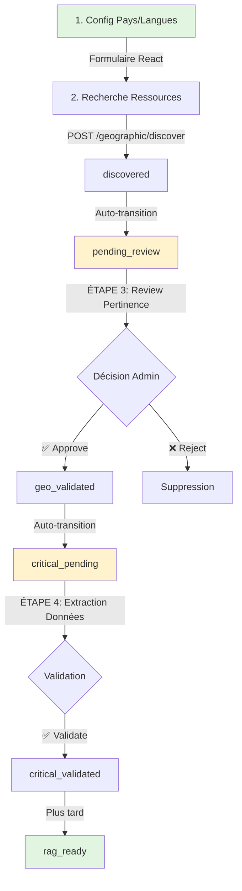

# 🚀 Plan d'Implémentation Validé - Workflow 2 Étapes

**Date** : 2026-02-13  
**Décisions Validées par Bert** ✅  
**Expert Fullstack** : Architecture optimale proposée

---

## ✅ Décisions Validées

### 1. Workflow en 2 Étapes Séparées
```
discovered → pending_review → geo_validated → critical_pending → critical_validated → (rag_ready plus tard)
```

**Étape 1** : Pertinence + Doublons (Vue globale, décision rapide)  
**Étape 2** : Extraction/Sélection données détaillées (mail, phone, etc.)

### 2. Configuration Pays/Langues
- ✅ Formulaire frontend React pour modification
- ✅ Stockage `config.json` backend
- ✅ Validation frontend + backend

### 3. RAG
- 🕐 Reporter la décision structure (on verra plus tard)

---

## 📋 Phase 1 : Backend Configuration Pays/Langues

**Effort** : 3-4 heures

### Fichier : `config.json` (à créer)

```json
{
  "version": "1.0",
  "last_updated": "2026-02-13T10:00:00Z",
  "updated_by": "admin_user",
  "languages": {
    "FR": {
      "name": "Français",
      "countries": [
        {
          "code": "FR",
          "name": "France",
          "flag": "🇫🇷",
          "search_terms": ["france", "français", "french"]
        },
        {
          "code": "BE",
          "name": "Belgique",
          "flag": "🇧🇪",
          "search_terms": ["belgique", "belgium", "belge"]
        },
        {
          "code": "CH",
          "name": "Suisse",
          "flag": "🇨🇭",
          "search_terms": ["suisse", "switzerland", "swiss"]
        }
      ]
    },
    "EN": {
      "name": "English",
      "countries": [
        {
          "code": "UK",
          "name": "United Kingdom",
          "flag": "🇬🇧",
          "search_terms": ["uk", "united kingdom", "britain"]
        },
        {
          "code": "US",
          "name": "United States",
          "flag": "🇺🇸",
          "search_terms": ["usa", "united states", "america"]
        }
      ]
    },
    "ES": {
      "name": "Español",
      "countries": [
        {
          "code": "ES",
          "name": "España",
          "flag": "🇪🇸",
          "search_terms": ["españa", "spain", "spanish"]
        }
      ]
    },
    "DE": {
      "name": "Deutsch",
      "countries": [
        {
          "code": "DE",
          "name": "Deutschland",
          "flag": "🇩🇪",
          "search_terms": ["deutschland", "germany", "german"]
        }
      ]
    },
    "PT": {
      "name": "Português",
      "countries": [
        {
          "code": "PT",
          "name": "Portugal",
          "flag": "🇵🇹",
          "search_terms": ["portugal", "portuguese"]
        }
      ]
    }
  }
}
```

---

### Fichier : `core/config_manager.py` (à créer)

```python
"""
Gestionnaire de configuration pays/langues
Stockage JSON avec validation
"""
import json
import os
from typing import Dict, List, Optional
from datetime import datetime
from pydantic import BaseModel, Field, validator
import logging

logger = logging.getLogger(__name__)

# === MODELS PYDANTIC ===

class CountryConfig(BaseModel):
    """Configuration d'un pays"""
    code: str = Field(..., min_length=2, max_length=2, description="Code pays ISO (ex: FR)")
    name: str = Field(..., min_length=2, description="Nom complet du pays")
    flag: str = Field(..., description="Emoji drapeau du pays")
    search_terms: List[str] = Field(default_factory=list, description="Termes de recherche")
    
    @validator('code')
    def code_uppercase(cls, v):
        return v.upper()

class LanguageConfig(BaseModel):
    """Configuration d'une langue"""
    name: str = Field(..., description="Nom de la langue")
    countries: List[CountryConfig] = Field(..., max_items=5, description="Max 5 pays par langue")
    
    @validator('countries')
    def max_countries(cls, v):
        if len(v) > 5:
            raise ValueError("Maximum 5 pays par langue selon stratégie lean")
        return v

class ConfigData(BaseModel):
    """Configuration complète"""
    version: str = "1.0"
    last_updated: str = Field(default_factory=lambda: datetime.now().isoformat())
    updated_by: str = "admin_user"
    languages: Dict[str, LanguageConfig]
    
    @validator('languages')
    def validate_languages(cls, v):
        supported = ["FR", "EN", "ES", "DE", "PT"]
        for lang_code in v.keys():
            if lang_code not in supported:
                raise ValueError(f"Langue {lang_code} non supportée. Langues valides: {supported}")
        return v

# === CONFIG MANAGER ===

class CountriesConfigManager:
    """
    Gestionnaire de configuration pays/langues
    Stockage JSON avec validation Pydantic
    """
    
    def __init__(self, config_file: str = "config.json"):
        self.config_file = config_file
        self._config_data: Optional[ConfigData] = None
        self._load_config()
    
    def _load_config(self):
        """Charge la configuration depuis le fichier JSON"""
        try:
            if os.path.exists(self.config_file):
                with open(self.config_file, 'r', encoding='utf-8') as f:
                    data = json.load(f)
                    self._config_data = ConfigData(**data)
                    logger.info(f"✅ Configuration chargée depuis {self.config_file}")
            else:
                logger.warning(f"⚠️ {self.config_file} introuvable, création config par défaut")
                self._create_default_config()
        except Exception as e:
            logger.error(f"❌ Erreur chargement config: {e}")
            raise
    
    def _create_default_config(self):
        """Crée une configuration par défaut"""
        default_config = {
            "version": "1.0",
            "last_updated": datetime.now().isoformat(),
            "updated_by": "system",
            "languages": {
                "FR": {
                    "name": "Français",
                    "countries": [
                        {"code": "FR", "name": "France", "flag": "🇫🇷", "search_terms": ["france", "français"]},
                        {"code": "BE", "name": "Belgique", "flag": "🇧🇪", "search_terms": ["belgique", "belgium"]},
                        {"code": "CH", "name": "Suisse", "flag": "🇨🇭", "search_terms": ["suisse", "switzerland"]}
                    ]
                },
                "EN": {
                    "name": "English",
                    "countries": [
                        {"code": "UK", "name": "United Kingdom", "flag": "🇬🇧", "search_terms": ["uk", "britain"]},
                        {"code": "US", "name": "United States", "flag": "🇺🇸", "search_terms": ["usa", "america"]}
                    ]
                }
            }
        }
        
        self._config_data = ConfigData(**default_config)
        self._save_config()
        logger.info("✅ Configuration par défaut créée")
    
    def _save_config(self):
        """Sauvegarde la configuration dans le fichier JSON"""
        try:
            with open(self.config_file, 'w', encoding='utf-8') as f:
                json.dump(self._config_data.dict(), f, indent=2, ensure_ascii=False)
            logger.info(f"💾 Configuration sauvegardée dans {self.config_file}")
        except Exception as e:
            logger.error(f"❌ Erreur sauvegarde config: {e}")
            raise
    
    # === API PUBLIQUE ===
    
    def get_all_config(self) -> Dict:
        """Récupère la configuration complète"""
        return self._config_data.dict()
    
    def get_language_config(self, language_code: str) -> Optional[Dict]:
        """Récupère la configuration d'une langue"""
        language_code = language_code.upper()
        if language_code in self._config_data.languages:
            return self._config_data.languages[language_code].dict()
        return None
    
    def get_countries_for_language(self, language_code: str) -> List[Dict]:
        """Récupère les pays pour une langue"""
        lang_config = self.get_language_config(language_code)
        if lang_config:
            return lang_config["countries"]
        return []
    
    def update_language_config(
        self, 
        language_code: str, 
        countries: List[Dict],
        updated_by: str = "admin_user"
    ) -> bool:
        """
        Met à jour la configuration d'une langue
        
        Args:
            language_code: Code langue (FR, EN, etc.)
            countries: Liste des pays (max 5)
            updated_by: ID de l'admin qui fait la modification
        
        Returns:
            True si succès, False sinon
        """
        try:
            language_code = language_code.upper()
            
            # Validation Pydantic
            lang_config = LanguageConfig(
                name=self._config_data.languages.get(language_code, LanguageConfig(name="", countries=[])).name,
                countries=[CountryConfig(**c) for c in countries]
            )
            
            # Mise à jour
            self._config_data.languages[language_code] = lang_config
            self._config_data.last_updated = datetime.now().isoformat()
            self._config_data.updated_by = updated_by
            
            # Sauvegarde
            self._save_config()
            
            logger.info(f"✅ Configuration {language_code} mise à jour par {updated_by}")
            return True
            
        except ValueError as e:
            logger.error(f"❌ Validation échouée: {e}")
            raise ValueError(str(e))
        except Exception as e:
            logger.error(f"❌ Erreur update config: {e}")
            return False
    
    def add_country_to_language(
        self,
        language_code: str,
        country_data: Dict,
        updated_by: str = "admin_user"
    ) -> bool:
        """Ajoute un pays à une langue"""
        try:
            language_code = language_code.upper()
            
            if language_code not in self._config_data.languages:
                raise ValueError(f"Langue {language_code} non trouvée")
            
            current_countries = self._config_data.languages[language_code].countries
            
            if len(current_countries) >= 5:
                raise ValueError("Maximum 5 pays par langue atteint")
            
            # Validation nouveau pays
            new_country = CountryConfig(**country_data)
            
            # Vérifier doublon
            for country in current_countries:
                if country.code == new_country.code:
                    raise ValueError(f"Pays {new_country.code} déjà présent pour {language_code}")
            
            # Ajouter
            current_countries.append(new_country)
            
            # Mettre à jour
            return self.update_language_config(
                language_code,
                [c.dict() for c in current_countries],
                updated_by
            )
            
        except Exception as e:
            logger.error(f"❌ Erreur ajout pays: {e}")
            raise
    
    def remove_country_from_language(
        self,
        language_code: str,
        country_code: str,
        updated_by: str = "admin_user"
    ) -> bool:
        """Supprime un pays d'une langue"""
        try:
            language_code = language_code.upper()
            country_code = country_code.upper()
            
            if language_code not in self._config_data.languages:
                raise ValueError(f"Langue {language_code} non trouvée")
            
            current_countries = self._config_data.languages[language_code].countries
            
            # Filtrer le pays à supprimer
            updated_countries = [c for c in current_countries if c.code != country_code]
            
            if len(updated_countries) == len(current_countries):
                raise ValueError(f"Pays {country_code} non trouvé pour {language_code}")
            
            # Mettre à jour
            return self.update_language_config(
                language_code,
                [c.dict() for c in updated_countries],
                updated_by
            )
            
        except Exception as e:
            logger.error(f"❌ Erreur suppression pays: {e}")
            raise
    
    def get_all_countries(self) -> List[Dict]:
        """Récupère tous les pays de toutes les langues"""
        all_countries = []
        seen_codes = set()
        
        for lang_code, lang_config in self._config_data.languages.items():
            for country in lang_config.countries:
                if country.code not in seen_codes:
                    all_countries.append({
                        **country.dict(),
                        "language": lang_code
                    })
                    seen_codes.add(country.code)
        
        return all_countries
    
    def get_stats(self) -> Dict:
        """Statistiques de la configuration"""
        total_countries = sum(
            len(lang.countries) 
            for lang in self._config_data.languages.values()
        )
        
        return {
            "total_languages": len(self._config_data.languages),
            "total_countries": total_countries,
            "languages": {
                lang_code: len(lang.countries)
                for lang_code, lang in self._config_data.languages.items()
            },
            "last_updated": self._config_data.last_updated,
            "updated_by": self._config_data.updated_by,
            "version": self._config_data.version
        }

# === SINGLETON ===

_config_manager: Optional[CountriesConfigManager] = None

def get_config_manager() -> CountriesConfigManager:
    """Récupère l'instance singleton du gestionnaire de config"""
    global _config_manager
    if _config_manager is None:
        _config_manager = CountriesConfigManager()
    return _config_manager
```

---

### Fichier : `admin_api.py` (routes à ajouter)

```python
# === IMPORTS À AJOUTER EN HAUT DU FICHIER ===
from core.config_manager import get_config_manager

# === NOUVEAUX ENDPOINTS À AJOUTER ===

# ==========================================
# 🆕 CONFIGURATION PAYS/LANGUES
# ==========================================

@app.get("/admin/config/countries-languages")
async def get_countries_languages_config():
    """
    📖 Récupère la configuration complète pays/langues
    
    Returns:
        Configuration avec toutes les langues et leurs pays
    """
    try:
        config_manager = get_config_manager()
        config = config_manager.get_all_config()
        
        return ResponseService.success(
            data=config,
            message="Configuration récupérée avec succès"
        )
        
    except Exception as e:
        OperationLogger.log_error("get_countries_languages_config", e)
        return ResponseService.server_error(e)

@app.get("/admin/config/countries-languages/{language}")
async def get_language_config(language: str):
    """
    📖 Récupère la configuration d'une langue spécifique
    
    Args:
        language: Code langue (FR, EN, ES, DE, PT)
    
    Returns:
        Configuration de la langue avec ses pays
    """
    try:
        config_manager = get_config_manager()
        lang_config = config_manager.get_language_config(language)
        
        if not lang_config:
            raise HTTPException(
                status_code=404,
                detail=f"Configuration pour la langue {language} non trouvée"
            )
        
        return ResponseService.success(
            data=lang_config,
            message=f"Configuration {language} récupérée"
        )
        
    except HTTPException:
        raise
    except Exception as e:
        OperationLogger.log_error(f"get_language_config/{language}", e)
        return ResponseService.server_error(e)

@app.put("/admin/config/countries-languages/{language}")
async def update_language_config(
    language: str,
    request: Request,
    admin_id: str = Depends(verify_admin_token)
):
    """
    ✏️ Met à jour la configuration d'une langue
    
    Args:
        language: Code langue (FR, EN, ES, DE, PT)
        request: Body avec countries array (max 5 pays)
    
    Body Example:
        {
            "countries": [
                {
                    "code": "FR",
                    "name": "France",
                    "flag": "🇫🇷",
                    "search_terms": ["france", "français"]
                }
            ]
        }
    
    Returns:
        Configuration mise à jour
    """
    try:
        data = await request.json()
        countries = data.get("countries", [])
        
        if not countries:
            raise HTTPException(
                status_code=400,
                detail="Le champ 'countries' est requis"
            )
        
        if len(countries) > 5:
            raise HTTPException(
                status_code=400,
                detail="Maximum 5 pays par langue autorisés (stratégie lean)"
            )
        
        config_manager = get_config_manager()
        
        # Mise à jour
        success = config_manager.update_language_config(
            language,
            countries,
            updated_by=admin_id
        )
        
        if not success:
            raise HTTPException(
                status_code=500,
                detail="Échec de la mise à jour"
            )
        
        # Récupérer config mise à jour
        updated_config = config_manager.get_language_config(language)
        
        OperationLogger.log_success(
            f"update_language_config/{language}",
            f"Configuration {language} mise à jour",
            {"admin_id": admin_id, "countries_count": len(countries)}
        )
        
        return ResponseService.success(
            data=updated_config,
            message=f"Configuration {language} mise à jour avec succès"
        )
        
    except ValueError as e:
        # Erreur de validation Pydantic
        raise HTTPException(status_code=400, detail=str(e))
    except HTTPException:
        raise
    except Exception as e:
        OperationLogger.log_error(f"update_language_config/{language}", e)
        return ResponseService.server_error(e)

@app.post("/admin/config/countries-languages/{language}/countries")
async def add_country_to_language(
    language: str,
    request: Request,
    admin_id: str = Depends(verify_admin_token)
):
    """
    ➕ Ajoute un pays à une langue
    
    Args:
        language: Code langue
        request: Body avec données du pays
    
    Body Example:
        {
            "code": "CA",
            "name": "Canada",
            "flag": "🇨🇦",
            "search_terms": ["canada", "canadian"]
        }
    """
    try:
        country_data = await request.json()
        
        # Validation champs requis
        required_fields = ["code", "name", "flag"]
        for field in required_fields:
            if field not in country_data:
                raise HTTPException(
                    status_code=400,
                    detail=f"Le champ '{field}' est requis"
                )
        
        config_manager = get_config_manager()
        
        # Ajout du pays
        success = config_manager.add_country_to_language(
            language,
            country_data,
            updated_by=admin_id
        )
        
        if not success:
            raise HTTPException(
                status_code=500,
                detail="Échec de l'ajout du pays"
            )
        
        OperationLogger.log_success(
            f"add_country/{language}",
            f"Pays {country_data['code']} ajouté à {language}",
            {"admin_id": admin_id}
        )
        
        return ResponseService.success(
            data={"country_code": country_data["code"]},
            message=f"Pays {country_data['name']} ajouté à {language}"
        )
        
    except ValueError as e:
        raise HTTPException(status_code=400, detail=str(e))
    except HTTPException:
        raise
    except Exception as e:
        OperationLogger.log_error(f"add_country/{language}", e)
        return ResponseService.server_error(e)

@app.delete("/admin/config/countries-languages/{language}/countries/{country_code}")
async def remove_country_from_language(
    language: str,
    country_code: str,
    admin_id: str = Depends(verify_admin_token)
):
    """
    ➖ Supprime un pays d'une langue
    
    Args:
        language: Code langue
        country_code: Code pays à supprimer
    """
    try:
        config_manager = get_config_manager()
        
        # Suppression
        success = config_manager.remove_country_from_language(
            language,
            country_code,
            updated_by=admin_id
        )
        
        if not success:
            raise HTTPException(
                status_code=500,
                detail="Échec de la suppression"
            )
        
        OperationLogger.log_success(
            f"remove_country/{language}",
            f"Pays {country_code} supprimé de {language}",
            {"admin_id": admin_id}
        )
        
        return ResponseService.success(
            data={"removed_country": country_code},
            message=f"Pays {country_code} supprimé de {language}"
        )
        
    except ValueError as e:
        raise HTTPException(status_code=404, detail=str(e))
    except HTTPException:
        raise
    except Exception as e:
        OperationLogger.log_error(f"remove_country/{language}", e)
        return ResponseService.server_error(e)

@app.get("/admin/config/stats")
async def get_config_stats():
    """
    📊 Statistiques de la configuration
    
    Returns:
        Statistiques (total langues, total pays, dernière maj, etc.)
    """
    try:
        config_manager = get_config_manager()
        stats = config_manager.get_stats()
        
        return ResponseService.success(
            data=stats,
            message="Statistiques de configuration"
        )
        
    except Exception as e:
        OperationLogger.log_error("get_config_stats", e)
        return ResponseService.server_error(e)
```

---

## 📋 Phase 2 : Workflow Étape 3 - Pertinence + Doublons

**Effort** : 4-5 heures

### Nouveau Statut : `pending_review`

```python
# Dans workflow_manager.py - Ajouter statut

class WorkflowStatus(str, Enum):
    DISCOVERED = "discovered"
    PENDING_REVIEW = "pending_review"  # 🆕 NOUVEAU
    GEO_VALIDATED = "geo_validated"
    CRITICAL_PENDING = "critical_pending"
    CRITICAL_VALIDATED = "critical_validated"
    RAG_READY = "rag_ready"
```

### Routes Workflow Étape 3

```python
# Dans admin_api.py

# ==========================================
# 🆕 ÉTAPE 3 : PERTINENCE + DOUBLONS
# ==========================================

@app.get("/sources/pending-review")
async def get_sources_pending_review(admin_id: str = Depends(verify_admin_token)):
    """
    📋 Liste des ressources en attente de review pertinence
    
    Returns:
        Ressources avec statut 'pending_review' + analyse doublons
    """
    try:
        adapter = get_api_adapter()
        
        # Récupérer ressources pending_review
        sources = adapter.workflow_manager.get_resources_by_status("pending_review")
        
        # Analyser doublons pour chaque ressource
        duplicates_analysis = {}
        for source_id in sources.keys():
            duplicates = adapter.workflow_manager.check_duplicates(source_id)
            if duplicates:
                duplicates_analysis[source_id] = duplicates
        
        return ResponseService.success(
            data={
                "sources": list(sources.values()),
                "total": len(sources),
                "duplicates": duplicates_analysis
            },
            message=f"{len(sources)} ressource(s) en attente de review"
        )
        
    except Exception as e:
        OperationLogger.log_error("get_sources_pending_review", e)
        return ResponseService.server_error(e)

@app.post("/sources/{source_id}/review-relevance")
async def review_source_relevance(
    source_id: str,
    request: Request,
    admin_id: str = Depends(verify_admin_token)
):
    """
    ✅ Review de pertinence d'une ressource (Étape 3)
    
    Args:
        source_id: ID de la ressource
        request: Body avec action (approve/reject) + raison optionnelle
    
    Body:
        {
            "action": "approve" | "reject",
            "reason": "Raison du rejet (optionnel)",
            "is_duplicate": false,
            "duplicate_of": "res_xxx (si doublon)"
        }
    
    Actions:
        - approve → Transition vers geo_validated
        - reject → Suppression de la ressource
    """
    try:
        data = await request.json()
        action = data.get("action")
        reason = data.get("reason", "")
        is_duplicate = data.get("is_duplicate", False)
        duplicate_of = data.get("duplicate_of")
        
        if not action or action not in ["approve", "reject"]:
            raise HTTPException(
                status_code=400,
                detail="Action doit être 'approve' ou 'reject'"
            )
        
        adapter = get_api_adapter()
        
        # Vérifier que la ressource existe et est en pending_review
        resource = adapter.workflow_manager.unified_data.get(source_id)
        if not resource:
            raise HTTPException(status_code=404, detail="Ressource non trouvée")
        
        current_status = resource.get("workflow_status")
        if current_status not in ["discovered", "pending_review"]:
            raise HTTPException(
                status_code=400,
                detail=f"Ressource doit être en 'pending_review' (statut actuel: {current_status})"
            )
        
        if action == "approve":
            # ✅ Approuver : Transition vers geo_validated
            success = adapter.workflow_manager.transition_status(
                source_id,
                "geo_validated",
                admin_id,
                f"Pertinence validée - {reason if reason else 'Ressource pertinente'}"
            )
            
            # Marquer comme doublon si spécifié
            if is_duplicate and duplicate_of:
                resource["is_duplicate"] = True
                resource["duplicate_of"] = duplicate_of
                resource["duplicate_reason"] = reason
            
            message = "Ressource approuvée et validée"
            
        else:  # reject
            # ❌ Rejeter : Supprimer la ressource
            del adapter.workflow_manager.unified_data[source_id]
            adapter.workflow_manager._save_json(
                adapter.workflow_manager.unified_data,
                adapter.workflow_manager.unified_file
            )
            
            OperationLogger.log_success(
                "reject_relevance",
                f"Ressource {source_id} rejetée",
                {
                    "source_id": source_id,
                    "admin_id": admin_id,
                    "reason": reason,
                    "is_duplicate": is_duplicate
                }
            )
            
            message = "Ressource rejetée et supprimée"
            success = True
        
        if success:
            return ResponseService.success(
                data={
                    "source_id": source_id,
                    "action": action,
                    "new_status": "geo_validated" if action == "approve" else "deleted"
                },
                message=message
            )
        else:
            raise HTTPException(status_code=500, detail="Échec de l'opération")
        
    except HTTPException:
        raise
    except Exception as e:
        OperationLogger.log_error(f"review_relevance/{source_id}", e)
        return ResponseService.server_error(e)

@app.post("/sources/batch/review-relevance")
async def batch_review_relevance(
    request: Request,
    admin_id: str = Depends(verify_admin_token)
):
    """
    ✅ Review batch de pertinence (pour sélection multiple)
    
    Body:
        {
            "decisions": {
                "res_001": {"action": "approve", "reason": "..."},
                "res_002": {"action": "reject", "reason": "Doublon", "is_duplicate": true}
            }
        }
    """
    try:
        data = await request.json()
        decisions = data.get("decisions", {})
        
        if not decisions:
            raise HTTPException(
                status_code=400,
                detail="Le champ 'decisions' est requis"
            )
        
        results = {
            "approved": [],
            "rejected": [],
            "errors": []
        }
        
        for source_id, decision in decisions.items():
            try:
                action = decision.get("action")
                reason = decision.get("reason", "")
                is_duplicate = decision.get("is_duplicate", False)
                
                # Utiliser endpoint individuel
                result = await review_source_relevance(
                    source_id=source_id,
                    request=Request(
                        scope={
                            "type": "http",
                            "method": "POST",
                            "headers": []
                        },
                        receive=lambda: {"body": json.dumps(decision).encode()}
                    ),
                    admin_id=admin_id
                )
                
                if action == "approve":
                    results["approved"].append(source_id)
                else:
                    results["rejected"].append(source_id)
                    
            except Exception as e:
                results["errors"].append({
                    "source_id": source_id,
                    "error": str(e)
                })
        
        return ResponseService.success(
            data=results,
            message=f"Batch review terminé: {len(results['approved'])} approuvées, {len(results['rejected'])} rejetées"
        )
        
    except HTTPException:
        raise
    except Exception as e:
        OperationLogger.log_error("batch_review_relevance", e)
        return ResponseService.server_error(e)
```

---

## 📋 Phase 3 : Frontend React

**Effort** : 15-20 heures (formation incluse)

### Page 1 : Configuration Pays/Langues (4h)

```tsx
// ConfigurationPage.tsx

import { useState } from 'react'
import { useQuery, useMutation, useQueryClient } from '@tanstack/react-query'
import { 
  getCountriesLanguagesConfig, 
  updateLanguageConfig,
  addCountryToLanguage,
  removeCountryFromLanguage
} from '../services/api'

export function ConfigurationPage() {
  const queryClient = useQueryClient()
  const [selectedLanguage, setSelectedLanguage] = useState('FR')
  
  // Récupérer config
  const { data: config, isLoading } = useQuery({
    queryKey: ['config', 'countries-languages'],
    queryFn: getCountriesLanguagesConfig
  })
  
  // Mutation MAJ config
  const updateMutation = useMutation({
    mutationFn: ({ language, countries }) => 
      updateLanguageConfig(language, countries),
    onSuccess: () => {
      queryClient.invalidateQueries(['config'])
    }
  })
  
  // Mutation ajout pays
  const addCountryMutation = useMutation({
    mutationFn: ({ language, countryData }) =>
      addCountryToLanguage(language, countryData),
    onSuccess: () => {
      queryClient.invalidateQueries(['config'])
    }
  })
  
  // Mutation suppression pays
  const removeCountryMutation = useMutation({
    mutationFn: ({ language, countryCode }) =>
      removeCountryFromLanguage(language, countryCode),
    onSuccess: () => {
      queryClient.invalidateQueries(['config'])
    }
  })
  
  if (isLoading) return <LoadingSpinner />
  
  const currentLanguageConfig = config?.languages[selectedLanguage]
  
  return (
    <div className="max-w-7xl mx-auto p-6">
      <h1 className="text-3xl font-bold mb-6">🌍 Configuration Pays/Langues</h1>
      
      {/* Sélecteur langue */}
      <div className="mb-6">
        <label className="block text-sm font-medium mb-2">Langue</label>
        <div className="flex gap-2">
          {Object.keys(config?.languages || {}).map(lang => (
            <button
              key={lang}
              onClick={() => setSelectedLanguage(lang)}
              className={`px-4 py-2 rounded ${
                selectedLanguage === lang 
                  ? 'bg-blue-600 text-white' 
                  : 'bg-gray-100'
              }`}
            >
              {lang}
            </button>
          ))}
        </div>
      </div>
      
      {/* Liste pays */}
      <div className="bg-white rounded-lg shadow p-6">
        <div className="flex justify-between items-center mb-4">
          <h2 className="text-xl font-semibold">
            Pays pour {currentLanguageConfig?.name}
          </h2>
          <span className="text-sm text-gray-600">
            {currentLanguageConfig?.countries.length || 0} / 5 pays
          </span>
        </div>
        
        <div className="space-y-3">
          {currentLanguageConfig?.countries.map(country => (
            <div 
              key={country.code}
              className="flex items-center justify-between p-3 bg-gray-50 rounded"
            >
              <div className="flex items-center gap-3">
                <span className="text-2xl">{country.flag}</span>
                <div>
                  <div className="font-medium">{country.name}</div>
                  <div className="text-sm text-gray-600">
                    Code: {country.code}
                  </div>
                </div>
              </div>
              
              <button
                onClick={() => removeCountryMutation.mutate({
                  language: selectedLanguage,
                  countryCode: country.code
                })}
                className="px-3 py-1 bg-red-500 text-white rounded hover:bg-red-600"
              >
                Supprimer
              </button>
            </div>
          ))}
        </div>
        
        {/* Bouton ajouter pays */}
        {currentLanguageConfig?.countries.length < 5 && (
          <button
            onClick={() => {/* Ouvrir modal ajout */}}
            className="mt-4 px-4 py-2 bg-green-500 text-white rounded hover:bg-green-600"
          >
            ➕ Ajouter un pays
          </button>
        )}
      </div>
    </div>
  )
}
```

### Page 2 : Sélection Pertinence (5-6h)

```tsx
// RelevanceReviewPage.tsx

export function RelevanceReviewPage() {
  const queryClient = useQueryClient()
  
  // Récupérer ressources pending_review
  const { data, isLoading } = useQuery({
    queryKey: ['sources', 'pending-review'],
    queryFn: fetchSourcesPendingReview
  })
  
  // Mutation review
  const reviewMutation = useMutation({
    mutationFn: ({ sourceId, action, reason }) =>
      reviewSourceRelevance(sourceId, action, reason),
    onSuccess: () => {
      queryClient.invalidateQueries(['sources'])
    }
  })
  
  const sources = data?.sources || []
  const duplicates = data?.duplicates || {}
  
  return (
    <div className="max-w-7xl mx-auto p-6">
      <h1 className="text-3xl font-bold mb-6">
        ✅ Sélection Pertinence ({sources.length} ressources)
      </h1>
      
      <div className="grid gap-4">
        {sources.map(source => (
          <div key={source.id} className="bg-white rounded-lg shadow p-6">
            {/* Badge doublon si détecté */}
            {duplicates[source.id] && (
              <div className="mb-3 p-2 bg-orange-100 border border-orange-200 rounded">
                ⚠️ Doublon potentiel détecté avec {duplicates[source.id].length} ressource(s)
              </div>
            )}
            
            <h3 className="text-lg font-semibold mb-2">{source.name}</h3>
            <p className="text-gray-600 mb-3">{source.description}</p>
            
            <div className="flex gap-3 text-sm text-gray-700 mb-4">
              <span>🌍 {source.country}</span>
              <span>📧 {source.contact_email}</span>
              <span>📞 {source.contact_phone}</span>
            </div>
            
            {/* Actions */}
            <div className="flex gap-2">
              <button
                onClick={() => reviewMutation.mutate({
                  sourceId: source.id,
                  action: 'approve',
                  reason: 'Ressource pertinente'
                })}
                disabled={reviewMutation.isPending}
                className="px-4 py-2 bg-green-500 text-white rounded hover:bg-green-600 disabled:opacity-50"
              >
                ✅ Garder
              </button>
              
              <button
                onClick={() => {
                  const reason = prompt('Raison du rejet:')
                  if (reason) {
                    reviewMutation.mutate({
                      sourceId: source.id,
                      action: 'reject',
                      reason
                    })
                  }
                }}
                disabled={reviewMutation.isPending}
                className="px-4 py-2 bg-red-500 text-white rounded hover:bg-red-600 disabled:opacity-50"
              >
                ❌ Rejeter
              </button>
            </div>
          </div>
        ))}
      </div>
    </div>
  )
}
```

---

## 📊 Schéma Workflow Final



---

## ✅ Avantages de cette Architecture

### 1. Configuration Frontend
- ✅ **UX excellente** : Modification visuelle intuitive
- ✅ **Validation temps réel** : Frontend + Backend
- ✅ **Pas de DB complexe** : Simple fichier JSON
- ✅ **Versionning Git** : Historique des modifications
- ✅ **Backup facile** : Copie du fichier

### 2. Workflow 2 Étapes
- ✅ **Séparation responsabilités** : Pertinence ≠ Données
- ✅ **Détection doublons précoce** : Avant extraction
- ✅ **Workflow clair** : Admin sait ce qu'il fait
- ✅ **Performance** : Pas d'extraction inutile si rejet

### 3. Évolutivité
- ✅ **Migration DB future simple** : Même API
- ✅ **RAG à implémenter plus tard** : Pas bloquant
- ✅ **Tests faciles** : Mock fichier JSON

---

## 📋 Planning Recommandé

### Semaine 1 : Backend (3 jours)
- **Jour 1** : Config Manager + Routes API (4h)
- **Jour 2** : Workflow Étape 3 + Routes Pertinence (4h)
- **Jour 3** : Tests backend complets (4h)

### Semaine 2 : Frontend React (5 jours)
- **Jour 1** : Setup React + Route Configuration (4h)
- **Jour 2** : Page Configuration avec formulaire (4h)
- **Jour 3** : Page Sélection Pertinence (4h)
- **Jour 4** : Intégration + Tests (4h)
- **Jour 5** : Polish + Documentation (4h)

**Total** : ~32 heures (2 semaines à mi-temps)

---

## 🎯 Prochaines Étapes Immédiates

1. ✅ **Valider cette architecture** avec toi
2. 🔨 **Créer `core/config_manager.py`** (1h)
3. 🔨 **Ajouter routes config dans `admin_api.py`** (1h)
4. 🔨 **Ajouter statut `pending_review`** dans workflow (30 min)
5. 🔨 **Créer routes review pertinence** (2h)
6. ✅ **Tester backend complet** (1h)
7. 🎨 **Commencer frontend React** (jour suivant)

---

**Bert, cette architecture te convient-elle ? As-tu des questions ou ajustements à faire ?** 🤔
